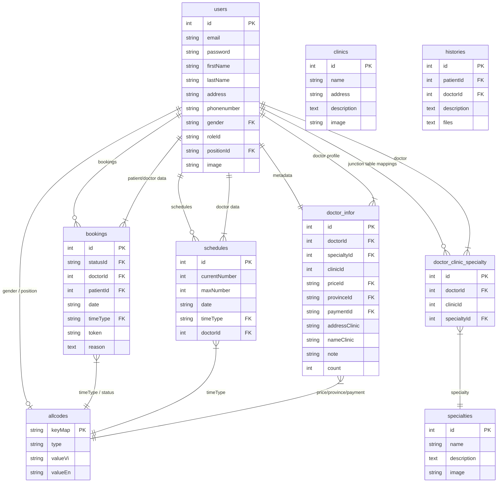

# ĐẶC TẢ YÊU CẦU CHỨC NĂNG & PHÂN TÍCH HỆ THỐNG
## HỆ THỐNG ĐẶT LỊCH KHÁM BỆNH TRỰC TUYẾN (HEALTHCARE BOOKING SYSTEM)

Tài liệu này cung cấp bản phân tích hệ thống chi tiết và đặc tả yêu cầu chức năng (Functional Specification) cho dự án Healthcare Booking System. Tài liệu được biên soạn dựa trên cấu trúc cơ sở dữ liệu thực tế và mã nguồn hiện tại của hệ thống.

---

## 1. TỔNG QUAN HỆ THỐNG (SYSTEM OVERVIEW)

Hệ thống **Healthcare Booking System** là một nền tảng trực tuyến kết nối bệnh nhân có nhu cầu khám bệnh với các bác sĩ chuyên khoa và cơ sở y tế (phòng khám). Hệ thống giúp bệnh nhân dễ dàng tìm kiếm thông tin, đặt lịch hẹn và nhận kết quả khám qua email; giúp bác sĩ quản lý lịch làm việc và ghi nhận bệnh án trực tuyến; giúp quản trị viên (Admin) vận hành toàn bộ danh mục thông tin và theo dõi tình trạng lịch hẹn một cách đồng bộ.

### Công nghệ áp dụng
*   **Front-end**: ReactJS (Redux quản lý trạng thái, SCSS thiết kế giao diện, React-Router điều hướng).
*   **Back-end**: NodeJS (Express framework xây dựng RESTful APIs).
*   **Database**: MySQL (sử dụng Sequelize ORM để ánh xạ thực thể và thực hiện các câu lệnh truy vấn).
*   **Hệ thống gửi Email**: Nodemailer kết hợp mẫu HTML động gửi email xác nhận lịch đặt (cho bệnh nhân) và email đơn thuốc/kết quả khám (Remedy).

---

## 2. PHÂN TÍCH TÁC NHÂN (ACTORS) & PHÂN QUYỀN

Hệ thống có 3 nhóm người dùng tương tác trực tiếp qua giao diện và 1 tác nhân hệ thống tự động:

1.  **Bệnh Nhân (Patient / Khách vãng lai)**:
    *   Không bắt buộc phải đăng nhập để tìm kiếm và đặt lịch khám.
    *   Có thể tra cứu lịch sử hẹn khám thông qua email cá nhân.
    *   Quyền hạn: Tìm kiếm thông tin bác sĩ, phòng khám, chuyên khoa; chọn giờ đặt lịch; xác nhận/hủy lịch hẹn cá nhân; xem lịch sử khám và tải về đơn thuốc điện tử.
2.  **Bác Sĩ (Doctor)**:
    *   Bắt buộc đăng nhập hệ thống phân hệ bác sĩ.
    *   Quyền hạn: Quản lý thông tin cá nhân; xem lịch trực/khám trong ngày; quản lý danh sách bệnh nhân chờ khám; xác nhận đã khám xong, nhập kết luận và tải lên đơn thuốc/hóa đơn; hủy lịch hẹn của bệnh nhân trong trường hợp bất khả kháng.
3.  **Quản Trị Viên (Admin)**:
    *   Bắt buộc đăng nhập hệ thống phân hệ admin (`/system`).
    *   Quyền hạn cao nhất: Quản lý người dùng (CRUD Users - Admin/Doctor/Patient); cấu hình thông tin chi tiết bác sĩ; thiết lập lịch khám bác sĩ (Schedule); quản lý chuyên khoa (CRUD Specialties); cấu hình thông tin phòng khám (Clinics); quản lý trạng thái lịch hẹn của toàn bộ hệ thống.
4.  **Hệ thống tự động (Mail Server / System)**:
    *   Tự động kích hoạt gửi Email xác nhận đính kèm liên kết chứa Token bảo mật khi có yêu cầu đặt lịch khám mới.
    *   Tự động gửi Email đính kèm file ảnh đơn thuốc/hóa đơn khi bác sĩ xác nhận hoàn thành khám.

---

## 3. KIẾN TRÚC DỮ LIỆU & QUAN HỆ THỰC THỂ (ERD)

Kiến trúc dữ liệu của hệ thống được tổ chức để đảm bảo tính toàn vẹn và linh hoạt, đặc biệt hỗ trợ quan hệ nhiều-nhiều giữa bác sĩ và chuyên khoa để một bác sĩ có thể làm việc ở nhiều chuyên khoa.

### 3.1 Mô tả các thực thể (Tables/Entities)

*   **User**: Lưu trữ thông tin tài khoản người dùng hệ thống.
    *   *Các trường chính*: `id`, `email`, `password`, `firstName`, `lastName`, `address`, `phonenumber`, `gender`, `roleId`, `positionId`, `image`.
*   **Allcode**: Bảng từ điển dùng chung hỗ trợ quốc tế hóa và chuẩn hóa mã hệ thống (Giới tính, Học hàm, Vai trò, Khung giờ, Tỉnh thành, Trạng thái lịch).
    *   *Các trường chính*: `keyMap` (PK), `type`, `valueVi`, `valueEn`.
*   **Booking**: Ghi nhận thông tin chi tiết từng ca đặt lịch khám.
    *   *Các trường chính*: `id`, `statusId` (S1 -> S4), `doctorId`, `patientId`, `date`, `timeType`, `token`, `reason`.
*   **Schedule**: Lưu trữ khung giờ khám cụ thể đã đăng ký của bác sĩ theo ngày.
    *   *Các trường chính*: `id`, `currentNumber`, `maxNumber`, `date`, `timeType`, `doctorId`.
*   **Doctor_Infor**: Cấu hình các thông tin dịch vụ, tài chính bổ sung của bác sĩ.
    *   *Các trường chính*: `id`, `doctorId`, `specialtyId`, `clinicId`, `priceId`, `provinceId`, `paymentId`, `addressClinic`, `nameClinic`, `note`, `count`.
*   **Doctor_Clinic_Specialty**: Bảng liên kết trung gian hỗ trợ quan hệ Nhiều - Nhiều.
    *   *Các trường chính*: `id`, `doctorId`, `clinicId`, `specialtyId`.
*   **Specialty**: Lưu danh mục chuyên khoa khám chữa bệnh.
    *   *Các trường chính*: `id`, `name`, `image`, `descriptionHTML`, `descriptionMarkdown`.
*   **Clinic**: Cấu hình thông tin cơ sở phòng khám y tế.
    *   *Các trường chính*: `id`, `name`, `address`, `image`, `descriptionHTML`, `descriptionMarkdown`.
*   **MarkDown**: Lưu trữ bài viết giới thiệu/mô tả chi tiết dưới dạng Markdown/HTML cho bác sĩ, chuyên khoa hoặc phòng khám.
    *   *Các trường chính*: `id`, `contentHTML`, `contentMarkdown`, `description`, `doctorId`, `specialtyId`, `clinicId`.
*   **History**: Lưu lịch sử khám và kết quả bệnh án của bệnh nhân.
    *   *Các trường chính*: `id`, `patientId`, `doctorId`, `description`, `files` (chứa dữ liệu ảnh đơn thuốc dạng base64/link).

### 3.2 Sơ đồ ERD (Entity Relationship Diagram)



---

## 4. ĐẶC TẢ CHI TIẾT YÊU CẦU CHỨC NĂNG

### 4.1 Phân hệ Bệnh Nhân & Khách Vãng Lai (Patient Module)

| STT | Chức năng | Mô tả chi tiết yêu cầu chức năng |
| :--- | :--- | :--- |
| **1** | **Tìm kiếm đa năng** | Cho phép tìm kiếm bác sĩ, chuyên khoa hoặc phòng khám trực tiếp tại trang chủ thông qua một ô tìm kiếm duy nhất. Kết quả hiển thị tức thời khi nhập ký tự. |
| **2** | **Xem chi tiết Bác sĩ** | Hiển thị hồ sơ đầy đủ bao gồm bài viết giới thiệu (giọng điệu chuyên gia, Markdown render), địa chỉ phòng khám nơi làm việc, các mức giá khám, hình thức thanh toán được áp dụng, và danh sách các lịch hẹn khám khả dụng theo ngày. |
| **3** | **Xem chi tiết Chuyên khoa** | Hiển thị thông tin mô tả chuyên khoa và danh sách toàn bộ các bác sĩ thuộc chuyên khoa đó kèm theo bảng lịch khám của mỗi bác sĩ. Hỗ trợ lọc danh sách bác sĩ thuộc chuyên khoa theo tỉnh thành. |
| **4** | **Xem chi tiết Phòng khám** | Hiển thị tên phòng khám, địa chỉ, ảnh thực tế, bài giới thiệu phòng khám và danh sách bác sĩ đang làm việc tại cơ sở đó. |
| **5** | **Đặt lịch hẹn trực tuyến** | Bệnh nhân click chọn một khung giờ khám còn trống trong lịch trình làm việc của bác sĩ. Hệ thống hiển thị biểu mẫu yêu cầu nhập: Họ tên bệnh nhân, Số điện thoại, Email nhận thông báo, Địa chỉ, Giới tính, Lý do khám bệnh. |
| **6** | **Xác nhận lịch đặt qua Email** | Khi biểu mẫu được gửi đi, hệ thống tạo bản ghi Booking ở trạng thái `S1` (Chờ xác nhận) và gửi email tự động. Bệnh nhân truy cập email cá nhân và nhấp chọn link xác nhận chứa token. Trạng thái lịch khám tự động chuyển sang `S2` (Đã xác nhận). |
| **7** | **Tra cứu lịch sử khám bệnh** | Bệnh nhân nhập email để nhận/tra cứu thông tin lịch hẹn. Giao diện hiển thị lịch sử phân loại rõ ràng: Lịch hẹn sắp tới, Lịch hẹn đã khám (Hoàn thành), Lịch hẹn đã hủy. |
| **8** | **Tự hủy lịch hẹn** | Bệnh nhân được phép tự hủy lịch khám đối với các lịch hẹn sắp tới (trạng thái `S1` hoặc `S2`) trực tiếp trên giao diện tra cứu lịch sử. Trạng thái đổi thành `S4` (Đã hủy). |

---

### 4.2 Phân hệ Bác Sĩ (Doctor Module)

| STT | Chức năng | Mô tả chi tiết yêu cầu chức năng |
| :--- | :--- | :--- |
| **1** | **Xem lịch khám hàng ngày** | Sau khi đăng nhập, bác sĩ truy cập màn hình xem danh sách các ca làm việc của mình theo ngày được chọn. Hệ thống hiển thị biểu đồ hoặc danh sách chi tiết số bệnh nhân đã đặt theo khung giờ. |
| **2** | **Quản lý danh sách bệnh nhân** | Hiển thị thông tin cá nhân của bệnh nhân (Họ tên, giới tính, SĐT, lý do khám) đã đặt khám và đã xác nhận lịch hẹn (`S2`) trong ngày được chọn. |
| **3** | **Xác nhận khám xong & gửi kết quả (Remedy)** | Đối với bệnh nhân đã khám xong, bác sĩ click nút "Xác nhận khám xong". Hộp thoại mở ra yêu cầu nhập kết luận y khoa/ghi chú và đăng tải hình ảnh đơn thuốc/hóa đơn (hỗ trợ chuyển đổi ảnh sang chuỗi Base64). Hệ thống tự động chuyển trạng thái Booking thành `S3` (Đã khám), tạo bản ghi `History` bệnh án và gửi email kết quả đính kèm ảnh đơn thuốc cho bệnh nhân. |
| **4** | **Hủy lịch khám bệnh nhân** | Bác sĩ có quyền hủy ca khám của bệnh nhân trong trường hợp khẩn cấp, yêu cầu nhập lý do hủy lịch. Hệ thống cập nhật trạng thái lịch thành `S4` và tự động gửi email thông báo kèm lý do hủy đến hòm thư bệnh nhân. |

---

### 4.3 Phân hệ Quản Trị Viên (Admin Module)

| STT | Chức năng | Mô tả chi tiết yêu cầu chức năng |
| :--- | :--- | :--- |
| **1** | **Quản lý người dùng (CRUD Users)** | Thực hiện các chức năng: Thêm mới, chỉnh sửa thông tin, xóa tài khoản người dùng và xem danh sách người dùng. Phân quyền và cấu hình vai trò (Admin, Bác sĩ, Bệnh nhân) kèm các thông tin liên hệ, ảnh đại diện, chức danh. |
| **2** | **Cấu hình chi tiết Bác sĩ** | Thiết lập thông tin nghiệp vụ y tế cho bác sĩ bao gồm: Giá khám (lọc theo các mức trong Allcode), phương thức thanh toán, tỉnh thành làm việc, địa chỉ phòng khám cụ thể, tên phòng khám, ghi chú thêm và viết bài giới thiệu chi tiết (sử dụng trình soạn thảo Rich Text/Markdown). Cập nhật quan hệ nhiều-nhiều với Chuyên khoa qua bảng trung gian. |
| **3** | **Lập lịch khám bác sĩ (Manage Schedule)** | Lập lịch làm việc cho từng bác sĩ theo ngày bằng tính năng tạo hàng loạt (Bulk Create). Chọn bác sĩ, chọn ngày, và click chọn hàng loạt các khung giờ khám khả dụng trong ngày đó. |
| **4** | **Quản lý Chuyên khoa (CRUD Specialty)** | Tạo mới, cập nhật thông tin (Tên chuyên khoa, hình ảnh, bài mô tả chi tiết bằng Markdown) và xóa chuyên khoa. |
| **5** | **Cấu hình Phòng khám (Clinics)** | Tạo mới và cập nhật thông tin cơ sở phòng khám (Tên phòng khám, địa chỉ chi tiết, hình ảnh cơ sở, mô tả bài viết bằng HTML/Markdown). |
| **6** | **Quản lý lịch hẹn toàn hệ thống** | Quản lý, giám sát tất cả các lịch đặt hẹn khám trên toàn hệ thống. Hỗ trợ lọc theo ngày, theo bác sĩ, và lọc nhanh theo trạng thái lịch đặt (`S1` Chờ xác nhận, `S2` Đã xác nhận, `S3` Đã khám, `S4` Đã hủy). Admin có quyền ghi đè, cập nhật nhanh trạng thái của bất kỳ lịch hẹn nào. |

---

## 5. MÔ TẢ CÁC LUỒNG NGHIỆP VỤ CỐT LÕI (SEQUENCE & ACTIVITY)

### 5.1 Luồng nghiệp vụ: Đặt lịch khám và Xác nhận tự động (Booking & Verification Flow)

```
[Bệnh nhân] --(1) Chọn bác sĩ & giờ khám--> [ReactJS Client]
[Bệnh nhân] --(2) Nhập thông tin & Xác nhận đặt lịch--> [ReactJS Client]
[ReactJS Client] --(3) POST /api/patient-book-appointment--> [NodeJS API]
[NodeJS API] --(4) Lưu Booking (Trạng thái S1, tạo Token)--> [MySQL DB]
[NodeJS API] --(5) Gửi email chứa link xác nhận & Token--> [Mail Server] --(6) Gửi thư--> [Email Bệnh nhân]
[Email Bệnh nhân] --(7) Bệnh nhân mở email & click link xác nhận--> [ReactJS Client (/verify-booking)]
[ReactJS Client] --(8) POST /api/verify-book-appointment (Token)--> [NodeJS API]
[NodeJS API] --(9) Cập nhật trạng thái Booking S1 -> S2--> [MySQL DB]
[ReactJS Client] <-- hiển thị thông báo xác nhận lịch hẹn thành công -- [NodeJS API]
```

### 5.2 Luồng nghiệp vụ: Bác sĩ gửi Đơn thuốc & Kết luận (Remedy Flow)

```
[Bác sĩ] --(1) Chọn bệnh nhân & Click "Xác nhận khám xong"--> [ReactJS Client]
[Bác sĩ] --(2) Nhập kết luận, tải lên ảnh đơn thuốc (base64) & bấm Gửi--> [ReactJS Client]
[ReactJS Client] --(3) POST /api/send-remedy--> [NodeJS API]
[NodeJS API] --(4) Cập nhật trạng thái Booking S2 -> S3 (Đã khám)--> [MySQL DB]
[NodeJS API] --(5) Lưu lịch sử bệnh án vào bảng History--> [MySQL DB]
[NodeJS API] --(6) Gửi email kết quả khám đính kèm ảnh đơn thuốc--> [Mail Server] --(7) Gửi thư--> [Email Bệnh nhân]
[ReactJS Client] <-- hiển thị thông báo gửi hóa đơn thành công & load lại danh sách -- [NodeJS API]
```

---

## 6. QUY TẮC CHUYỂN TRẠNG THÁI LỊCH HẸN (BOOKING STATE TRANSITIONS)

Trạng thái lịch đặt hẹn (`Booking`) được quản lý nghiêm ngặt thông qua các mã ký hiệu trong bảng từ điển `Allcode` (`type = STATUS`):

*   **`S1` (Chờ xác nhận - Created)**:
    *   Trạng thái ban đầu sau khi bệnh nhân điền form đặt lịch hẹn khám thành công.
    *   Hệ thống đang chờ bệnh nhân click xác nhận qua email, hoặc Admin duyệt thủ công.
*   **`S2` (Đã xác nhận - Confirmed)**:
    *   Được chuyển từ `S1` sau khi bệnh nhân xác nhận qua liên kết email thành công hoặc Admin bấm nút "Xác nhận".
    *   Ca khám được đưa vào danh sách chờ khám chính thức của Bác sĩ trong ngày được chọn.
*   **`S3` (Đã khám / Hoàn thành - Completed)**:
    *   Được chuyển từ `S2` sau khi Bác sĩ thực hiện khám bệnh thực tế cho bệnh nhân và xác nhận gửi thông tin Remedy (Đơn thuốc & Hóa đơn) thành công, hoặc khi Admin chuyển đổi trạng thái thủ công.
*   **`S4` (Đã hủy - Canceled)**:
    *   Có thể chuyển từ `S1` hoặc `S2`.
    *   Kích hoạt khi bệnh nhân tự hủy qua trang tra cứu lịch sử, hoặc khi Bác sĩ/Admin thực hiện thao tác hủy ca khám kèm lý do hủy lịch hẹn.

---
*Bản đặc tả phân tích hệ thống được duy trì đồng bộ với cấu trúc cơ sở dữ liệu hiện hành.*
