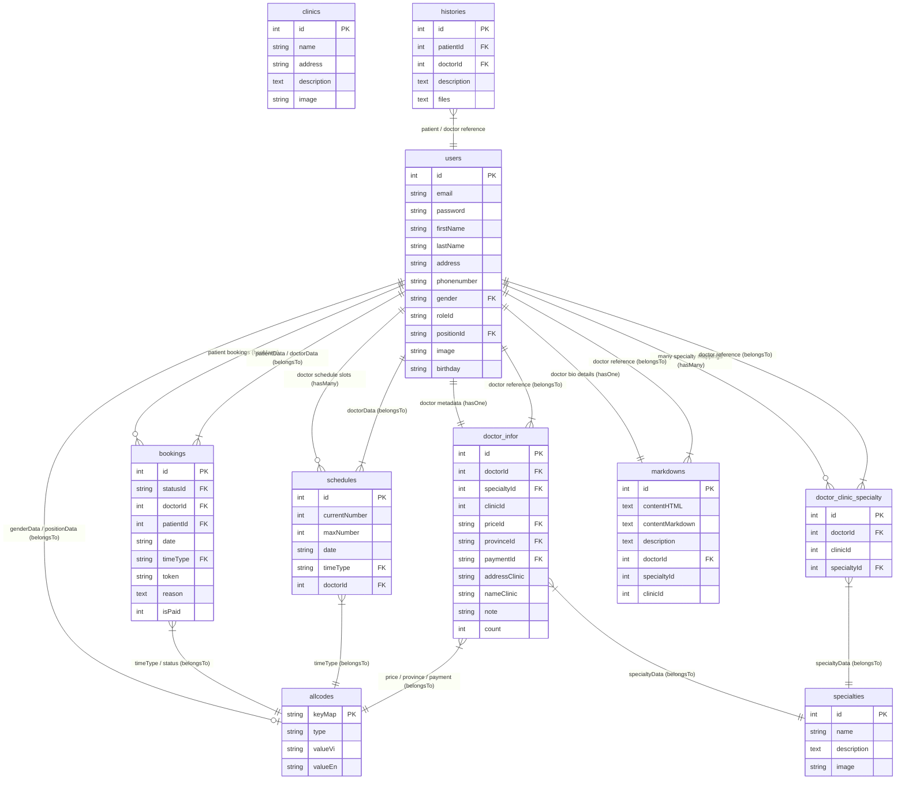

# MỐI QUAN HỆ GIỮA CÁC THỰC THỂ CƠ SỞ DỮ LIỆU
## HỆ THỐNG ĐẶT LỊCH KHÁM BỆNH TRỰC TUYẾN (HEALTHCARE BOOKING SYSTEM)

Tài liệu này tổng hợp cấu trúc các bảng dữ liệu (Tables/Entities) trong hệ thống và liệt kê tất cả các mối quan hệ (Associations) được cấu hình thông qua **Sequelize ORM** kết nối tới cơ sở dữ liệu **MySQL**.

---

## MỤC LỤC
1. [TỔNG QUAN CÁC THỰC THỂ (ENTITIES)](#1-tổng-quan-các-thực-thể-entities)
2. [BIỂU ĐỒ MỐI QUAN HỆ THỰC THỂ (ER DIAGRAM)](#2-biểu-đồ-mối-quan-hệ-thực-thể-er-diagram)
3. [CHI TIẾT CÁC MỐI QUAN HỆ GIỮA CÁC BẢNG](#3-chi-tiết-các-mối-quan-hệ-giữa-các-bảng)
   - [3.1 Bảng User (Người dùng)](#31-bảng-user-người-dùng)
   - [3.2 Bảng Booking (Lịch hẹn khám)](#32-bảng-booking-lịch-hẹn-khám)
   - [3.3 Bảng Doctor_Infor (Thông tin cấu hình Bác sĩ)](#33-bảng-doctor_infor-thông-tin-cấu-hình-bác-sĩ)
   - [3.4 Bảng Schedule (Lịch ca khám của Bác sĩ)](#34-bảng-schedule-lịch-ca-khám-của-bác-sĩ)
   - [3.5 Bảng Doctor_Clinic_Specialty (Bảng trung gian Bác sĩ - Phòng khám - Chuyên khoa)](#35-bảng-doctor_clinic_specialty-bảng-trung-gian-bác-sĩ---phòng-khám---chuyên-khoa)
   - [3.6 Bảng MarkDown (Bài viết & Mô tả chi tiết)](#36-bảng-markdown-bài-viết--mô-tả-chi-tiết)
   - [3.7 Bảng History (Lịch sử khám bệnh)](#37-bảng-history-lịch-sử-khám-bệnh)
   - [3.8 Bảng Allcode (Từ điển/Code hệ thống)](#38-bảng-allcode-từ-điểncode-hệ-thống)

---

## 1. TỔNG QUAN CÁC THỰC THỂ (ENTITIES)

Hệ thống bao gồm các thực thể chính sau:
*   **User**: Lưu thông tin tất cả tài khoản (Họ tên, email, mật khẩu, SĐT, giới tính, vai trò: Admin/Doctor/Patient).
*   **Allcode**: Bảng từ điển chung chứa các mã ánh xạ (Giới tính, Học hàm/Vị trí, Vai trò, Khung giờ khám, Khoảng giá, Tỉnh thành, Phương thức thanh toán, Trạng thái lịch đặt).
*   **Booking**: Lưu thông tin lịch đặt khám (Mã bác sĩ, Mã bệnh nhân, Ngày khám, Ca khám, Lý do khám, Trạng thái).
*   **Schedule**: Lưu lịch làm việc đã đăng ký của Bác sĩ theo ngày (Ngày khám, Ca khám, Số lượng bệnh nhân tối đa).
*   **Doctor_Infor**: Cấu hình thông tin phụ của Bác sĩ (Giá khám, Tỉnh thành, Thanh toán, Chuyên khoa, Phòng khám, Địa chỉ phòng khám).
*   **Doctor_Clinic_Specialty**: Bảng liên kết trung gian hỗ trợ quan hệ Nhiều-Nhiều giữa Bác sĩ với Chuyên khoa và Phòng khám.
*   **MarkDown**: Lưu thông tin giới thiệu, mô tả chi tiết của Bác sĩ/Chuyên khoa/Phòng khám dưới định dạng bài viết Markdown/HTML.
*   **Specialty**: Lưu danh mục Chuyên khoa (Tên khoa, Ảnh đại diện).
*   **Clinic**: Lưu danh mục Phòng khám (Tên phòng khám, Địa chỉ, Ảnh đại diện).
*   **History**: Lưu lịch sử bệnh án khi hoàn thành khám (Mã bệnh nhân, Mã bác sĩ, Ghi chú bệnh án, File đơn thuốc đính kèm).

---

## 2. BIỂU ĐỒ MỐI QUAN HỆ THỰC THỂ (ER DIAGRAM)

Sơ đồ ERD dưới đây biểu diễn cấu trúc liên kết và khóa ngoại giữa các bảng dữ liệu chính trong hệ thống:

**Mô tả chi tiết sơ đồ thực thể (ERD):**

1. **Thực thể người dùng (`users`):** 
   * Là thực thể trung tâm quản lý tất cả các tài khoản truy cập hệ thống. Phân loại đối tượng bằng trường `roleId` (`ADMIN` - Quản trị viên, `DOCTOR` - Bác sĩ, `PATIENT` - Bệnh nhân).
   * Khóa ngoại `gender` và `positionId` kết nối tới bảng `allcodes` nhằm lấy chuỗi hiển thị đa ngôn ngữ tương ứng (Giới tính, học hàm như Thạc sĩ, Tiến sĩ, Bác sĩ chuyên khoa...).

2. **Thực thể danh mục dùng chung (`allcodes`):**
   * Đóng vai trò là bảng tra cứu (Look-up Table) tập trung. Tránh việc hardcode các giá trị tĩnh trong mã nguồn bằng cách định nghĩa các loại danh mục (`type` như `GENDER`, `ROLE`, `POSITION`, `STATUS`, `TIME`, `PRICE`, `PROVINCE`, `PAYMENT`).
   * Các thực thể khác trong hệ thống như `users`, `bookings`, `schedules`, `doctor_infor` đều thiết lập quan hệ `belongsTo` với bảng này thông qua khóa ngoại liên kết với trường khóa chính `keyMap`.

3. **Thực thể cuộc hẹn/lịch đặt (`bookings`):**
   * Lưu trữ các giao dịch đặt lịch của Bệnh nhân với Bác sĩ.
   * Chứa các khóa ngoại: `patientId` (ID bệnh nhân từ bảng `users`), `doctorId` (ID bác sĩ từ bảng `users`), `timeType` (khung giờ khám từ bảng `allcodes`), và `statusId` (trạng thái lịch đặt từ bảng `allcodes` gồm các mã `S1` - Lịch mới, `S2` - Đã xác nhận, `S3` - Đã khám, `S4` - Đã hủy).
   * Trường `isPaid` (0 - Chưa thanh toán, 1 - Đã thanh toán) để theo dõi luồng checkout dịch vụ lâm sàng.

4. **Thực thể lịch ca khám của bác sĩ (`schedules`):**
   * Quản lý khung thời gian làm việc được đăng ký trước của bác sĩ theo từng ngày (`date`).
   * Khóa ngoại `doctorId` liên kết với bảng `users`, và `timeType` xác định ca khám chi tiết liên kết với bảng `allcodes`.

5. **Thực thể cấu hình nghiệp vụ bác sĩ (`doctor_infor`):**
   * Mở rộng thông tin chuyên môn cho bác sĩ (chỉ áp dụng cho các dòng dữ liệu trong bảng `users` có `roleId` là `DOCTOR`).
   * Quản lý giá khám (`priceId`), phương thức thanh toán (`paymentId`), và khu vực phòng khám (`provinceId`) thông qua liên kết khóa ngoại với bảng `allcodes`.
   * Liên kết trực tiếp với Chuyên khoa y tế (`specialtyId`) trong bảng `specialties`.

6. **Thực thể trung gian (`doctor_clinic_specialty`):**
   * Giải quyết mối quan hệ Nhiều-Nhiều (Many-to-Many) giữa Bác sĩ, Phòng khám và Chuyên khoa trong trường hợp hệ thống mở rộng quy mô phòng khám, cho phép lập bản đồ định tuyến linh hoạt.

7. **Thực thể bài viết giới thiệu (`markdowns`):**
   * Lưu trữ nội dung văn bản giới thiệu chi tiết định dạng Markdown/HTML cho Bác sĩ (`doctorId`), Chuyên khoa (`specialtyId`), hoặc Phòng khám (`clinicId`). Giúp tách biệt dữ liệu mô tả dài khỏi các bảng nghiệp vụ chính để tối ưu hóa hiệu năng truy vấn.

8. **Thực thể lịch sử bệnh án (`histories`):**
   * Lưu lại thông tin kết luận chẩn đoán (`description`) và các tài liệu/hóa đơn dịch vụ cận lâm sàng đi kèm dưới dạng dữ liệu văn bản JSON (`files`) sau khi bác sĩ hoàn thành quy trình khám chữa bệnh cho Bệnh nhân.

---

## 3. CHI TIẾT CÁC MỐI QUAN HỆ GIỮA CÁC BẢNG

### 3.1 Bảng User (Người dùng)
*   **Quan hệ 1-Nhiều với Allcode (Giới tính & Học vị)**:
    *   `User.belongsTo(Allcode)` qua khóa ngoại `gender` nối với khóa chính `keyMap` (Bảng Allcode). Alias: `genderData`.
    *   `User.belongsTo(Allcode)` qua khóa ngoại `positionId` nối với khóa chính `keyMap` (Bảng Allcode). Alias: `positionData`.
*   **Quan hệ 1-1 với MarkDown (Thông tin giới thiệu chi tiết dạng văn bản/HTML)**:
    *   `User.hasOne(MarkDown)` qua khóa ngoại `doctorId` ở bảng `MarkDown`.
*   **Quan hệ 1-1 với Doctor_Infor (Thông tin bổ sung của Bác sĩ)**:
    *   `User.hasOne(Doctor_Infor)` qua khóa ngoại `doctorId` ở bảng `Doctor_Infor`.
*   **Quan hệ 1-Nhiều với Schedule (Lịch làm việc của Bác sĩ)**:
    *   `User.hasMany(Schedule)` qua khóa ngoại `doctorId` ở bảng `Schedule`. Alias: `doctorData`.
*   **Quan hệ 1-Nhiều với Booking (Cuộc hẹn - dành cho bệnh nhân)**:
    *   `User.hasMany(Booking)` qua khóa ngoại `patientId` ở bảng `Booking`. Alias: `patientData`.
*   **Quan hệ 1-Nhiều với Doctor_Clinic_Specialty (Liên kết Chuyên khoa - Bác sĩ)**:
    *   `User.hasMany(Doctor_Clinic_Specialty)` qua khóa ngoại `doctorId` ở bảng `Doctor_Clinic_Specialty`. Alias: `doctorSpecialties`.

---

### 3.2 Bảng Booking (Lịch hẹn khám)
*   **Quan hệ 1-Nhiều với User (Bệnh nhân & Bác sĩ)**:
    *   `Booking.belongsTo(User)` qua khóa ngoại `patientId` nối với `id` (User). Alias: `patientData`. (Lấy thông tin Bệnh nhân).
    *   `Booking.belongsTo(User)` qua khóa ngoại `doctorId` nối với `id` (User). Alias: `doctorData`. (Lấy thông tin Bác sĩ được đặt lịch).
*   **Quan hệ 1-Nhiều với Allcode (Ca khám & Trạng thái)**:
    *   `Booking.belongsTo(Allcode)` qua khóa ngoại `timeType` nối với `keyMap` (Allcode). Alias: `timeTypeDataPatient`. (Khung giờ như 8:00 - 9:00).
    *   `Booking.belongsTo(Allcode)` qua khóa ngoại `statusId` nối với `keyMap` (Allcode). Alias: `statusData`. (Các trạng thái S1 - Chờ xác nhận, S2 - Đã xác nhận, S3 - Đã khám, S4 - Đã hủy).

---

### 3.3 Bảng Doctor_Infor (Thông tin cấu hình Bác sĩ)
*   **Quan hệ 1-1 với User (Bác sĩ tương ứng)**:
    *   `Doctor_Infor.belongsTo(User)` qua khóa ngoại `doctorId` nối với `id` (User).
*   **Quan hệ 1-Nhiều với Allcode (Thuộc tính giá cả, tỉnh thành, thanh toán)**:
    *   `Doctor_Infor.belongsTo(Allcode)` qua khóa ngoại `priceId` nối với `keyMap` (Allcode). Alias: `priceTypeData`.
    *   `Doctor_Infor.belongsTo(Allcode)` qua khóa ngoại `provinceId` nối với `keyMap` (Allcode). Alias: `provinceTypeData`.
    *   `Doctor_Infor.belongsTo(Allcode)` qua khóa ngoại `paymentId` nối với `keyMap` (Allcode). Alias: `paymentTypeData`.
*   **Quan hệ 1-Nhiều với Specialty (Chuyên khoa trực thuộc)**:
    *   `Doctor_Infor.belongsTo(Specialty)` qua khóa ngoại `specialtyId` nối với `id` (Specialty). Alias: `specialtyData`.

---

### 3.4 Bảng Schedule (Lịch ca khám của Bác sĩ)
*   **Quan hệ 1-Nhiều với User (Bác sĩ tương ứng)**:
    *   `Schedule.belongsTo(User)` qua khóa ngoại `doctorId` nối với `id` (User). Alias: `doctorData`.
*   **Quan hệ 1-Nhiều với Allcode (Khung giờ khám)**:
    *   `Schedule.belongsTo(Allcode)` qua khóa ngoại `timeType` nối với `keyMap` (Allcode). Alias: `timeTypeData`.

---

### 3.5 Bảng Doctor_Clinic_Specialty (Bảng trung gian Bác sĩ - Phòng khám - Chuyên khoa)
Bảng trung gian này thiết lập quan hệ Nhiều-Nhiều để cho phép một Bác sĩ có thể hoạt động ở nhiều chuyên khoa khác nhau, hoặc liên kết linh hoạt.
*   **Quan hệ với User**:
    *   `Doctor_Clinic_Specialty.belongsTo(User)` qua khóa ngoại `doctorId` nối với `id` (User).
*   **Quan hệ với Specialty**:
    *   `Doctor_Clinic_Specialty.belongsTo(Specialty)` qua khóa ngoại `specialtyId` nối với `id` (Specialty). Alias: `specialtyData`.

---

### 3.6 Bảng MarkDown (Bài viết & Mô tả chi tiết)
*   **Quan hệ với User**:
    *   `MarkDown.belongsTo(User)` qua khóa ngoại `doctorId` nối với `id` (User) để hiển thị thông tin bài giới thiệu trên trang chi tiết Bác sĩ.

---

### 3.7 Bảng History (Lịch sử khám bệnh)
*   Thực thể này ghi nhận lịch sử bệnh án bằng cách sử dụng các khóa logic `patientId` và `doctorId` liên kết đến bảng `users`. Ghi nhận thông tin tổng kết sau buổi khám (`description`) và liên kết tệp đơn thuốc điện tử (`files`).

---

### 3.8 Bảng Allcode (Từ điển/Code hệ thống)
*   Bảng này đóng vai trò bảng danh mục toàn cục trong CSDL. Nó cung cấp các trường dữ liệu cố định hoặc động (`gender`, `position`, `role`, `status`, `time`, `price`, `province`, `payment`) dùng chung để chuẩn hóa hiển thị đa ngôn ngữ (Tiếng Việt `valueVi`, Tiếng Anh `valueEn`). Các bảng khác tham chiếu đến bảng này bằng quan hệ `belongsTo` dựa trên trường `keyMap`.

---
*Tài liệu phân tích mối quan hệ được lập dựa trên code Sequelize models của backend NodeJS.*
