# BIỂU ĐỒ TUẦN TỰ HỆ THỐNG
## HỆ THỐNG ĐẶT LỊCH KHÁM BỆNH TRỰC TUYẾN (HEALTHCARE BOOKING SYSTEM)

Tài liệu này cung cấp các biểu đồ tuần tự (Sequence Diagrams) mô tả chi tiết luồng tương tác giữa các thành phần trong hệ thống: **Người dùng (Bệnh nhân/Bác sĩ/Admin)**, **Giao diện Client (ReactJS)**, **Máy chủ (NodeJS API)**, **Cơ sở dữ liệu (MySQL Database/Sequelize)** và **Hệ thống gửi Email**.

---

## MỤC LỤC
1. [XÁC THỰC TÀI KHOẢN (AUTHENTICATION)](#1-xác-thực-tài-khoản-authentication)
   - [1.1 Đăng nhập hệ thống](#11-đăng-nhập-hệ-thống)
   - [1.2 Đăng xuất hệ thống](#12-đăng-xuất-hệ-thống)
2. [PHÂN HỆ BỆNH NHÂN (PATIENT)](#2-phân-hệ-bệnh-nhân-patient)
   - [2.1 Tìm kiếm thông tin & Xem chi tiết Bác sĩ / Chuyên khoa / Phòng khám](#21-tìm-kiếm-thông-tin--xem-chi-tiết-bác-sĩ--chuyên-khoa--phòng-khám)
   - [2.2 Đặt lịch khám bệnh trực tuyến](#22-đặt-lịch-khám-bệnh-trực-tuyến)
   - [2.3 Xác nhận lịch đặt hẹn qua Email](#23-xác-nhận-lịch-đặt-hẹn-qua-email)
   - [2.4 Tra cứu lịch sử cuộc hẹn & Tự hủy lịch hẹn](#24-tra-cứu-lịch-sử-cuộc-hẹn--tự-hủy-lịch-hẹn)
   - [2.5 Chỉnh sửa thông tin cá nhân](#25-chỉnh-sửa-thông-tin-cá-nhân)
3. [PHÂN HỆ BÁC SĨ (DOCTOR)](#3-phân-hệ-bác-sĩ-doctor)
   - [3.1 Xem lịch khám và danh sách bệnh nhân](#31-xem-lịch-khám-và-danh-sách-bệnh-nhân)
   - [3.2 Xác nhận khám xong và gửi đơn thuốc/hóa đơn](#32-xác-nhận-khám-xong-và-gửi-đơn-thuốchóa-đơn)
   - [3.3 Hủy lịch hẹn bệnh nhân](#33-hủy-lịch-hẹn-bệnh-nhân)
   - [3.4 Cập nhật hồ sơ thông tin cá nhân](#34-cập-nhật-hồ-sơ-thông-tin-cá-nhân)
4. [PHÂN HỆ QUẢN TRỊ VIÊN (ADMIN)](#4-phân-hệ-quản-trị-viên-admin)
   - [4.1 Quản lý người dùng](#41-quản-lý-người-dùng)
   - [4.2 Cấu hình thông tin chi tiết bác sĩ](#42-cấu-hình-thông-tin-chi-tiết-bác-sĩ)
   - [4.3 Tạo lịch làm việc cho bác sĩ](#43-tạo-lịch-làm-việc-cho-bác-sĩ)
   - [4.4 Quản lý chuyên khoa](#44-quản-lý-chuyên-khoa)
   - [4.5 Cấu hình thông tin phòng khám](#45-cấu-hình-thông-tin-phòng-khám)
   - [4.6 Quản lý lịch đặt khám toàn hệ thống](#46-quản-lý-lịch-đặt-khám-toàn-hệ-thống)

---

## 1. XÁC THỰC TÀI KHOẢN (AUTHENTICATION)

### 1.1 Đăng nhập hệ thống
Mô tả quy trình người dùng (Admin, Bác sĩ, hoặc Bệnh nhân) đăng nhập vào hệ thống để xác thực quyền truy cập.

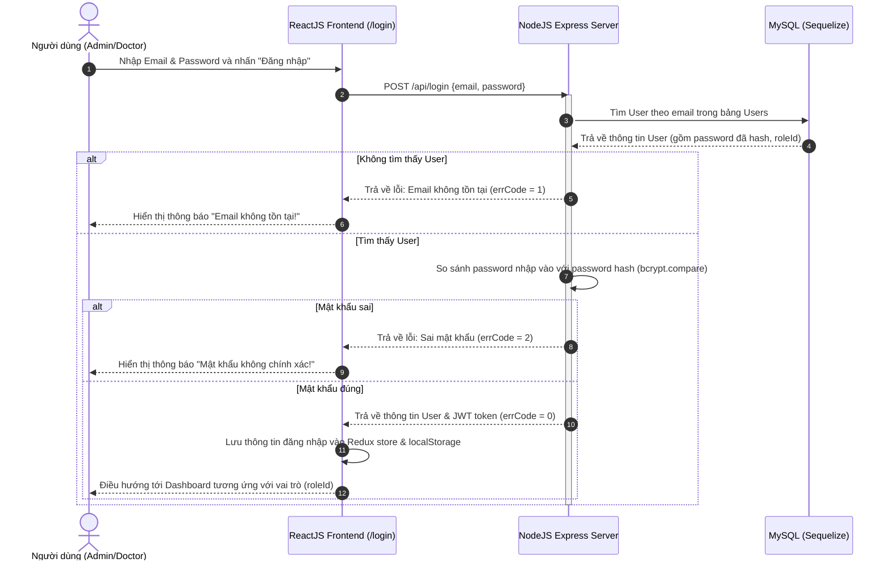

**Mô tả chi tiết luồng xử lý:**
1. **Yêu cầu đăng nhập:** Người dùng nhập các trường `Email` và `Password` tại giao diện ReactJS (`/login`) và nhấp nút "Đăng nhập".
2. **Gửi API:** Giao diện Client thực hiện gửi một yêu cầu `POST /api/login` mang theo dữ liệu `{email, password}` tới NodeJS Server.
3. **Truy vấn DB:** Server NodeJS tiếp nhận và sử dụng Sequelize truy vấn CSDL (`select * from Users where email = ?`).
4. **Kiểm tra sự tồn tại:**
   * *Trường hợp không tồn tại email:* Hệ thống trả về `errCode = 1` cùng thông báo lỗi tương ứng. Giao diện hiển thị cảnh báo đỏ cho người dùng.
   * *Trường hợp email tồn tại:* Server sẽ lấy bản ghi thông tin người dùng (chứa password đã mã hóa bằng bcrypt và vai trò `roleId`).
5. **Xác thực mật khẩu:** Server gọi thư viện `bcrypt.compare` để đối chiếu mật khẩu người dùng nhập vào với chuỗi hash trong CSDL.
   * *Sai mật khẩu:* Hệ thống trả về `errCode = 2` và hiển thị toast thông báo sai mật khẩu.
   * *Đúng mật khẩu:* Server tạo một JSON Web Token (JWT) chứa thông tin định danh và phản hồi `errCode = 0` kèm thông tin User + Token về Frontend.
6. **Lưu phiên & Điều hướng:** ReactJS lưu trữ token/user vào Redux Store và LocalStorage, sau đó điều hướng người dùng sang Dashboard quản trị `/system` hoặc màn hình bác sĩ `/doctor` dựa trên `roleId`.

---

### 1.2 Đăng xuất hệ thống
Mô tả tiến trình xóa phiên làm việc và đăng xuất khỏi giao diện hệ thống.

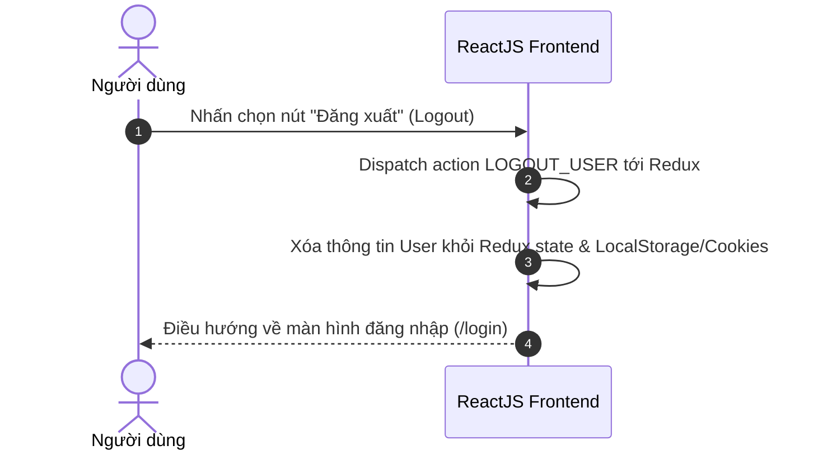

**Mô tả chi tiết luồng xử lý:**
1. **Kích hoạt đăng xuất:** Người dùng nhấp chọn nút "Đăng xuất" (Logout) trên thanh Header/Navigation của giao diện Client.
2. **Cập nhật State:** ReactJS bắt sự kiện và thực hiện dispatch action `LOGOUT_USER` tới Redux Store.
3. **Xóa bộ nhớ tạm:** Redux Reducer xử lý action này, thực hiện làm sạch (clear) dữ liệu người dùng trong Redux State và đồng thời xóa các khóa lưu giữ token trong `localStorage` hoặc `sessionStorage`/`cookies`.
4. **Điều hướng:** Hệ thống tự động chuyển hướng người dùng quay trở lại màn hình đăng nhập `/login`.

---

## 2. PHÂN HỆ BỆNH NHÂN (PATIENT)

### 2.1 Tìm kiếm thông tin & Xem chi tiết Bác sĩ / Chuyên khoa / Phòng khám
Mô tả cách bệnh nhân tìm kiếm thông tin phòng khám, chuyên khoa hoặc bác sĩ và xem chi tiết trên giao diện.

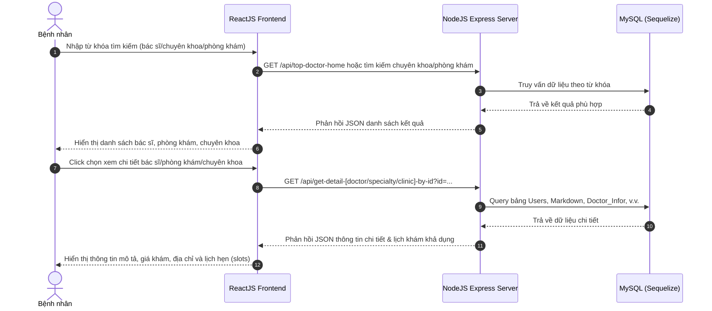

**Mô tả chi tiết luồng xử lý:**
1. **Tìm kiếm (Search Flow):**
   * Bệnh nhân nhập từ khóa tìm kiếm (Ví dụ: tên chuyên khoa, tên bác sĩ) trên thanh tìm kiếm của ReactJS.
   * ReactJS gửi yêu cầu HTTP GET tương ứng (`/api/top-doctor-home` hoặc các API chuyên khoa/phòng khám) kèm tham số tìm kiếm.
   * Server NodeJS thực hiện truy vấn `SELECT LIKE` hoặc đối chiếu quan hệ trong CSDL MySQL để tìm các kết quả phù hợp.
   * CSDL trả về danh sách bản ghi; NodeJS đóng gói thành JSON phản hồi lại ReactJS để hiển thị lên màn hình.
2. **Xem thông tin chi tiết (View Detail Flow):**
   * Bệnh nhân click chọn một Bác sĩ, Chuyên khoa, hoặc Phòng khám cụ thể.
   * ReactJS gọi API `GET /api/get-detail-[doctor/specialty/clinic]-by-id?id=...`.
   * Server thực hiện truy vấn kết hợp nhiều bảng (bảng `Users` join với bảng `Markdown` để lấy bài viết chi tiết, bảng `Doctor_Infor` để lấy thông tin phòng khám, giá khám, phương thức thanh toán).
   * DB phản hồi kết quả thô, Server kiểm tra, định dạng dữ liệu và trả về JSON cho Client.
   * ReactJS render thông tin mô tả chi tiết, bản đồ phòng khám, bảng giá dịch vụ và các khung giờ khám còn trống (slots) lấy từ bảng `Schedule`.

---

### 2.2 Đặt lịch khám bệnh trực tuyến
Mô tả quy trình bệnh nhân điền thông tin và yêu cầu đặt lịch khám bệnh trực tuyến trên hệ thống.

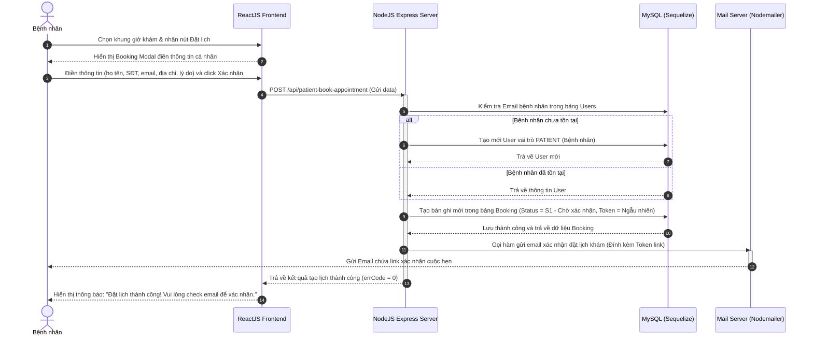

**Mô tả chi tiết luồng xử lý:**
1. **Chọn khung giờ:** Bệnh nhân chọn ca khám y tế mong muốn trên giao diện và bấm nút "Đặt lịch".
2. **Nhập thông tin:** Hệ thống hiển thị Modal điền thông tin (Booking Modal). Bệnh nhân điền các trường: Họ tên, Số điện thoại, Email, Địa chỉ, Lý do khám, Giới tính và nhấp nút "Xác nhận".
3. **Gửi API đặt lịch:** ReactJS gửi yêu cầu `POST /api/patient-book-appointment` chứa toàn bộ thông tin biểu mẫu sang Server.
4. **Xử lý tài khoản Bệnh nhân:**
   * Server NodeJS kiểm tra xem Email bệnh nhân đã tồn tại trong bảng `Users` chưa.
   * *Nếu chưa:* Server tạo mới một tài khoản với vai trò `PATIENT`, mật khẩu mặc định được hash.
   * *Nếu đã có:* Server lấy thông tin người dùng hiện tại để liên kết lịch hẹn.
5. **Tạo bản ghi Booking:** Server tạo mới bản ghi trong bảng `Booking` với trạng thái mặc định ban đầu là `S1` (Chờ xác nhận), đồng thời tạo ra một mã token ngẫu nhiên dạng chuỗi hash bảo mật duy nhất cho giao dịch này.
6. **Gửi Email xác thực:** Server NodeJS gọi thư viện `Nodemailer` thực hiện gửi email bất đồng bộ tới hòm thư của bệnh nhân. Nội dung email chứa đường link xác nhận có đính kèm tham số `token` và `doctorId`.
7. **Phản hồi Client:** Server trả về kết quả thành công (`errCode = 0`). ReactJS đóng modal đặt lịch và hiển thị thông điệp hướng dẫn bệnh nhân truy cập hòm thư để xác nhận.

---

### 2.3 Xác nhận lịch đặt hẹn qua Email
Mô tả tiến trình khi bệnh nhân nhấp chọn liên kết xác nhận lịch đặt trong email.

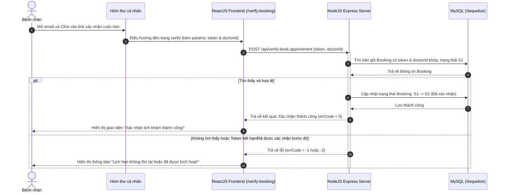

**Mô tả chi tiết luồng xử lý:**
1. **Nhấp liên kết:** Bệnh nhân mở hòm thư cá nhân và click chọn liên kết xác nhận y tế.
2. **Điều hướng Frontend:** Trình duyệt mở trang `/verify-booking?token=...&doctorId=...` trên giao diện ReactJS.
3. **Gửi yêu cầu kích hoạt:** ReactJS trích xuất tham số trên URL và tự động gọi API `POST /api/verify-book-appointment` truyền lên Server NodeJS.
4. **Xử lý xác thực phía Server:**
   * Server NodeJS thực hiện truy vấn bảng `Booking` tìm bản ghi khớp cả `token`, `doctorId` và đang ở trạng thái `S1` (Chờ xác nhận).
   * *Nếu không tìm thấy hoặc đã hết hạn:* Hệ thống báo lỗi và hiển thị thông báo trên Client: "Lịch hẹn không tồn tại hoặc đã được kích hoạt trước đó".
   * *Nếu tìm thấy hợp lệ:* Server thực hiện cập nhật trường `statusId` trong DB từ `S1` sang `S2` (Đã xác nhận).
5. **Hoàn tất:** Server phản hồi kết quả thành công (`errCode = 0`). ReactJS cập nhật giao diện hiển thị thông điệp chúc mừng bệnh nhân đã kích hoạt lịch hẹn thành công.

---

### 2.4 Tra cứu lịch sử cuộc hẹn & Tự hủy lịch hẹn
Mô tả quy trình bệnh nhân tự tra cứu lịch hẹn đã đặt của mình thông qua Email và tiến hành hủy lịch hẹn sắp tới.

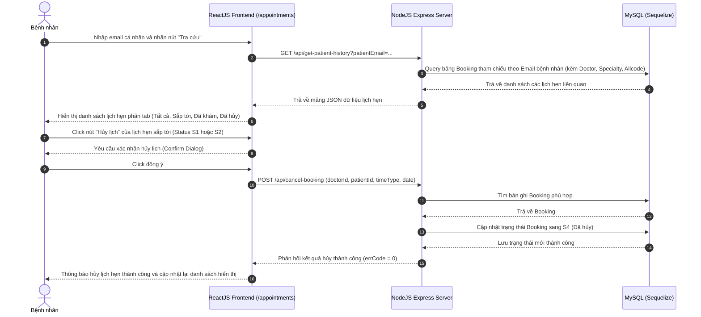

**Mô tả chi tiết luồng xử lý:**
1. **Yêu cầu tra cứu:** Bệnh nhân truy cập trang `/appointments`, nhập Email cá nhân của mình và nhấp nút "Tra cứu".
2. **Truy vấn danh sách lịch hẹn:**
   * ReactJS gửi yêu cầu `GET /api/get-patient-history?patientEmail=...` tới Server NodeJS.
   * Server thực hiện câu lệnh truy vấn quan hệ: bảng `Booking` liên kết với bảng `Users` theo Email, join với bảng `Allcode` để dịch các mã trạng thái (`statusId` S1-S4) và khung giờ (`timeType`).
   * MySQL trả về danh sách lịch hẹn. Server gửi danh sách này về ReactJS để hiển thị theo dạng các tab trực quan (Chờ xác nhận, Đã xác nhận, Đã khám, Đã hủy).
3. **Thao tác tự hủy lịch:**
   * Tại tab lịch hẹn sắp tới (trạng thái `S1` hoặc `S2`), bệnh nhân bấm nút "Hủy lịch".
   * Hệ thống hiển thị hộp thoại xác nhận hủy lịch y tế.
   * Khi người dùng đồng ý, ReactJS gửi API `POST /api/cancel-booking` kèm các tham số xác định duy nhất lịch hẹn y tế (`doctorId`, `patientId`, `timeType`, `date`).
   * Server kiểm tra tính hợp lệ và thực hiện cập nhật trường `statusId` của bản ghi trong bảng `Booking` thành `S4` (Đã hủy).
   * DB lưu thành công. Server phản hồi trạng thái hoàn tất về Client. ReactJS tải lại danh sách lịch hẹn mới cho người dùng.

---

### 2.5 Chỉnh sửa thông tin cá nhân
Mô tả quy trình bệnh nhân chỉnh sửa thông tin cá nhân (Họ tên, số điện thoại, địa chỉ, giới tính) của mình thông qua giao diện lịch sử đặt lịch và nhận email xác nhận thay đổi.

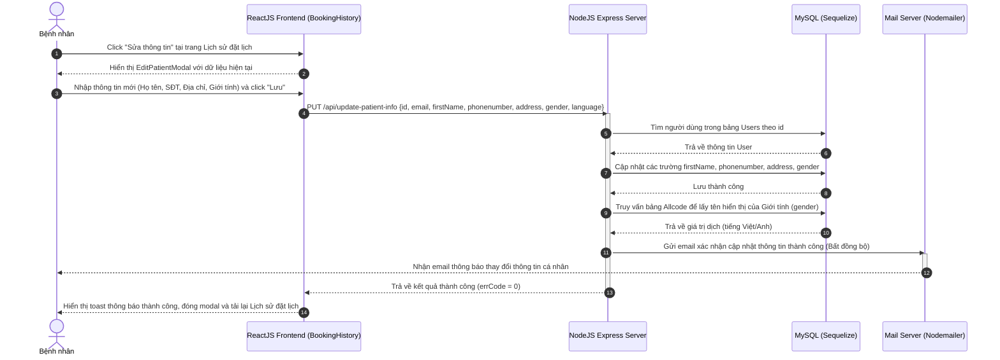

**Mô tả chi tiết luồng xử lý:**
1. **Mở Modal chỉnh sửa:** Tại giao diện lịch sử cuộc hẹn (`BookingHistory`), Bệnh nhân bấm nút "Sửa thông tin". ReactJS mở `EditPatientModal` hiển thị thông tin hiện tại của bệnh nhân.
2. **Lưu thông tin mới:** Bệnh nhân cập nhật Họ tên, Số điện thoại, Địa chỉ, Giới tính và bấm "Lưu".
3. **Gửi API cập nhật:** ReactJS gửi yêu cầu `PUT /api/update-patient-info` với các tham số tương ứng lên NodeJS Server.
4. **Xử lý cập nhật DB:**
   * Server NodeJS tìm kiếm người dùng trong bảng `Users` theo `id`.
   * Cập nhật các trường thông tin y tế (`firstName`, `phonenumber`, `address`, `gender`).
   * DB lưu lại thành công.
5. **Dịch mã hiển thị & gửi Email:**
   * Server truy vấn bảng `Allcode` để lấy giá trị dịch ngôn ngữ (Việt/Anh) của trường Giới tính nhằm mục đích hiển thị trực quan trong email.
   * Server gọi dịch vụ gửi mail bất đồng bộ (Nodemailer) gửi thông báo về hòm thư bệnh nhân xác nhận thông tin cá nhân của họ đã được cập nhật thành công trên hệ thống.
6. **Cập nhật giao diện:** Server phản hồi `errCode = 0`. ReactJS hiển thị thông báo Toast thành công, đóng modal và reload lại dữ liệu lịch sử đặt lịch để cập nhật hiển thị mới.

---

## 3. PHÂN HỆ BÁC SĨ (DOCTOR)

### 3.1 Xem lịch khám và danh sách bệnh nhân
Mô tả cách bác sĩ xem lịch khám và danh sách bệnh nhân hẹn khám theo ngày được chỉ định.

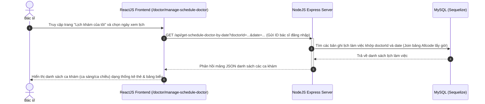

**Mô tả chi tiết luồng xử lý:**
1. **Chọn ngày làm việc:** Bác sĩ truy cập vào phân hệ `/doctor/manage-schedule-doctor` và lựa chọn ngày làm việc trên bộ lịch chọn ngày.
2. **Gửi API truy vấn:** ReactJS gửi yêu cầu `GET /api/get-schedule-doctor-by-date` mang theo `doctorId` của bác sĩ hiện tại đang đăng nhập và ngày `date` đã chọn.
3. **Xử lý CSDL:**
   * Server NodeJS thực hiện câu lệnh truy vấn bảng `Schedule` lọc theo `doctorId` và `date`.
   * Thực hiện kết nối (Join) với bảng `Allcode` để lấy nhãn hiển thị thời gian tương ứng (ví dụ: `8:00 - 9:00`).
   * CSDL trả về dữ liệu lịch trình của ngày hôm đó.
4. **Hiển thị kết quả:** Server NodeJS trả về mảng dữ liệu JSON. ReactJS nhận dữ liệu và kết xuất lên màn hình dạng các thẻ khung giờ khám và danh sách bệnh nhân tương ứng thuộc ngày đó để bác sĩ theo dõi ca trực.

---

### 3.2 Xác nhận khám xong và gửi đơn thuốc/hóa đơn
Mô tả nghiệp vụ khi bác sĩ hoàn thành buổi khám, thực hiện lưu hồ sơ bệnh án và gửi đơn thuốc/hóa đơn cho bệnh nhân để hoàn thành quy trình.

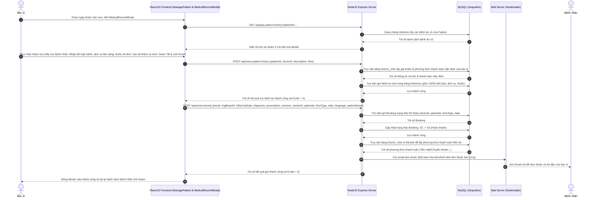

**Mô tả chi tiết luồng xử lý:**
1. **Tra cứu bệnh sử cũ (Medical History):**
   * Bác sĩ mở `MedicalRecordModal` cho một bệnh nhân trong danh sách chờ khám.
   * ReactJS gửi yêu cầu `GET /api/get-patient-history?patientId=...` lên Server.
   * Server truy vấn bảng `Histories` lấy toàn bộ các lần khám bệnh trong quá khứ của bệnh nhân này. Dữ liệu bệnh án cũ được hiển thị trực quan ở cột bên trái Modal giúp bác sĩ có góc nhìn tổng quan.
2. **Nhập hồ sơ bệnh án mới:**
   * Bác sĩ khám lâm sàng, sau đó nhập thông tin kết luận chẩn đoán, thuốc kê đơn, hẹn tái khám và đính kèm các dịch vụ cận lâm sàng y tế (siêu âm, xét nghiệm...). Bác sĩ bấm nút "Hoàn Tất & Gửi Email".
   * Giao diện gửi yêu cầu `POST /api/save-patient-history` lên Server NodeJS để tạo hồ sơ bệnh án.
   * Server truy vấn bảng `Doctor_Infor` để lấy giá khám gốc và phương thức thanh toán mặc định của bác sĩ.
   * Server thêm bản ghi bệnh án mới vào bảng `Histories` lưu giữ JSON chẩn đoán y khoa.
3. **Gửi Remedy và Đóng ca khám:**
   * Giao diện ReactJS gửi tiếp yêu cầu `POST /api/send-remedy` chứa toàn bộ thông tin chẩn đoán, đơn thuốc, chi phí dịch vụ, hóa đơn dạng ảnh Base64.
   * Server tìm bản ghi `Booking` có trạng thái `S2` (Đã xác nhận) khớp các thông tin cuộc hẹn hiện tại và tiến hành cập nhật trạng thái cuộc hẹn y tế này lên `S3` (Đã khám/Hoàn thành).
   * Server gửi email đơn thuốc điện tử chứa đầy đủ lời dặn, thuốc kê đơn, chi phí chỉ định và ảnh hóa đơn/đơn thuốc về email bệnh nhân.
   * Server trả về kết quả thành công. Giao diện ReactJS đóng Modal, thông báo thành công và tải lại danh sách bệnh nhân của ngày để loại bỏ bệnh nhân đã khám xong khỏi danh sách chờ.

---

### 3.3 Hủy lịch hẹn bệnh nhân
Mô tả luồng nghiệp vụ khi bác sĩ chủ động hủy ca khám của bệnh nhân vì lý do khách quan (ví dụ: lịch bận đột xuất).

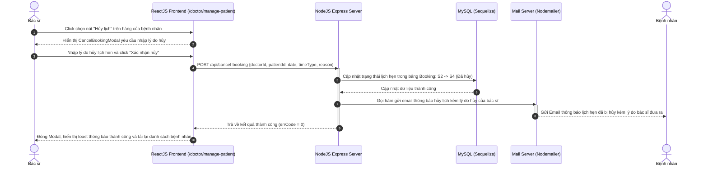

**Mô tả chi tiết luồng xử lý:**
1. **Yêu cầu hủy:** Bác sĩ nhấp chọn nút "Hủy lịch" trên hàng danh sách của một bệnh nhân đang chờ khám.
2. **Nhập lý do hủy:** Hệ thống hiển thị `CancelBookingModal`. Bác sĩ nhập lý do hủy lịch hẹn y tế và click nút "Xác nhận hủy".
3. **Gửi yêu cầu API:** ReactJS gửi yêu cầu `POST /api/cancel-booking` chứa các tham số `{doctorId, patientId, date, timeType, reason}` lên NodeJS Server.
4. **Cập nhật trạng thái:**
   * Server NodeJS cập nhật trạng thái bản ghi trong bảng `Booking` từ `S2` (Đã xác nhận) sang trạng thái `S4` (Đã hủy).
   * Đồng thời lưu lý do hủy vào CSDL.
5. **Gửi Email thông báo:** Server tự động gọi hệ thống gửi email gửi thông báo hủy lịch kèm lý do chi tiết từ bác sĩ tới email của bệnh nhân.
6. **Hoàn tất:** Server NodeJS phản hồi kết quả thành công (`errCode = 0`). ReactJS đóng modal hủy lịch, hiển thị toast thông báo hoàn tất nghiệp vụ và tự động cập nhật tải lại danh sách bệnh nhân.

---

### 3.4 Cập nhật hồ sơ thông tin cá nhân
Mô tả quy trình bác sĩ tự cập nhật thông tin cá nhân và chỉnh sửa nội dung bài viết giới thiệu chuyên môn trên trang cá nhân của mình.

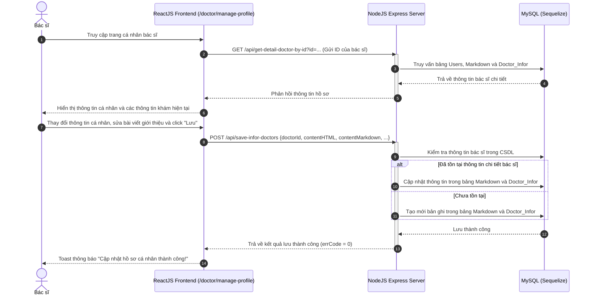

**Mô tả chi tiết luồng xử lý:**
1. **Truy cập hồ sơ:** Bác sĩ truy cập vào trang thiết lập thông tin cá nhân `/doctor/manage-profile`.
2. **Tải thông tin cũ:**
   * ReactJS gọi API `GET /api/get-detail-doctor-by-id?id=...`.
   * Server NodeJS thực hiện câu lệnh truy vấn SELECT kết hợp các bảng `Users` (thông tin tài khoản), `Markdown` (bài viết giới thiệu chi tiết) và `Doctor_Infor` (thông tin giá khám, chuyên khoa, phòng khám liên kết).
   * Dữ liệu trả về được đổ lên form nhập liệu để bác sĩ sửa đổi.
3. **Lưu cập nhật mới:**
   * Bác sĩ điều chỉnh các thông tin cá nhân và cập nhật bài viết giới thiệu dưới dạng trình soạn thảo Markdown, sau đó bấm nút "Lưu".
   * Giao diện gửi yêu cầu `POST /api/save-infor-doctors` mang theo toàn bộ dữ liệu mới lên Server.
   * Server kiểm tra xem thông tin chi tiết bác sĩ đã tồn tại trong CSDL chưa. Nếu đã có thì thực hiện câu lệnh UPDATE, nếu chưa có thì thực hiện INSERT bản ghi mới vào bảng `Markdown` và `Doctor_Infor`.
4. **Phản hồi:** CSDL lưu thành công, Server NodeJS phản hồi trạng thái hoàn tất về Client. ReactJS hiển thị thông báo Toast cập nhật hồ sơ cá nhân thành công.

---

## 4. PHÂN HỆ QUẢN TRỊ VIÊN (ADMIN)

### 4.1 Quản lý người dùng
Mô tả quy trình Admin thực hiện thao tác quản lý tài khoản người dùng hệ thống. Chức năng dưới đây đặc tả việc tạo mới người dùng, các chức năng sửa/xóa/đọc có luồng tương tự.

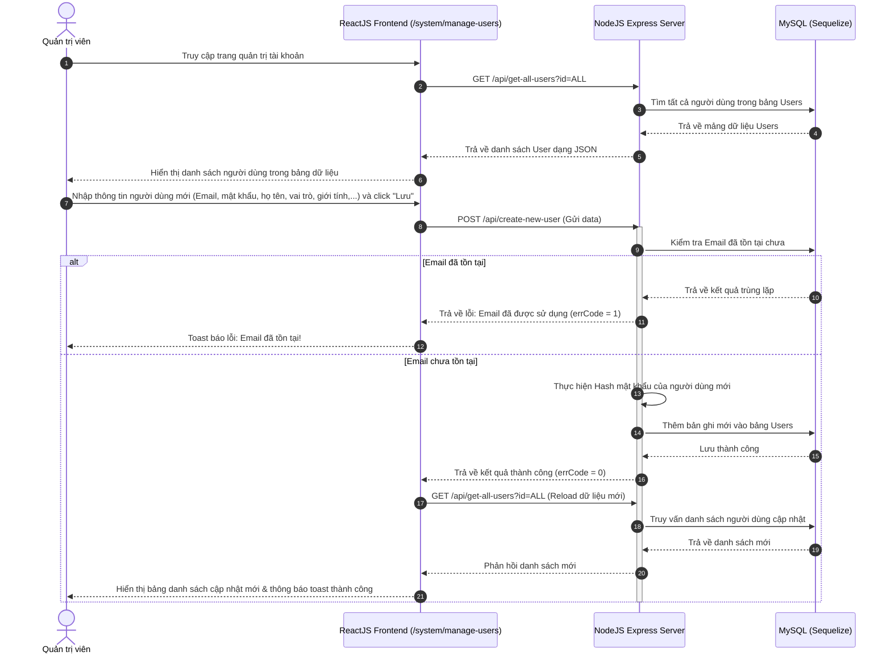

**Mô tả chi tiết luồng xử lý:**
1. **Tải danh sách người dùng:**
   * Khi truy cập trang `/system/manage-users`, ReactJS gọi API `GET /api/get-all-users?id=ALL`.
   * Server NodeJS truy vấn bảng `Users` lấy danh sách toàn bộ tài khoản hiện tại trong hệ thống.
   * Trả về mảng JSON dữ liệu người dùng để ReactJS hiển thị lên bảng dữ liệu (Data Table).
2. **Tạo mới người dùng (Create User Flow):**
   * Admin điền thông tin tài khoản mới tại form đăng ký (Email, Mật khẩu, Họ tên, SĐT, Giới tính, Vai trò, Chức danh...) và click "Lưu".
   * ReactJS gửi yêu cầu `POST /api/create-new-user` mang dữ liệu sang Server NodeJS.
   * Server kiểm tra xem Email này đã tồn tại trong CSDL chưa. Nếu trùng lặp, trả về `errCode = 1` và ReactJS hiển thị Toast báo lỗi email đã tồn tại.
   * Nếu email hợp lệ, Server tiến hành mã hóa mật khẩu bằng thuật toán `bcrypt` và ghi bản ghi mới vào bảng `Users` với vai trò và giới tính đã chọn.
3. **Lưu & Tải lại:**
   * DB lưu thành công. Server phản hồi `errCode = 0`.
   * Frontend nhận kết quả thành công liền tự động kích hoạt lại hàm gọi danh sách người dùng `GET /api/get-all-users?id=ALL` để làm mới danh sách hiển thị trên giao diện, đồng thời hiển thị thông báo Toast thành công cho Admin. Do đó, quy trình hiển thị danh sách mới được cập nhật liên tục.

---

### 4.2 Cấu hình thông tin chi tiết bác sĩ
Mô tả quy trình Admin thiết lập giá khám, chuyên khoa, phòng khám liên kết và bài viết giới thiệu cho bác sĩ.

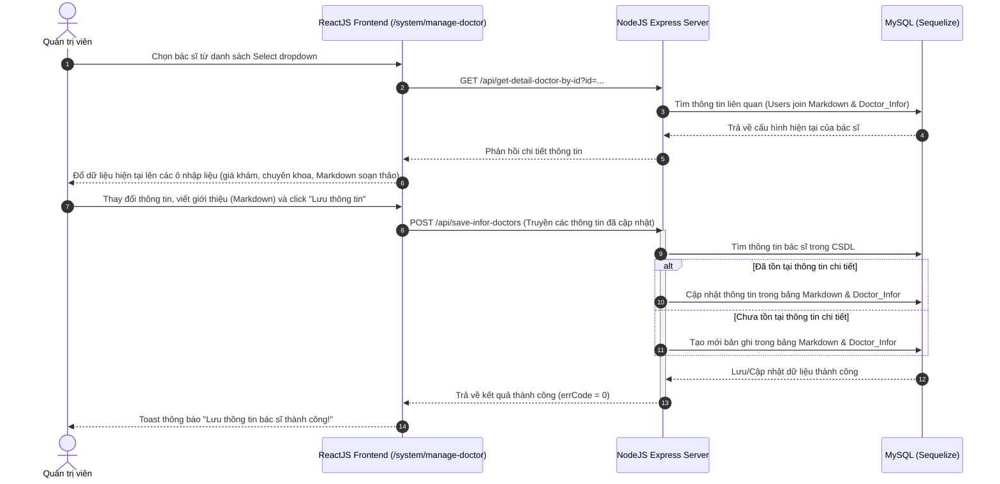

**Mô tả chi tiết luồng xử lý:**
1. **Chọn Bác sĩ cần cấu hình:** Admin truy cập `/system/manage-doctor` và chọn tên bác sĩ từ Select dropdown.
2. **Tải thông tin hiện tại:**
   * Hệ thống tự động gọi API `GET /api/get-detail-doctor-by-id?id=...`.
   * Server NodeJS truy vấn dữ liệu chi tiết của bác sĩ y khoa từ bảng `Users`, `Markdown`, `Doctor_Infor` gửi về Client.
   * ReactJS đổ dữ liệu lên các ô điền thông tin (giá khám, chuyên khoa liên kết, phòng khám liên kết, bài giới thiệu dạng văn bản Markdown).
3. **Cập nhật cấu hình:**
   * Admin sửa đổi giá khám, chọn chuyên khoa/phòng khám mới cho bác sĩ, chỉnh sửa bài viết Markdown giới thiệu bác sĩ và click nút "Lưu thông tin".
   * ReactJS gửi yêu cầu `POST /api/save-infor-doctors` lên Server NodeJS.
   * Server thực hiện kiểm tra trong CSDL: nếu thông tin bác sĩ đã tồn tại thì UPDATE bảng `Markdown` và `Doctor_Infor`, ngược lại thì INSERT tạo mới.
4. **Phản hồi:** DB lưu thành công, Server NodeJS phản hồi kết quả. ReactJS hiển thị Toast báo cáo cấu hình thành công.

---

### 4.3 Tạo lịch làm việc cho bác sĩ
Mô tả quy trình Admin chủ động thiết lập hoặc điều chỉnh khung thời gian làm việc (ca khám bệnh) cho từng bác sĩ.

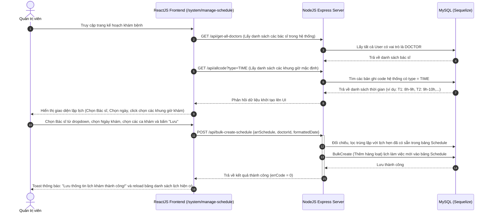

**Mô tả chi tiết luồng xử lý:**
1. **Tải dữ liệu khởi tạo:**
   * Khi Admin truy cập `/system/manage-schedule`, giao diện gửi các yêu cầu: `GET /api/get-all-doctors` để lấy danh sách bác sĩ y khoa và `GET /api/allcode?type=TIME` để lấy danh sách các khung giờ ca khám mặc định.
   * Server truy vấn bảng `Users` (vai trò `DOCTOR`) và bảng `Allcode` (có `type = TIME`), sau đó trả về dữ liệu cho Client hiển thị.
2. **Thiết lập lịch làm việc:**
   * Admin chọn tên Bác sĩ y khoa từ dropdown, chọn Ngày làm việc cụ thể và nhấp chọn các khung ca khám mong muốn (ví dụ: ca 8h-9h, 10h-11h). Bấm nút "Lưu".
   * ReactJS gửi dữ liệu mảng lịch biểu y tế qua API `POST /api/bulk-create-schedule`.
3. **Ghi nhận hàng loạt (Bulk Create):**
   * Server NodeJS nhận mảng ca khám, tiến hành đối chiếu loại bỏ các ca trùng lặp đã tồn tại trong CSDL cho ngày và bác sĩ đó.
   * Sử dụng lệnh `bulkCreate` của Sequelize ghi đồng thời danh sách ca khám mới vào bảng `Schedule`.
4. **Hoàn tất:** DB lưu thành công. Server gửi phản hồi. ReactJS hiển thị thông báo lưu thành công và tải lại bảng danh sách lịch hiện hữu.

---

### 4.4 Quản lý chuyên khoa
Mô tả luồng công việc của Admin khi thiết lập danh mục Chuyên khoa y khoa mới hoặc sửa đổi chuyên khoa cũ.

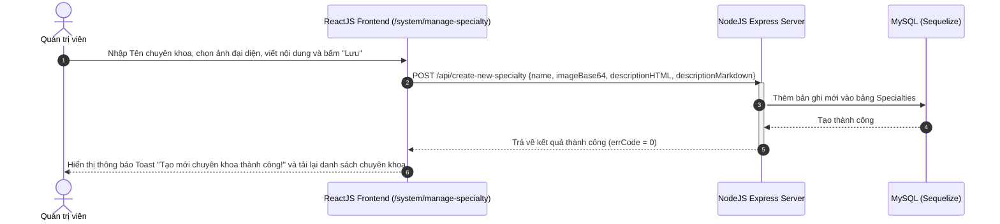

**Mô tả chi tiết luồng xử lý:**
1. **Khai báo chuyên khoa:** Admin điền tên chuyên khoa y tế, tải lên hình ảnh đại diện (Base64), viết nội dung mô tả chi tiết của chuyên khoa và bấm "Lưu".
2. **Gửi API tạo mới:** ReactJS gửi dữ liệu qua yêu cầu `POST /api/create-new-specialty` tới Server NodeJS.
3. **Xử lý DB:**
   * Server NodeJS tiếp nhận và ghi bản ghi mới vào bảng `Specialties` (Lưu tên chuyên khoa, hình ảnh đại diện dạng chuỗi Base64 dài, bài viết HTML và Markdown).
   * CSDL lưu dữ liệu y khoa thành công.
4. **Cập nhật giao diện:** Server phản hồi `errCode = 0`. ReactJS thông báo Toast thành công chuyên khoa mới và tự động tải lại danh sách chuyên khoa trên giao diện.

---

### 4.5 Cấu hình thông tin phòng khám
Mô tả quy trình Admin thiết lập và cập nhật thông tin giới thiệu, địa chỉ, hình ảnh cho cơ sở y tế duy nhất của hệ thống.

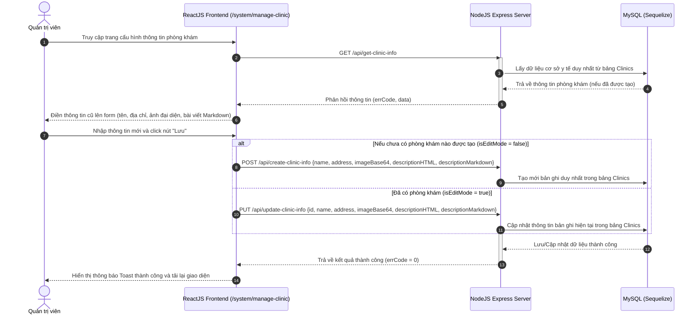

**Mô tả chi tiết luồng xử lý:**
1. **Tải thông tin hiện có:**
   * Khi Admin truy cập màn hình `/system/manage-clinic`, ReactJS tự động gọi API `GET /api/get-clinic-info`.
   * Server truy vấn bảng `Clinics` để tìm bản ghi cơ sở y tế duy nhất của hệ thống.
   * Nếu có dữ liệu phòng khám cũ, trả về JSON để ReactJS điền sẵn lên các trường form (Tên phòng khám, địa chỉ, ảnh đại diện, bài viết giới thiệu Markdown).
2. **Lưu cấu hình y tế:**
   * Admin nhập thông tin mới hoặc thay đổi địa chỉ phòng khám, ảnh đại diện và nhấp nút "Lưu".
   * Hệ thống kiểm tra chế độ:
     * *Nếu chưa có phòng khám nào trong CSDL (`isEditMode = false`):* ReactJS gọi API `POST /api/create-clinic-info` để Server thêm bản ghi mới vào bảng `Clinics`.
     * *Nếu đã tồn tại phòng khám (`isEditMode = true`):* ReactJS gọi API `PUT /api/update-clinic-info` để Server cập nhật bản ghi hiện hành trong bảng `Clinics`.
3. **Hoàn tất cập nhật:** CSDL lưu/cập nhật dữ liệu thành công. Server trả về kết quả thành công (`errCode = 0`). ReactJS thông báo toast thành công và cập nhật lại giao diện hiển thị.

---

### 4.6 Quản lý lịch đặt khám toàn hệ thống
Mô tả quy trình Admin giám sát lịch đặt hẹn khám, thực hiện xác nhận/hủy lịch hẹn, tiến hành thủ tục checkout thanh toán (tính phí dịch vụ lâm sàng động từ hồ sơ bác sĩ khám gần nhất) và in hóa đơn thanh toán cho bệnh nhân.

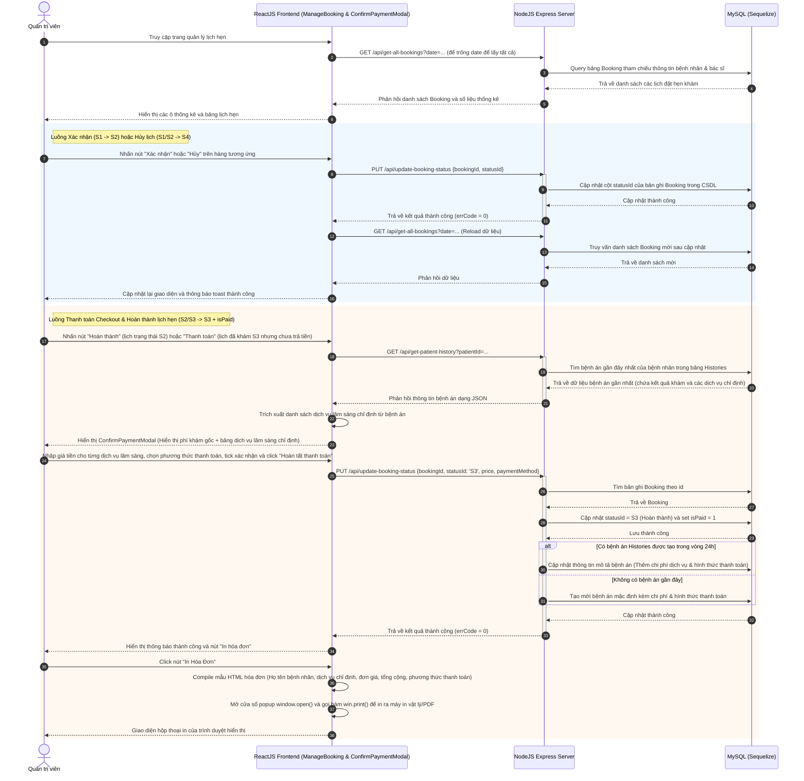

**Mô tả chi tiết luồng xử lý:**
1. **Tải lịch đặt hẹn:**
   * Admin truy cập trang `/system/manage-booking`. Hệ thống gọi API `GET /api/get-all-bookings` lọc theo ngày.
   * Server NodeJS thực hiện truy vấn bảng `Booking` join với bảng `Users` (lấy họ tên bệnh nhân, bác sĩ) gửi về Frontend hiển thị dạng bảng lịch hẹn kèm theo trạng thái.
2. **Quy trình xác nhận/hủy thông thường:**
   * Admin bấm nút "Xác nhận" (từ trạng thái Chờ xác nhận `S1` sang Đã xác nhận `S2`) hoặc nút "Hủy" (sang trạng thái Đã hủy `S4`) trực tiếp trên bảng.
   * ReactJS gửi yêu cầu cập nhật trạng thái `PUT /api/update-booking-status` tới Server NodeJS.
   * Server lưu thay đổi trạng thái vào DB và phản hồi thành công. Giao diện tải lại dữ liệu mới cập nhật.
3. **Cổng thanh toán Checkout nâng cao & In hóa đơn:**
   * **Bước 1: Tải bệnh án gần nhất:** Khi Admin chọn lịch ở trạng thái `S2` để Hoàn thành khám, hoặc lịch trạng thái `S3` (Đã khám) để thanh toán, ReactJS gửi yêu cầu `GET /api/get-patient-history?patientId=...` tới Server NodeJS.
   * **Bước 2: Hiển thị hóa đơn y tế:** Server trả về hồ sơ bệnh án gần nhất (chứa thông tin chẩn đoán, thuốc kê đơn, dịch vụ y tế chỉ định). ReactJS trích xuất danh sách dịch vụ lâm sàng và hiển thị `ConfirmPaymentModal` bao gồm tiền khám gốc cùng bảng danh sách dịch vụ cận lâm sàng chi tiết để Admin nhập đơn giá riêng cho từng dịch vụ và tự động tính tổng tiền.
   * **Bước 3: Xác nhận thanh toán:** Admin chọn hình thức thanh toán (Tiền mặt/Chuyển khoản...), click xác nhận và bấm nút "Hoàn tất thanh toán". ReactJS gọi API `PUT /api/update-booking-status` truyền thông tin thanh toán (`statusId: S3`, `price`, `paymentMethod`, `isPaid: 1`).
   * **Bước 4: Đồng bộ bệnh án:** Server NodeJS cập nhật bảng `Booking` chuyển trạng thái sang `S3` và set `isPaid = 1`. Đồng thời cập nhật thông tin chi tiết hóa đơn (chi phí dịch vụ & hình thức thanh toán) vào bản ghi bệnh án tương ứng trong bảng `Histories`.
   * **Bước 5: In hóa đơn:** Server phản hồi thành công. ReactJS hiển thị nút "In hóa đơn". Khi Admin nhấp chọn, giao diện biên dịch mẫu HTML hóa đơn thanh toán chi tiết, mở cửa sổ pop-up mới và gọi lệnh `window.print()` kích hoạt hộp thoại in vật lý hoặc xuất file PDF của hệ điều hành.

---
*Tài liệu biểu đồ tuần tự được viết dựa trên luồng API thực tế của dự án.*
