# BIỂU ĐỒ TUẦN TỰ HỆ THỐNG
## HỆ THỐNG ĐẶT LỊCH KHÁM BỆNH TRỰC TUYẾN (HEALTHCARE BOOKING SYSTEM)

Tài liệu này cung cấp các biểu đồ tuần tự (Sequence Diagrams) mô tả chi tiết luồng tương tác giữa các thành phần trong hệ thống: **Người dùng (Bệnh nhân/Bác sĩ/Admin)**, **Giao diện Client (ReactJS)**, **Máy chủ (NodeJS API)**, **Cơ sở dữ liệu (MySQL Database/Sequelize)** và **Hệ thống gửi Email**.

---

## MỤC LỤC
1. [XÁC THỰC TÀI KHOẢN (AUTHENTICATION)](#1-xác-thực-tài-khoản-authentication)
   - [1.1 Đăng nhập hệ thống](#11-đăng-nhập-hệ-thống)
   - [1.2 Đăng xuất hệ thống](#12-đăng-xuất-hệ-thống)
2. [PHÂN HỆ BỆNH NHÂN (PATIENT)](#2-phân-hệ-bệnh-nhân-patient)
   - [2.1 Tìm kiếm & Xem chi tiết thông tin](#21-tìm-kiếm--xem-chi-tiết-thông-tin)
   - [2.2 Đặt lịch hẹn khám bệnh](#22-đặt-lịch-hẹn-khám-bệnh)
   - [2.3 Xác nhận đặt lịch qua Email](#23-xác-nhận-đặt-lịch-qua-email)
   - [2.4 Tra cứu lịch sử & Hủy lịch khám](#24-tra-cứu-lịch-sử--hủy-lịch-khám)
3. [PHÂN HỆ BÁC SĨ (DOCTOR)](#3-phân-hệ-bác-sĩ-doctor)
   - [3.1 Xem lịch làm việc/ca khám](#31-xem-lịch-làm-việcca-khám)
   - [3.2 Xác nhận khám xong & Gửi hóa đơn/đơn thuốc](#32-xác-nhận-khám-xong--gửi-hóa-đơnđơn-thuốc)
   - [3.3 Hủy lịch hẹn của bệnh nhân](#33-hủy-lịch-hẹn-của-bệnh-nhân)
4. [PHÂN HỆ QUẢN TRỊ VIÊN (ADMIN)](#4-phân-hệ-quản-trị-viên-admin)
   - [4.1 Quản lý người dùng (CRUD Users)](#41-quản-lý-người-dùng-crud-users)
   - [4.2 Cấu hình thông tin chi tiết bác sĩ](#42-cấu-hình-thông-tin-chi-tiết-bác-sĩ)
   - [4.3 Thiết lập lịch khám cho bác sĩ](#43-thiết-lập-lịch-khám-cho-bác-sĩ)
   - [4.4 Quản lý Chuyên khoa (CRUD Specialty)](#44-quản-lý-chuyên-khoa-crud-specialty)
   - [4.5 Cấu hình Thông tin Phòng khám (Cơ sở y tế)](#45-cấu-hình-thông-tin-phòng-khám-cơ-sở-y-tế)
   - [4.6 Quản lý lịch hẹn toàn hệ thống](#46-quản-lý-lịch-hẹn-toàn-hệ-thống)

---

## 1. XÁC THỰC TÀI KHOẢN (AUTHENTICATION)

### 1.1 Đăng nhập hệ thống
Mô tả quy trình người dùng (Admin, Bác sĩ, hoặc Bệnh nhân) đăng nhập vào hệ thống để xác thực quyền truy cập.

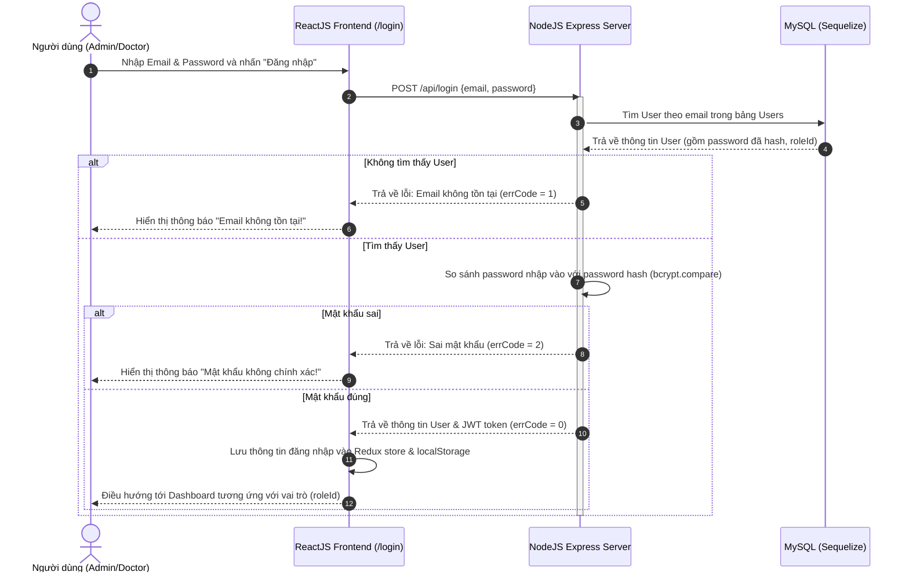

---

### 1.2 Đăng xuất hệ thống
Mô tả tiến trình xóa phiên làm việc và đăng xuất khỏi giao diện hệ thống.

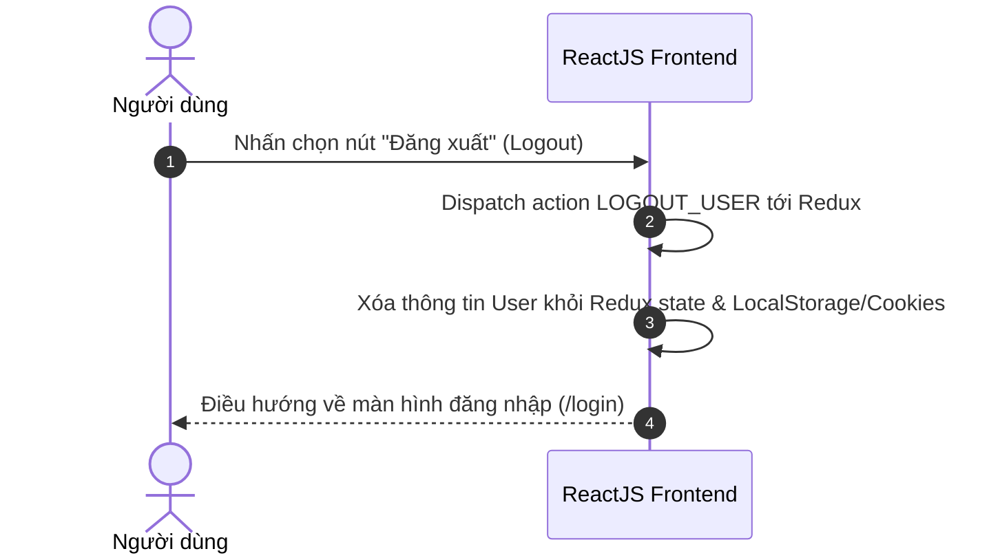

---

## 2. PHÂN HỆ BỆNH NHÂN (PATIENT)

### 2.1 Tìm kiếm & Xem chi tiết thông tin
Mô tả cách bệnh nhân tìm kiếm thông tin phòng khám, chuyên khoa hoặc bác sĩ và xem chi tiết trên giao diện.

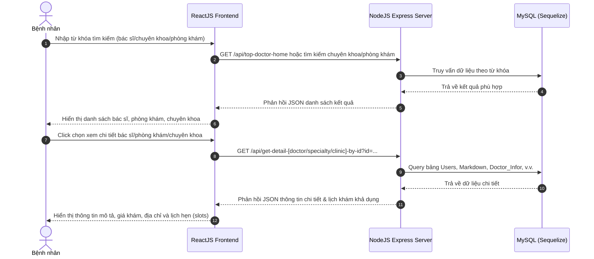

---

### 2.2 Đặt lịch hẹn khám bệnh
Mô tả quy trình bệnh nhân điền thông tin và yêu cầu đặt lịch khám bệnh trên hệ thống.

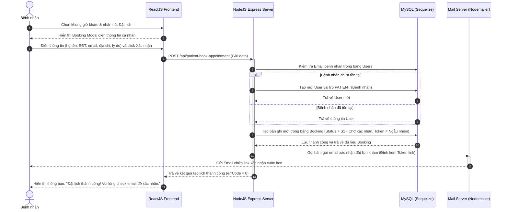

---

### 2.3 Xác nhận đặt lịch qua Email
Mô tả tiến trình khi bệnh nhân nhấp chọn liên kết xác nhận lịch đặt trong email.

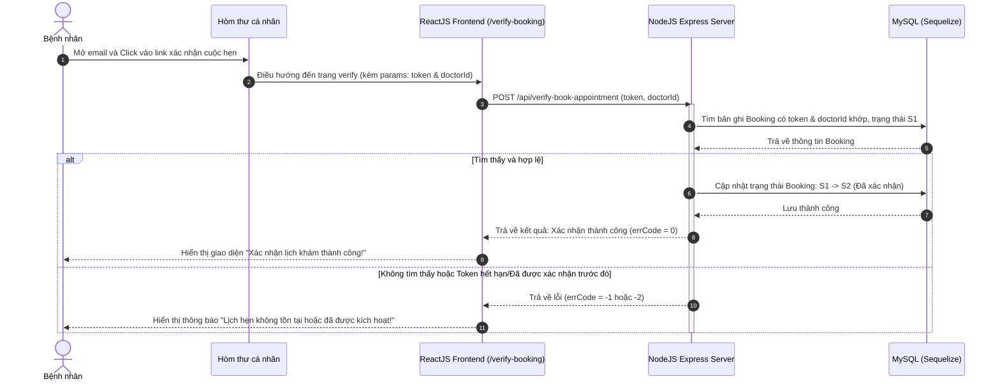

---

### 2.4 Tra cứu lịch sử & Hủy lịch khám
Mô tả quy trình bệnh nhân tự tra cứu lịch hẹn đã đặt của mình thông qua Email và tiến hành hủy lịch hẹn sắp tới.

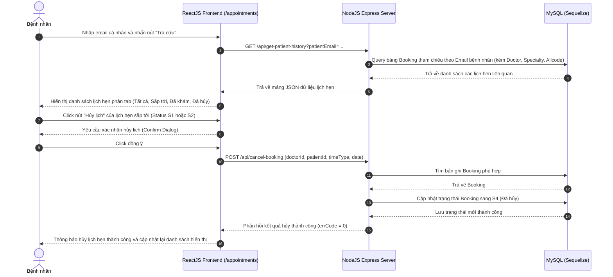

---

## 3. PHÂN HỆ BÁC SĨ (DOCTOR)

### 3.1 Xem lịch làm việc/ca khám
Mô tả cách bác sĩ xem lịch làm việc (ca khám bệnh) được Admin thiết lập cho mình.

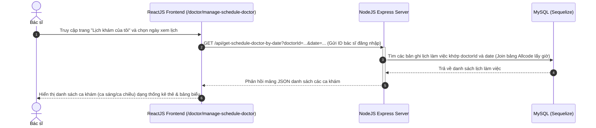

---

### 3.2 Xác nhận khám xong & Gửi hóa đơn/đơn thuốc
Mô tả nghiệp vụ khi bác sĩ hoàn thành buổi khám và gửi bệnh án/hóa đơn cho bệnh nhân để kết thúc quy trình.

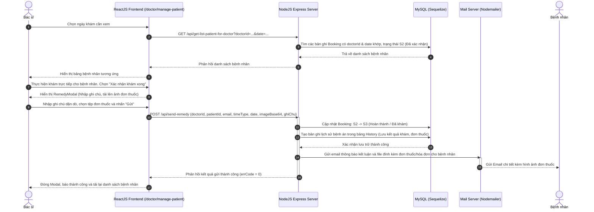

---

### 3.3 Hủy lịch hẹn của bệnh nhân
Mô tả luồng nghiệp vụ khi bác sĩ chủ động hủy ca khám của bệnh nhân vì lý do khách quan (ví dụ: lịch bận đột xuất).

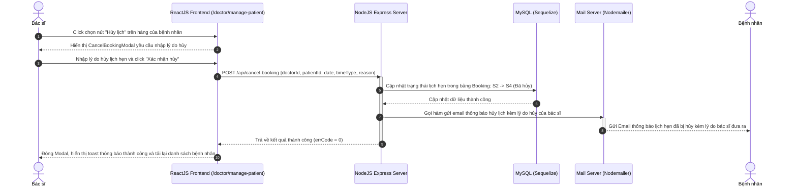

---

## 4. PHÂN HỆ QUẢN TRỊ VIÊN (ADMIN)

### 4.1 Quản lý người dùng (CRUD Users)
Mô tả quy trình Admin thực hiện thao tác quản lý tài khoản người dùng hệ thống. Chức năng dưới đây đặc tả việc tạo mới người dùng, các chức năng sửa/xóa/đọc có luồng tương tự.

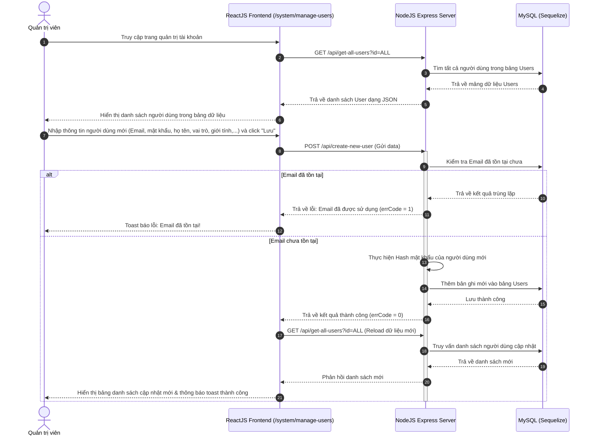

---

### 4.2 Cấu hình thông tin chi tiết bác sĩ
Mô tả quy trình Admin thiết lập giá khám, chuyên khoa, phòng khám liên kết và bài viết giới thiệu cho bác sĩ.

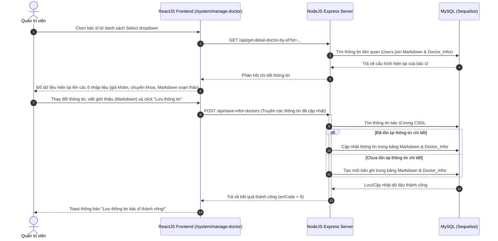

---

### 4.3 Thiết lập lịch khám cho bác sĩ
Mô tả quy trình Admin chủ động thiết lập hoặc điều chỉnh khung thời gian làm việc (ca khám bệnh) cho từng bác sĩ.

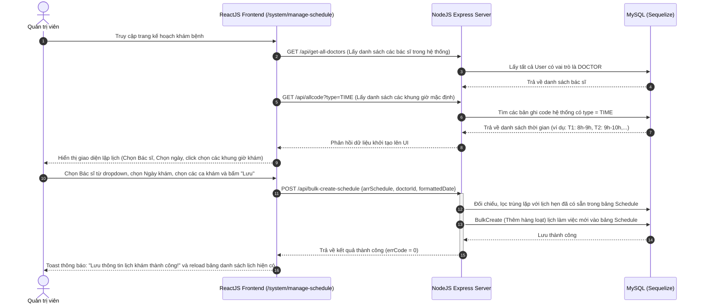

---

### 4.4 Quản lý Chuyên khoa (CRUD Specialty)
Mô tả luồng công việc của Admin khi thiết lập danh mục Chuyên khoa y khoa mới hoặc sửa đổi chuyên khoa cũ.

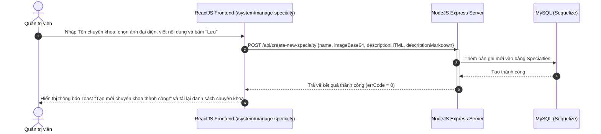

---

### 4.5 Cấu hình Thông tin Phòng khám (Cơ sở y tế)
Mô tả quy trình Admin thiết lập và cập nhật thông tin giới thiệu, địa chỉ, hình ảnh cho cơ sở y tế duy nhất của hệ thống.

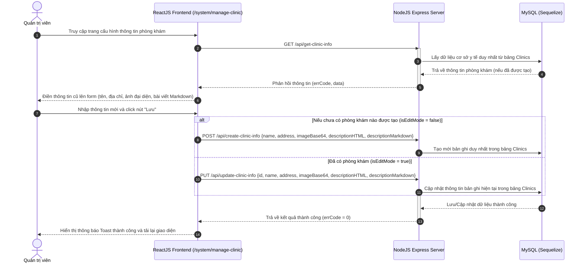

---

### 4.6 Quản lý lịch hẹn toàn hệ thống
Mô tả quy trình Admin giám sát và thay đổi trạng thái các lịch đặt khám của bệnh nhân trên hệ thống.

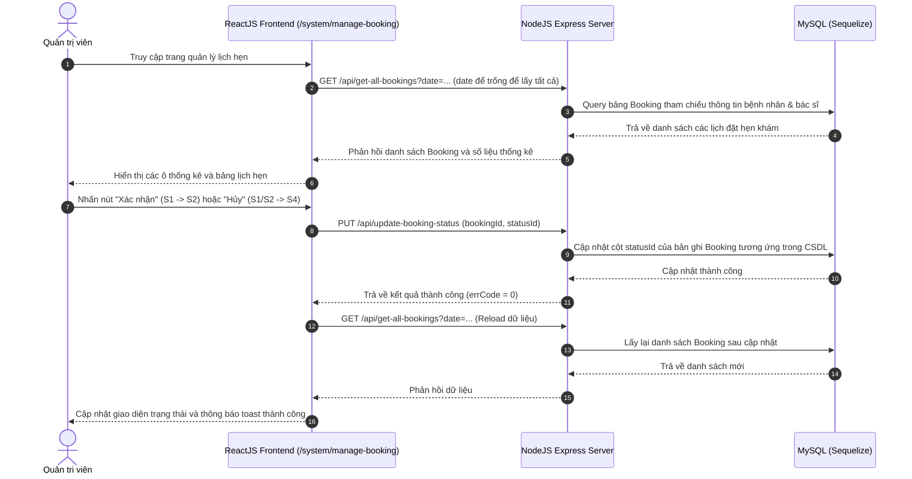

---
*Tài liệu biểu đồ tuần tự được viết dựa trên luồng API thực tế của dự án.*
