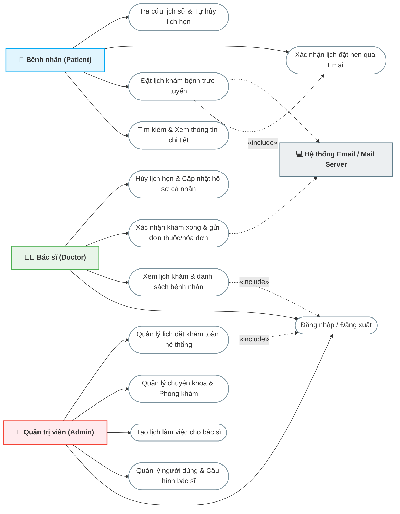
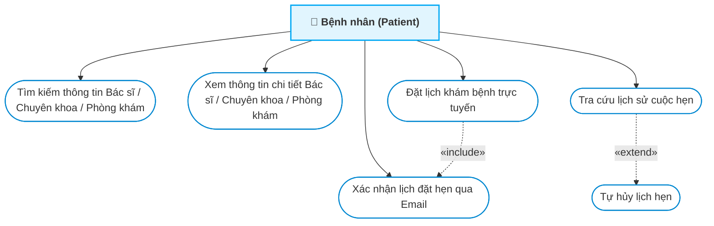
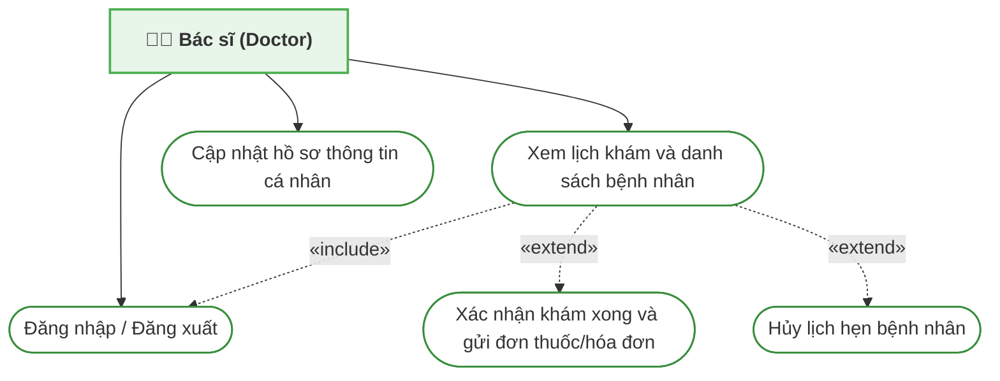
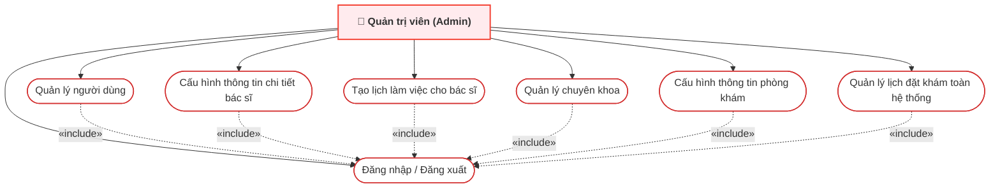

# PHÂN TÍCH HỆ THỐNG & BIỂU ĐỒ USE CASE
## HỆ THỐNG ĐẶT LỊCH KHÁM BỆNH TRỰC TUYẾN (HEALTHCARE BOOKING SYSTEM)

Tài liệu này cung cấp phân tích chi tiết về hệ thống đặt lịch khám bệnh trực tuyến, xác định các tác nhân (Actors), các trường hợp sử dụng (Use Cases) tương ứng, sơ đồ Use Case trực quan sử dụng Mermaid, và đặc tả chi tiết cho các luồng nghiệp vụ cốt lõi.

---

## MỤC LỤC
1. [TỔNG QUAN HỆ THỐNG](#1-tổng-quan-hệ-thống)
2. [PHÂN TÍCH TÁC NHÂN (ACTORS)](#2-phân-tích-tác-nhân-actors)
3. [DANH SÁCH & PHÂN NHÓM USE CASE](#3-danh-sách--phân-nhóm-use-case)
4. [BIỂU ĐỒ USE CASE (USE CASE DIAGRAMS)](#4-biểu-đồ-use-case-use-case-diagrams)
   - [4.1 Biểu đồ Use Case Tổng Quan](#41-biểu-đồ-use-case-tổng-quan)
   - [4.2 Biểu đồ Use Case Chi Tiết - Bệnh Nhân](#42-biểu-đồ-use-case-chi-tiết---bệnh-nhân)
   - [4.3 Biểu đồ Use Case Chi Tiết - Bác Sĩ](#43-biểu-đồ-use-case-chi-tiết---bác-sĩ)
   - [4.4 Biểu đồ Use Case Chi Tiết - Admin](#44-biểu-đồ-use-case-chi-tiết---admin)
5. [ĐẶC TẢ CHI TIẾT CÁC USE CASE TRỌNG TÂM](#5-đặc-tả-chi-tiết-các-use-case-trọng-tâm)
   - [5.1 Đặt Lịch Hẹn Khám Bệnh (Patient Book Appointment)](#51-đặt-lịch-hẹn-khám-bệnh-patient-book-appointment)
   - [5.2 Xác Nhận Khám & Gửi Hóa Đơn/Đơn Thuốc (Doctor Send Remedy)](#52-xác-nhận-khám--gửi-hóa-đơnđơn-thuốc-doctor-send-remedy)
   - [5.3 Cấu hình Thông tin Phòng khám (Admin Configure Clinic)](#53-cấu-hình-thông-tin-phòng-khám-admin-configure-clinic)
   - [5.4 Quản Lý Lịch Hẹn Toàn Hệ Thống (Admin Manage Booking)](#54-quản-lý-lịch-hẹn-toàn-hệ-thống-admin-manage-booking)

---

## 1. TỔNG QUAN HỆ THỐNG

Hệ thống Đặt lịch khám bệnh trực tuyến (Healthcare Booking System) là nền tảng kết nối giữa **Bệnh nhân (Patient)**, **Bác sĩ (Doctor)** và **Cơ sở y tế / Chuyên khoa**. Hệ thống hỗ trợ tối ưu hóa quy trình đặt lịch khám, giảm thiểu thời gian chờ đợi tại bệnh viện và nâng cao hiệu quả quản lý lịch trình làm việc của bác sĩ.

*   **Front-end**: ReactJS (Redux, SCSS, React-Router)
*   **Back-end**: Node.js (Express framework)
*   **Database**: MySQL hỗ trợ thông qua Sequelize ORM.
*   **Dịch vụ bổ trợ**: Gửi Email tự động (Nodemailer) kèm đính kèm tệp kết quả/hóa đơn dạng hình ảnh/Base64.

---

## 2. PHÂN TÍCH TÁC NHÂN (ACTORS)

Hệ thống bao gồm 3 tác nhân chính tương tác trực tiếp với giao diện người dùng và 1 tác nhân hệ thống tự động:

| STT | Tác nhân (Actor) | Mô tả vai trò và quyền hạn trong hệ thống |
| :--- | :--- | :--- |
| 1 | **Bệnh Nhân (Patient)** | Người dùng cuối sử dụng hệ thống để tìm kiếm thông tin sức khỏe, phòng khám, chuyên khoa và bác sĩ. Họ tiến hành đặt lịch khám, xác nhận qua email, theo dõi lịch sử khám bệnh và nhận kết quả khám qua email cá nhân. |
| 2 | **Bác Sĩ (Doctor)** | Nhân sự chuyên môn trực tiếp thực hiện việc khám chữa bệnh. Có quyền xem danh sách ca khám (do Admin thiết lập), quản lý danh sách bệnh nhân chờ khám theo ngày, xác nhận kết thúc ca khám bằng việc nhập kết luận và gửi hóa đơn/đơn thuốc điện tử (Remedy). |
| 3 | **Quản Trị Viên (Admin)** | Người kiểm soát toàn bộ hệ thống. Chịu trách nhiệm quản lý tài khoản người dùng (CRUD Users), thiết lập lịch khám bác sĩ (Schedule), cấu hình thông tin bác sĩ (giá khám, chuyên khoa, bài giới thiệu), quản trị danh mục Chuyên khoa (Specialties), cấu hình thông tin duy nhất của Phòng khám/Cơ sở y tế (Clinic Info) và giám sát/cập nhật trạng thái các lịch hẹn toàn hệ thống. |
| 4 | **Hệ Thống (System / Mail Server)** | Tác nhân tự động thực hiện các tác vụ nền như gửi email xác nhận đặt lịch khám cho bệnh nhân khi họ vừa tạo lịch, và tự động gửi hóa đơn kèm kết quả khám bệnh khi bác sĩ xác nhận hoàn thành khám. |

---

## 3. DANH SÁCH & PHÂN NHÓM USE CASE

Dưới đây là danh sách các trường hợp sử dụng (Use Cases) được phân chia cụ thể theo từng nhóm tác nhân:

### 3.1 Nhóm Use Case của Bệnh Nhân (Patient)
1.  **Tìm kiếm thông tin Bác sĩ / Chuyên khoa / Phòng khám**: Bệnh nhân tìm kiếm thông tin nhanh theo từ khóa trực tiếp trên giao diện chính.
2.  **Xem thông tin chi tiết Bác sĩ / Chuyên khoa / Phòng khám**: Hiển thị đầy đủ thông tin chuyên môn, lịch làm việc của bác sĩ cũng như dịch vụ của phòng khám.
3.  **Đặt lịch khám bệnh trực tuyến**: Điền biểu mẫu thông tin đặt lịch hẹn khám trực tuyến mà không bắt buộc đăng nhập tài khoản.
4.  **Xác nhận lịch đặt hẹn qua Email**: Xác thực và kích hoạt trạng thái lịch hẹn qua liên kết trong email gửi tự động từ hệ thống.
5.  **Tra cứu lịch sử cuộc hẹn**: Nhập email cá nhân để xem danh sách toàn bộ các cuộc hẹn khám đã đặt trên hệ thống.
6.  **Tự hủy lịch hẹn**: Chủ động hủy lịch hẹn (đối với ca hẹn chưa khám) trực tiếp từ giao diện tra cứu lịch sử cá nhân.

### 3.2 Nhóm Use Case của Bác Sĩ (Doctor)
1.  **Đăng nhập / Đăng xuất**: Phân quyền truy cập và làm việc an toàn trên giao diện bác sĩ.
2.  **Xem lịch khám và danh sách bệnh nhân**: Xem và theo dõi chi tiết danh sách bệnh nhân hẹn khám theo ngày được chỉ định.
3.  **Xác nhận khám xong và gửi đơn thuốc/hóa đơn**: Khám bệnh lâm sàng, nhập kết luận chẩn đoán, kê đơn, gửi email đơn thuốc điện tử tự động và cập nhật trạng thái hoàn thành ca khám.
4.  **Hủy lịch hẹn bệnh nhân**: Chủ động hủy ca khám của bệnh nhân khi bác sĩ gặp sự cố đột xuất không thể trực phòng khám.
5.  **Cập nhật hồ sơ thông tin cá nhân**: Tự điều chỉnh thông tin cá nhân và bài viết giới thiệu chuyên môn cá nhân trên hệ thống.

### 3.3 Nhóm Use Case của Quản Trị Viên (Admin)
1.  **Đăng nhập / Đăng xuất**: Bảo mật phiên quản trị và làm việc trên trang quản trị hệ thống.
2.  **Quản lý người dùng**: Quản trị toàn bộ danh sách tài khoản toàn hệ thống (CRUD Users).
3.  **Cấu hình thông tin chi tiết bác sĩ**: Cấu hình các thông tin chuyên sâu của bác sĩ (giá khám, chuyên khoa, phòng khám liên kết và bài viết giới thiệu Markdown/HTML).
4.  **Tạo lịch làm việc cho bác sĩ**: Lập kế hoạch phân bổ ca trực khám theo ngày và theo khung giờ (Bulk Create Schedules).
5.  **Quản lý chuyên khoa**: CRUD các danh mục chuyên khoa kèm hình ảnh đại diện và mô tả.
6.  **Cấu hình thông tin phòng khám**: Thiết lập và cập nhật các thông tin chung giới thiệu về cơ sở phòng khám (tên phòng khám, địa chỉ, ảnh đại diện, bài viết giới thiệu).
7.  **Quản lý lịch đặt khám toàn hệ thống**: Theo dõi, lọc danh sách lịch hẹn toàn phòng khám, xác nhận thanh toán dịch vụ phát sinh lâm sàng tại quầy và kết xuất hóa đơn in giấy/PDF trực tiếp.

---

## 4. BIỂU ĐỒ USE CASE (USE CASE DIAGRAMS)

Các biểu đồ dưới đây mô tả cấu trúc tương tác của hệ thống bằng ngôn ngữ thiết kế Mermaid.

### 4.1 Biểu đồ Use Case Tổng Quan
Sơ đồ mô tả bức tranh toàn cảnh về cách các tác nhân chính tương tác với các khối tính năng cốt lõi của hệ thống.

**Mô tả chi tiết biểu đồ:**
*   **Bệnh nhân (Patient):** Tương tác với hệ thống không cần tài khoản đăng nhập để Tìm kiếm, Xem thông tin chi tiết của Bác sĩ/Chuyên khoa/Phòng khám và Đặt lịch hẹn trực tuyến. Ngoài ra, Bệnh nhân có thể tự phục vụ Tra cứu lịch sử và Hủy lịch hẹn đã đặt.
*   **Bác sĩ (Doctor):** Phải qua xác thực tài khoản (Đăng nhập/Đăng xuất). Tương tác với hệ thống để Xem lịch khám theo ca trực, thực hiện nghiệp vụ lâm sàng Xác nhận khám xong để gửi hóa đơn và đơn thuốc y khoa điện tử, cũng như Hủy lịch hẹn hoặc Cập nhật hồ sơ giới thiệu cá nhân.
*   **Quản trị viên (Admin):** Có toàn quyền cấu hình hệ thống (CRUD người dùng, Cấu hình bác sĩ, Tạo lịch ca khám, CRUD Chuyên khoa, Cấu hình Phòng khám) và trực tiếp tham gia quản lý, thanh toán chi phí lâm sàng động tại quầy của phòng khám.
*   **Mối liên kết Include (Bao hàm):**
    *   `Đặt lịch khám bệnh` luôn đi kèm (`include`) `Xác nhận lịch đặt hẹn qua Email` để xác thực người dùng thật.
    *   `Xem lịch khám` của Bác sĩ và `Quản lý lịch khám` của Admin bắt buộc đi kèm (`include`) `Đăng nhập / Đăng xuất` để bảo vệ tài nguyên hệ thống.
*   **Tác nhân tự động Mail Server:** Nhận lệnh từ hệ thống khi Bệnh nhân tạo lịch hẹn thành công (để gửi email xác nhận) hoặc khi Bác sĩ xác nhận khám hoàn tất (để gửi email đơn thuốc).

---

### 4.2 Biểu đồ Use Case Chi Tiết - Bệnh Nhân
Mô tả chi tiết các hành động mà một bệnh nhân thực hiện trên giao diện Client.

**Mô tả chi tiết biểu đồ:**
*   **Tìm kiếm & Xem thông tin chi tiết:** Bệnh nhân thực hiện tra cứu tự do theo tên bác sĩ hoặc chuyên khoa, click xem thông tin liên kết gồm địa chỉ phòng khám, bài viết chuyên sâu và bảng giá.
*   **Đặt lịch khám & Xác nhận qua Email:** Khi chọn một ca trực, Bệnh nhân điền thông tin biểu mẫu. Hệ thống tạo lịch ở trạng thái `S1` (Chờ xác nhận) và gửi email chứa token bảo mật. Hành động này bắt buộc bao hàm (`include`) việc người dùng mở hòm thư nhấp chọn link kích hoạt (`verify`) để nâng trạng thái cuộc hẹn lên `S2` (Đã xác nhận).
*   **Tra cứu & Tự hủy lịch (Extend):** Bệnh nhân nhập email để lấy danh sách lịch sử. Đối với các lịch hẹn ở trạng thái `S1` hoặc `S2` chưa diễn ra, người dùng có quyền thực hiện mở rộng (`extend`) việc tự hủy lịch hẹn trực tuyến.

---

### 4.3 Biểu đồ Use Case Chi Tiết - Bác Sĩ
Mô tả các chức năng làm việc của Bác sĩ trong phân hệ quản lý cá nhân.

**Mô tả chi tiết biểu đồ:**
*   **Đăng nhập / Đăng xuất:** Xác thực quyền truy cập vào phân hệ `/doctor` dành riêng cho bác sĩ.
*   **Xem lịch khám và bệnh nhân:** Bác sĩ chọn ngày làm việc để hiển thị toàn bộ bệnh nhân đã đặt hẹn thành công. Các tác vụ này bắt buộc bao hàm (`include`) Đăng nhập hệ thống.
*   **Luồng xử lý lâm sàng mở rộng (Extend):** Tại danh sách bệnh nhân chờ khám, bác sĩ có thể click thực hiện hai nghiệp vụ mở rộng:
    *   `Xác nhận khám xong và gửi đơn thuốc/hóa đơn`: Mở modal y bạ điện tử, ghi kết luận chẩn đoán, lưu thông tin bệnh án và kết xuất gửi file đơn thuốc y khoa tới bệnh nhân.
    *   `Hủy lịch hẹn bệnh nhân`: Hủy ca khám của bệnh nhân trong trường hợp sự cố đột xuất.
*   **Cập nhật hồ sơ thông tin cá nhân:** Bác sĩ tự chỉnh sửa nội dung bài viết Markdown và thông tin chuyên môn giới thiệu bản thân trên trang chủ.

---

### 4.4 Biểu đồ Use Case Chi Tiết - Admin
Mô tả các hoạt động quản lý danh mục và cấu hình toàn hệ thống của Admin.

**Mô tả chi tiết biểu đồ:**
*   **Xác thực hệ thống:** Admin bắt buộc phải đăng nhập thành công vào đường dẫn quản trị `/system` để được phân quyền thao tác.
*   **Quản lý tài nguyên & Danh mục:**
    *   `Quản lý người dùng`: CRUD tài khoản cho tất cả các tác nhân (Bệnh nhân, Bác sĩ, Admin khác).
    *   `Cấu hình thông tin chi tiết bác sĩ`: Khai báo phòng khám, chuyên khoa liên kết, đơn giá khám y tế và nội dung bài viết chuyên sâu.
    *   `Tạo lịch làm việc`: Thiết lập các khung giờ ca khám theo ngày của bác sĩ.
    *   `Quản lý chuyên khoa`: CRUD danh sách các khoa lâm sàng (ví dụ: Tai Mũi Họng, Răng Hàm Mặt).
    *   `Cấu hình thông tin phòng khám`: Khai báo thông tin mô tả giới thiệu thực tế của cơ sở y tế.
*   **Quản lý lịch đặt khám toàn hệ thống:** Theo dõi tình trạng đặt lịch, thực hiện checkout thanh toán cận lâm sàng động tại quầy và kích hoạt chức năng in hóa đơn tài chính giấy trực tiếp từ trình duyệt.

---

## 5. ĐẶC TẢ CHI TIẾT CÁC USE CASE TRỌNG TÂM

### 5.1 Đặt lịch khám bệnh trực tuyến (Patient Book Appointment)

*   **Tác nhân chính**: Bệnh Nhân.
*   **Tác nhân phụ**: Hệ thống (Mail Server gửi email).
*   **Mục tiêu**: Bệnh nhân đặt thành công lịch hẹn khám bệnh với bác sĩ mong muốn vào khung giờ lựa chọn.
*   **Tiền điều kiện**: Bác sĩ đã được thiết lập lịch khám (Schedule) và còn các khung giờ trống trên hệ thống.
*   **Hậu điều kiện**: Một bản ghi lịch hẹn mới được tạo trong cơ sở dữ liệu ở trạng thái `S1` (Chờ xác nhận). Email xác nhận được gửi đi.

#### Luồng sự kiện chính (Basic Flow):
1.  Bệnh nhân truy cập trang chủ hệ thống, tìm kiếm bác sĩ hoặc chuyên khoa.
2.  Hệ thống hiển thị danh sách kết quả, bệnh nhân chọn một bác sĩ cụ thể để xem chi tiết.
3.  Bệnh nhân xem thông tin chi tiết bác sĩ, thông tin phòng khám và danh sách các khung giờ khám khả dụng trong ngày hiện tại hoặc các ngày tiếp theo.
4.  Bệnh nhân chọn một khung giờ khám cụ thể và nhấn nút đặt lịch.
5.  Hệ thống hiển thị biểu mẫu (Booking Modal) yêu cầu nhập thông tin bệnh nhân:
    *   Họ tên bệnh nhân.
    *   Số điện thoại liên hệ.
    *   Địa chỉ email (để nhận liên kết xác nhận).
    *   Địa chỉ nhà.
    *   Giới tính.
    *   Lý do khám bệnh.
6.  Bệnh nhân điền đầy đủ thông tin và nhấn "Xác nhận đặt lịch".
7.  Hệ thống kiểm tra tính hợp lệ của dữ liệu, ghi nhận thông tin lịch đặt vào bảng `Booking` với trạng thái mặc định là `S1` (Chờ xác nhận).
8.  Hệ thống kích hoạt dịch vụ Mail gửi tự động một email chứa liên kết xác nhận lịch hẹn (chứa token bảo mật) đến địa chỉ email bệnh nhân cung cấp.
9.  Bệnh nhân mở email cá nhân, nhấp vào liên kết xác nhận lịch hẹn.
10. Hệ thống hiển thị trang xác nhận thành công và tự động cập nhật trạng thái lịch đặt thành `S2` (Đã xác nhận).

#### Luồng thay thế (Alternative Flows):
*   *Lỗi trùng lịch hẹn*: Nếu trong thời gian bệnh nhân điền form, khung giờ đó đã bị một bệnh nhân khác đặt trước, hệ thống hiển thị thông báo lỗi và yêu cầu bệnh nhân chọn lại khung giờ khác.
*   *Thông tin không hợp lệ*: Nếu bệnh nhân nhập sai định dạng email hoặc số điện thoại, hệ thống sẽ báo lỗi tại trường tương ứng và giữ nguyên biểu mẫu để sửa đổi.

---

### 5.2 Xác nhận khám xong và gửi đơn thuốc/hóa đơn (Doctor Send Remedy)

*   **Tác nhân chính**: Bác Sĩ.
*   **Tác nhân phụ**: Hệ thống (Mail Server gửi email kèm file đính kèm).
*   **Mục tiêu**: Bác sĩ xác nhận hoàn thành buổi khám bệnh, cập nhật trạng thái lịch khám của bệnh nhân thành "Đã khám" và gửi hóa đơn/đơn thuốc điện tử.
*   **Tiền điều kiện**: Bác sĩ đã đăng nhập thành công vào phân hệ quản trị. Lịch hẹn của bệnh nhân phải ở trạng thái `S2` (Đã xác nhận).
*   **Hậu điều kiện**: Trạng thái lịch đặt chuyển sang `S3` (Hoàn thành / Đã khám). Bệnh nhân nhận được email thông báo kết luận kèm hình ảnh đơn thuốc/hóa đơn.

#### Luồng sự kiện chính (Basic Flow):
1.  Bác sĩ chọn mục "Quản lý bệnh nhân" trên thanh điều hướng.
2.  Bác sĩ chọn ngày cần xem danh sách khám bệnh. Hệ thống hiển thị danh sách các bệnh nhân đã đăng ký khám trong ngày đó.
3.  Bác sĩ lọc danh sách theo trạng thái "Đã xác nhận" (Confirmed - S2).
4.  Bác sĩ tiến hành khám bệnh trực tiếp cho bệnh nhân.
5.  Sau khi khám xong, bác sĩ nhấn vào nút "Xác nhận khám xong" tại dòng thông tin của bệnh nhân tương ứng.
6.  Hệ thống hiển thị hộp thoại (Remedy Modal) yêu cầu nhập các thông tin:
    *   Email nhận của bệnh nhân (đã được điền tự động).
    *   Tải lên hình ảnh hóa đơn hoặc đơn thuốc (tệp hình ảnh được quét, chuyển đổi dạng Base64).
    *   Ghi chú hoặc lời dặn của bác sĩ.
7.  Bác sĩ nhấn nút "Gửi".
8.  Hệ thống thực hiện:
    *   Cập nhật trạng thái bản ghi lịch đặt trong CSDL từ `S2` thành `S3` (Hoàn thành / Đã khám).
    *   Lưu trữ tệp hình ảnh đơn thuốc vào CSDL.
    *   Tự động gửi email thông báo kết quả khám kèm lời dặn và tệp đính kèm hóa đơn/đơn thuốc cho bệnh nhân.
9.  Hộp thoại đóng lại, danh sách bệnh nhân được tải lại để cập nhật trạng thái mới.

---

### 5.3 Cấu hình thông tin phòng khám (Admin Configure Clinic)

*   **Tác nhân chính**: Quản Trị Viên (Admin).
*   **Mục tiêu**: Thiết lập và cập nhật thông tin giới thiệu chung (tên phòng khám, địa chỉ, ảnh đại diện, bài viết giới thiệu) cho cơ sở y tế duy nhất sử dụng hệ thống.
*   **Tiền điều kiện**: Admin đã đăng nhập thành công vào phân hệ `/system`.
*   **Hậu điều kiện**: Dữ liệu thông tin phòng khám được cập nhật và lưu trữ thành công trong cơ sở dữ liệu.

#### Luồng sự kiện chính (Basic Flow):
1.  Admin điều hướng đến trang "Thông Tin Phòng Khám" (Manage Clinic).
2.  Hệ thống tự động tải dữ liệu phòng khám hiện tại (gọi API `GET /api/get-clinic-info`).
3.  Nếu phòng khám đã được cấu hình trước đó, hệ thống điền sẵn các thông tin cũ (tên phòng khám, địa chỉ, hình ảnh xem trước, bài viết markdown chi tiết) và bật chế độ **Cập nhật** (`isEditMode = true`). Nếu chưa có dữ liệu, hệ thống thông báo chưa có phòng khám và bật chế độ **Tạo mới** (`isEditMode = false`).
4.  Admin tiến hành chỉnh sửa hoặc nhập mới các thông tin:
    *   Tên cơ sở phòng khám.
    *   Địa chỉ.
    *   Tải lên hình ảnh phòng khám.
    *   Soạn thảo bài viết mô tả chi tiết bằng Markdown/HTML.
5.  Admin nhấn nút "Cập Nhật Thông Tin" hoặc "Tạo Phòng Khám".
6.  Hệ thống kiểm tra tính đầy đủ của dữ liệu:
    *   Nếu ở chế độ tạo mới: Hệ thống gọi API `POST /api/create-clinic-info` để lưu trữ bản ghi phòng khám vào bảng `Clinics`.
    *   Nếu ở chế độ cập nhật: Hệ thống gọi API `PUT /api/update-clinic-info` để cập nhật bản ghi hiện tại.
7.  Hệ thống cập nhật thành công, lưu dữ liệu vào bảng `Clinics`, và hiển thị thông báo Toast thành công đến Admin.

---

### 5.4 Quản lý lịch đặt khám toàn hệ thống (Admin Manage Booking)

*   **Tác nhân chính**: Quản Trị Viên (Admin).
*   **Mục tiêu**: Kiểm tra, giám sát tình trạng đặt lịch khám bệnh trên toàn hệ thống và can thiệp cập nhật trạng thái khi cần thiết.
*   **Tiền điều kiện**: Admin đã đăng nhập thành công vào phân hệ `/system`.
*   **Hậu điều kiện**: Trạng thái lịch đặt của bệnh nhân được thay đổi và đồng bộ trong cơ sở dữ liệu.

#### Luồng sự kiện chính (Basic Flow):
1.  Admin điều hướng đến trang "Quản lý lịch đặt khám" (Manage Booking).
2.  Hệ thống tải toàn bộ danh sách lịch đặt khám kèm theo thông tin bệnh nhân, bác sĩ, ngày hẹn, khung giờ khám và trạng thái hiện tại.
3.  Hệ thống hiển thị các thẻ thống kê tổng quan (Tổng lịch đặt, Chờ xác nhận, Đã xác nhận, Hoàn thành, Đã hủy).
4.  Admin thực hiện các thao tác tìm kiếm hoặc lọc dữ liệu:
    *   Lọc lịch đặt theo Ngày khám.
    *   Lọc nhanh theo Trạng thái (S1, S2, S3, S4).
    *   Tìm kiếm theo từ khóa (tên bệnh nhân, tên bác sĩ, số điện thoại, email).
5.  Admin thực hiện thay đổi trạng thái của lịch hẹn bằng các nút chức năng nhanh:
    *   Với lịch hẹn `S1` (Chờ xác nhận): Admin có thể nhấn "Xác nhận" để chuyển trạng thái thành `S2` (Đã xác nhận), hoặc nhấn "Hủy" để chuyển thành `S4` (Đã hủy).
    *   Với lịch hẹn `S2` (Đã xác nhận): Admin có thể nhấn "Hoàn thành" để chuyển trạng thái thành `S3` (Hoàn thành / Đã khám) trong trường hợp có quy trình xác nhận riêng tại quầy.
6.  Hệ thống kiểm tra quyền và thực hiện cập nhật CSDL, sau đó thông báo thành công cho Admin và tải lại bảng dữ liệu.

---
*Tài liệu được phân tích dựa trên cấu trúc cơ sở dữ liệu và mã nguồn thực tế của dự án.*

