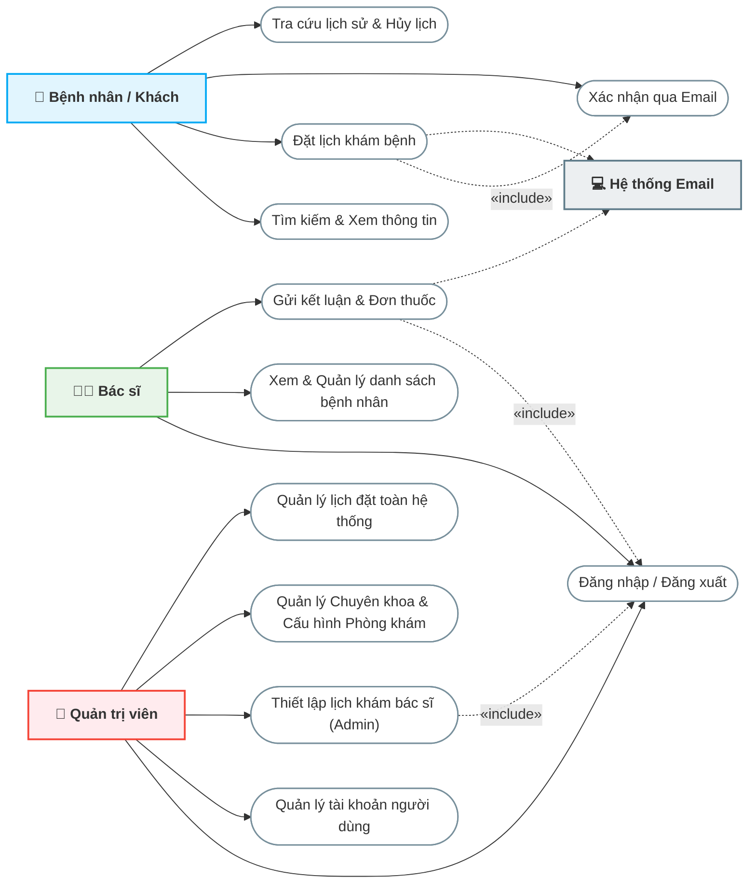
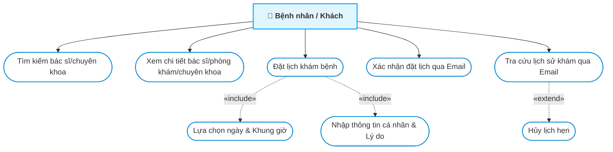
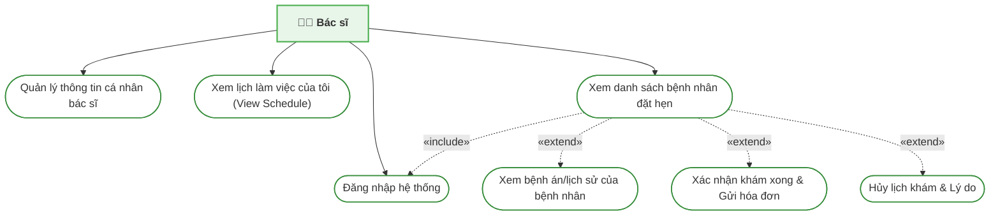
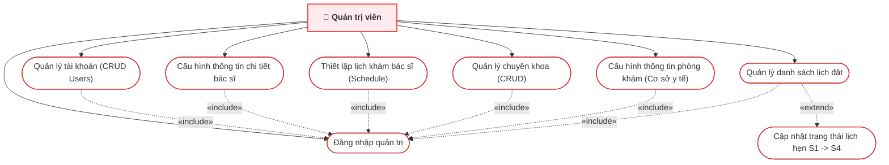

# PHÂN TÍCH HỆ THỐNG & BIỂU ĐỒ USE CASE
## HỆ THỐNG ĐẶT LỊCH KHÁM BỆNH TRỰC TUYẾN (HEALTHCARE BOOKING SYSTEM)

Tài liệu này cung cấp phân tích chi tiết về hệ thống đặt lịch khám bệnh trực tuyến, xác định các tác nhân (Actors), các trường hợp sử dụng (Use Cases) tương ứng, sơ đồ Use Case trực quan sử dụng Mermaid, và đặc tả chi tiết cho các luồng nghiệp vụ cốt lõi.

---

## MỤC LỤC
1. [TỔNG QUAN HỆ THỐNG](#1-tổng-quan-hệ-thống)
2. [PHÂN TÍCH TÁC NHÂN (ACTORS)](#2-phân-tích-tác-nhân-actors)
3. [DANH SÁCH & PHÂN NHÓM USE CASE](#3-danh-sách--phân-nhóm-use-case)
4. [BIỂU ĐỒ USE CASE (USE CASE DIAGRAMS)](#4-biểu-đồ-use-case-use-case-diagrams)
   - [4.1 Biểu đồ Use Case Tổng Quan](#41-biểu-đồ-use-case-tổng-quan)
   - [4.2 Biểu đồ Use Case Chi Tiết - Bệnh Nhân](#42-biểu-đồ-use-case-chi-tiết---bệnh-nhân)
   - [4.3 Biểu đồ Use Case Chi Tiết - Bác Sĩ](#43-biểu-đồ-use-case-chi-tiết---bác-sĩ)
   - [4.4 Biểu đồ Use Case Chi Tiết - Admin](#44-biểu-đồ-use-case-chi-tiết---admin)
5. [ĐẶC TẢ CHI TIẾT CÁC USE CASE TRỌNG TÂM](#5-đặc-tả-chi-tiết-các-use-case-trọng-tâm)
   - [5.1 Đặt Lịch Hẹn Khám Bệnh (Patient Book Appointment)](#51-đặt-lịch-hẹn-khám-bệnh-patient-book-appointment)
   - [5.2 Xác Nhận Khám & Gửi Hóa Đơn/Đơn Thuốc (Doctor Send Remedy)](#52-xác-nhận-khám--gửi-hóa-đơnđơn-thuốc-doctor-send-remedy)
   - [5.3 Cấu hình Thông tin Phòng khám (Admin Configure Clinic)](#53-cấu-hình-thông-tin-phòng-khám-admin-configure-clinic)
   - [5.4 Quản Lý Lịch Hẹn Toàn Hệ Thống (Admin Manage Booking)](#54-quản-lý-lịch-hẹn-toàn-hệ-thống-admin-manage-booking)

---

## 1. TỔNG QUAN HỆ THỐNG

Hệ thống Đặt lịch khám bệnh trực tuyến (Healthcare Booking System) là nền tảng kết nối giữa **Bệnh nhân (Patient)**, **Bác sĩ (Doctor)** và **Cơ sở y tế / Chuyên khoa**. Hệ thống hỗ trợ tối ưu hóa quy trình đặt lịch khám, giảm thiểu thời gian chờ đợi tại bệnh viện và nâng cao hiệu quả quản lý lịch trình làm việc của bác sĩ.

*   **Front-end**: ReactJS (Redux, SCSS, React-Router)
*   **Back-end**: Node.js (Express framework)
*   **Database**: MySQL hỗ trợ thông qua Sequelize ORM.
*   **Dịch vụ bổ trợ**: Gửi Email tự động (Nodemailer) kèm đính kèm tệp kết quả/hóa đơn dạng hình ảnh/Base64.

---

## 2. PHÂN TÍCH TÁC NHÂN (ACTORS)

Hệ thống bao gồm 3 tác nhân chính tương tác trực tiếp với giao diện người dùng và 1 tác nhân hệ thống tự động:

| STT | Tác nhân (Actor) | Mô tả vai trò và quyền hạn trong hệ thống |
| :--- | :--- | :--- |
| 1 | **Bệnh Nhân (Patient)** | Người dùng cuối sử dụng hệ thống để tìm kiếm thông tin sức khỏe, phòng khám, chuyên khoa và bác sĩ. Họ tiến hành đặt lịch khám, xác nhận qua email, theo dõi lịch sử khám bệnh và nhận kết quả khám qua email cá nhân. |
| 2 | **Bác Sĩ (Doctor)** | Nhân sự chuyên môn trực tiếp thực hiện việc khám chữa bệnh. Có quyền xem danh sách ca khám (do Admin thiết lập), quản lý danh sách bệnh nhân chờ khám theo ngày, xác nhận kết thúc ca khám bằng việc nhập kết luận và gửi hóa đơn/đơn thuốc điện tử (Remedy). |
| 3 | **Quản Trị Viên (Admin)** | Người kiểm soát toàn bộ hệ thống. Chịu trách nhiệm quản lý tài khoản người dùng (CRUD Users), thiết lập lịch khám bác sĩ (Schedule), cấu hình thông tin bác sĩ (giá khám, chuyên khoa, bài giới thiệu), quản trị danh mục Chuyên khoa (Specialties), cấu hình thông tin duy nhất của Phòng khám/Cơ sở y tế (Clinic Info) và giám sát/cập nhật trạng thái các lịch hẹn toàn hệ thống. |
| 4 | **Hệ Thống (System / Mail Server)** | Tác nhân tự động thực hiện các tác vụ nền như gửi email xác nhận đặt lịch khám cho bệnh nhân khi họ vừa tạo lịch, và tự động gửi hóa đơn kèm kết quả khám bệnh khi bác sĩ xác nhận hoàn thành khám. |

---

## 3. DANH SÁCH & PHÂN NHÓM USE CASE

Dưới đây là danh sách các trường hợp sử dụng (Use Cases) được phân chia cụ thể theo từng nhóm tác nhân:

### 3.1 Nhóm Use Case của Bệnh Nhân (Patient)
1.  **Tìm kiếm thông tin**: Tìm bác sĩ, tìm chuyên khoa qua thanh tìm kiếm thông minh trên trang chủ.
2.  **Xem chi tiết**: Xem hồ sơ bác sĩ (giá khám, mô tả, lịch khám khả dụng), thông tin chuyên khoa (danh sách bác sĩ thuộc khoa), thông tin chi tiết phòng khám (cơ sở y tế).
3.  **Đặt lịch khám bệnh (Booking Flow)**: Lựa chọn bác sĩ, chọn ngày khám và khung giờ khám khả dụng; điền biểu mẫu thông tin bệnh nhân (họ tên, số điện thoại, email, giới tính, địa chỉ, lý do khám).
4.  **Xác nhận lịch hẹn qua Email (Verify Booking)**: Nhấp vào liên kết xác nhận được hệ thống gửi tự động về email cá nhân để chuyển trạng thái lịch khám từ "Chờ xác nhận" sang "Đã xác nhận".
5.  **Tra cứu lịch sử cuộc hẹn (Booking History)**: Nhập email cá nhân để hệ thống kiểm tra và trả về lịch sử tất cả các lịch hẹn (sắp tới, đã khám, đã hủy).
6.  **Hủy lịch hẹn**: Tự hủy lịch hẹn trực tiếp trên hệ thống (đối với lịch sắp tới ở trạng thái Chờ xác nhận hoặc Đã xác nhận).

### 3.2 Nhóm Use Case của Bác Sĩ (Doctor)
1.  **Đăng nhập / Đăng xuất**: Xác thực tài khoản bác sĩ để truy cập vào phân hệ quản trị của bác sĩ.
2.  **Xem lịch làm việc (View Schedule)**: Xem danh sách các khung giờ/ca khám bệnh trong ngày đã được Admin thiết lập cho mình.
3.  **Xem danh sách bệnh nhân khám (Manage Patient)**: Xem danh sách bệnh nhân đã đặt lịch với mình theo ngày được chọn, hiển thị các thông tin liên hệ và lý do khám.
4.  **Xác nhận khám & gửi đơn thuốc (Confirm & Send Remedy)**: Điền kết luận bệnh án, đính kèm hình ảnh hóa đơn/đơn thuốc để hoàn thành ca khám. Hệ thống sẽ tự động đổi trạng thái lịch hẹn thành "Đã khám" và gửi email kết quả cho bệnh nhân.
5.  **Hủy lịch hẹn bệnh nhân (Cancel Booking)**: Hủy ca khám của bệnh nhân khi có sự cố phát sinh đột xuất và gửi kèm lý do hủy lịch.
6.  **Quản lý hồ sơ bác sĩ**: Cập nhật thông tin cá nhân của bản thân.

### 3.3 Nhóm Use Case của Quản Trị Viên (Admin)
1.  **Đăng nhập / Đăng xuất**: Xác thực tài khoản quản trị viên.
2.  **Quản lý người dùng (CRUD Users)**: Tạo mới, cập nhật, xóa và tìm kiếm người dùng trong hệ thống (phân loại theo vai trò Admin/Doctor/Patient và quản lý các thuộc tính liên quan).
3.  **Quản lý thông tin bác sĩ (Manage Doctor Details)**: Thiết lập giá khám, hình thức thanh toán, tỉnh thành, chuyên khoa, phòng khám liên kết và cập nhật bài viết giới thiệu bác sĩ bằng Markdown.
4.  **Thiết lập lịch khám bác sĩ (Manage Schedule)**: Đăng ký/lập ca làm việc cho từng bác sĩ theo ngày (Bulk Create Schedule) hoặc xóa các ca làm việc.
5.  **Quản lý Chuyên khoa (CRUD Specialty)**: Tạo mới, cập nhật, xóa các chuyên khoa y tế kèm hình ảnh và bài viết giới thiệu.
6.  **Cấu hình Thông tin Phòng khám (Configure Clinic Info)**: Thiết lập và cập nhật các thông tin của cơ sở y tế duy nhất bao gồm tên phòng khám, địa chỉ, ảnh đại diện, bài viết giới thiệu (dùng chung cho toàn hệ thống một cơ sở).
7.  **Quản lý Lịch hẹn hệ thống (Manage Booking)**: Xem và giám sát toàn bộ danh sách lịch hẹn của hệ thống, lọc theo ngày/trạng thái và có quyền cập nhật trực tiếp trạng thái lịch hẹn (Xác nhận/Hủy/Hoàn thành).

---

## 4. BIỂU ĐỒ USE CASE (USE CASE DIAGRAMS)

Các biểu đồ dưới đây mô tả cấu trúc tương tác của hệ thống bằng ngôn ngữ thiết kế Mermaid.

### 4.1 Biểu đồ Use Case Tổng Quan
Sơ đồ mô tả bức tranh toàn cảnh về cách các tác nhân chính tương tác với các khối tính năng cốt lõi của hệ thống.

---

### 4.2 Biểu đồ Use Case Chi Tiết - Bệnh Nhân
Mô tả chi tiết các hành động mà một bệnh nhân hoặc khách vãng lai thực hiện trên giao diện Client.

---

### 4.3 Biểu đồ Use Case Chi Tiết - Bác Sĩ
Mô tả các chức năng làm việc của Bác sĩ trong phân hệ quản lý cá nhân.

---

### 4.4 Biểu đồ Use Case Chi Tiết - Admin
Mô tả các hoạt động quản lý danh mục và cấu hình toàn hệ thống của Admin.

---

## 5. ĐẶC TẢ CHI TIẾT CÁC USE CASE TRỌNG TÂM

### 5.1 Đặt Lịch Hẹn Khám Bệnh (Patient Book Appointment)

*   **Tác nhân chính**: Bệnh Nhân.
*   **Tác nhân phụ**: Hệ thống (Mail Server gửi email).
*   **Mục tiêu**: Bệnh nhân đặt thành công lịch hẹn khám bệnh với bác sĩ mong muốn vào khung giờ lựa chọn.
*   **Tiền điều kiện**: Bác sĩ đã được thiết lập lịch khám (Schedule) và còn các khung giờ trống trên hệ thống.
*   **Hậu điều kiện**: Một bản ghi lịch hẹn mới được tạo trong cơ sở dữ liệu ở trạng thái `S1` (Chờ xác nhận). Email xác nhận được gửi đi.

#### Luồng sự kiện chính (Basic Flow):
1.  Bệnh nhân truy cập trang chủ hệ thống, tìm kiếm bác sĩ hoặc chuyên khoa.
2.  Hệ thống hiển thị danh sách kết quả, bệnh nhân chọn một bác sĩ cụ thể để xem chi tiết.
3.  Bệnh nhân xem thông tin chi tiết bác sĩ, thông tin phòng khám và danh sách các khung giờ khám khả dụng trong ngày hiện tại hoặc các ngày tiếp theo.
4.  Bệnh nhân chọn một khung giờ khám cụ thể và nhấn nút đặt lịch.
5.  Hệ thống hiển thị biểu mẫu (Booking Modal) yêu cầu nhập thông tin bệnh nhân:
    *   Họ tên bệnh nhân.
    *   Số điện thoại liên hệ.
    *   Địa chỉ email (để nhận liên kết xác nhận).
    *   Địa chỉ nhà.
    *   Giới tính.
    *   Lý do khám bệnh.
6.  Bệnh nhân điền đầy đủ thông tin và nhấn "Xác nhận đặt lịch".
7.  Hệ thống kiểm tra tính hợp lệ của dữ liệu, ghi nhận thông tin lịch đặt vào bảng `Booking` với trạng thái mặc định là `S1` (Chờ xác nhận).
8.  Hệ thống kích hoạt dịch vụ Mail gửi tự động một email chứa liên kết xác nhận lịch hẹn (chứa token bảo mật) đến địa chỉ email bệnh nhân cung cấp.
9.  Bệnh nhân mở email cá nhân, nhấp vào liên kết xác nhận lịch hẹn.
10. Hệ thống hiển thị trang xác nhận thành công và tự động cập nhật trạng thái lịch đặt thành `S2` (Đã xác nhận).

#### Luồng thay thế (Alternative Flows):
*   *Lỗi trùng lịch hẹn*: Nếu trong thời gian bệnh nhân điền form, khung giờ đó đã bị một bệnh nhân khác đặt trước, hệ thống hiển thị thông báo lỗi và yêu cầu bệnh nhân chọn lại khung giờ khác.
*   *Thông tin không hợp lệ*: Nếu bệnh nhân nhập sai định dạng email hoặc số điện thoại, hệ thống sẽ báo lỗi tại trường tương ứng và giữ nguyên biểu mẫu để sửa đổi.

---

### 5.2 Xác Nhận Khám & Gửi Hóa Đơn/Đơn Thuốc (Doctor Send Remedy)

*   **Tác nhân chính**: Bác Sĩ.
*   **Tác nhân phụ**: Hệ thống (Mail Server gửi email kèm file đính kèm).
*   **Mục tiêu**: Bác sĩ xác nhận hoàn thành buổi khám bệnh, cập nhật trạng thái lịch khám của bệnh nhân thành "Đã khám" và gửi hóa đơn/đơn thuốc điện tử.
*   **Tiền điều kiện**: Bác sĩ đã đăng nhập thành công vào phân hệ quản trị. Lịch hẹn của bệnh nhân phải ở trạng thái `S2` (Đã xác nhận).
*   **Hậu điều kiện**: Trạng thái lịch đặt chuyển sang `S3` (Hoàn thành / Đã khám). Bệnh nhân nhận được email thông báo kết luận kèm hình ảnh đơn thuốc/hóa đơn.

#### Luồng sự kiện chính (Basic Flow):
1.  Bác sĩ chọn mục "Quản lý bệnh nhân" trên thanh điều hướng.
2.  Bác sĩ chọn ngày cần xem danh sách khám bệnh. Hệ thống hiển thị danh sách các bệnh nhân đã đăng ký khám trong ngày đó.
3.  Bác sĩ lọc danh sách theo trạng thái "Đã xác nhận" (Confirmed - S2).
4.  Bác sĩ tiến hành khám bệnh trực tiếp cho bệnh nhân.
5.  Sau khi khám xong, bác sĩ nhấn vào nút "Xác nhận khám xong" tại dòng thông tin của bệnh nhân tương ứng.
6.  Hệ thống hiển thị hộp thoại (Remedy Modal) yêu cầu nhập các thông tin:
    *   Email nhận của bệnh nhân (đã được điền tự động).
    *   Tải lên hình ảnh hóa đơn hoặc đơn thuốc (tệp hình ảnh được quét, chuyển đổi dạng Base64).
    *   Ghi chú hoặc lời dặn của bác sĩ.
7.  Bác sĩ nhấn nút "Gửi".
8.  Hệ thống thực hiện:
    *   Cập nhật trạng thái bản ghi lịch đặt trong CSDL từ `S2` thành `S3` (Hoàn thành / Đã khám).
    *   Lưu trữ tệp hình ảnh đơn thuốc vào CSDL.
    *   Tự động gửi email thông báo kết quả khám kèm lời dặn và tệp đính kèm hóa đơn/đơn thuốc cho bệnh nhân.
9.  Hộp thoại đóng lại, danh sách bệnh nhân được tải lại để cập nhật trạng thái mới.

---

### 5.3 Cấu hình Thông tin Phòng khám (Admin Configure Clinic)

*   **Tác nhân chính**: Quản Trị Viên (Admin).
*   **Mục tiêu**: Thiết lập và cập nhật thông tin giới thiệu chung (tên phòng khám, địa chỉ, ảnh đại diện, bài viết giới thiệu) cho cơ sở y tế duy nhất sử dụng hệ thống.
*   **Tiền điều kiện**: Admin đã đăng nhập thành công vào phân hệ `/system`.
*   **Hậu điều kiện**: Dữ liệu thông tin phòng khám được cập nhật và lưu trữ thành công trong cơ sở dữ liệu.

#### Luồng sự kiện chính (Basic Flow):
1.  Admin điều hướng đến trang "Thông Tin Phòng Khám" (Manage Clinic).
2.  Hệ thống tự động tải dữ liệu phòng khám hiện tại (gọi API `GET /api/get-clinic-info`).
3.  Nếu phòng khám đã được cấu hình trước đó, hệ thống điền sẵn các thông tin cũ (tên phòng khám, địa chỉ, hình ảnh xem trước, bài viết markdown chi tiết) và bật chế độ **Cập nhật** (`isEditMode = true`). Nếu chưa có dữ liệu, hệ thống thông báo chưa có phòng khám và bật chế độ **Tạo mới** (`isEditMode = false`).
4.  Admin tiến hành chỉnh sửa hoặc nhập mới các thông tin:
    *   Tên cơ sở phòng khám.
    *   Địa chỉ.
    *   Tải lên hình ảnh phòng khám.
    *   Soạn thảo bài viết mô tả chi tiết bằng Markdown/HTML.
5.  Admin nhấn nút "Cập Nhật Thông Tin" hoặc "Tạo Phòng Khám".
6.  Hệ thống kiểm tra tính đầy đủ của dữ liệu:
    *   Nếu ở chế độ tạo mới: Hệ thống gọi API `POST /api/create-clinic-info` để lưu trữ bản ghi phòng khám vào bảng `Clinics`.
    *   Nếu ở chế độ cập nhật: Hệ thống gọi API `PUT /api/update-clinic-info` để cập nhật bản ghi hiện tại.
7.  Hệ thống cập nhật thành công, lưu dữ liệu vào bảng `Clinics`, và hiển thị thông báo Toast thành công đến Admin.

---

### 5.4 Quản Lý Lịch Hẹn Toàn Hệ Thống (Admin Manage Booking)

*   **Tác nhân chính**: Quản Trị Viên (Admin).
*   **Mục tiêu**: Kiểm tra, giám sát tình trạng đặt lịch khám bệnh trên toàn hệ thống và can thiệp cập nhật trạng thái khi cần thiết.
*   **Tiền điều kiện**: Admin đã đăng nhập thành công vào phân hệ `/system`.
*   **Hậu điều kiện**: Trạng thái lịch đặt của bệnh nhân được thay đổi và đồng bộ trong cơ sở dữ liệu.

#### Luồng sự kiện chính (Basic Flow):
1.  Admin điều hướng đến trang "Quản lý lịch đặt khám" (Manage Booking).
2.  Hệ thống tải toàn bộ danh sách lịch đặt khám kèm theo thông tin bệnh nhân, bác sĩ, ngày hẹn, khung giờ khám và trạng thái hiện tại.
3.  Hệ thống hiển thị các thẻ thống kê tổng quan (Tổng lịch đặt, Chờ xác nhận, Đã xác nhận, Hoàn thành, Đã hủy).
4.  Admin thực hiện các thao tác tìm kiếm hoặc lọc dữ liệu:
    *   Lọc lịch đặt theo Ngày khám.
    *   Lọc nhanh theo Trạng thái (S1, S2, S3, S4).
    *   Tìm kiếm theo từ khóa (tên bệnh nhân, tên bác sĩ, số điện thoại, email).
5.  Admin thực hiện thay đổi trạng thái của lịch hẹn bằng các nút chức năng nhanh:
    *   Với lịch hẹn `S1` (Chờ xác nhận): Admin có thể nhấn "Xác nhận" để chuyển trạng thái thành `S2` (Đã xác nhận), hoặc nhấn "Hủy" để chuyển thành `S4` (Đã hủy).
    *   Với lịch hẹn `S2` (Đã xác nhận): Admin có thể nhấn "Hoàn thành" để chuyển trạng thái thành `S3` (Hoàn thành / Đã khám) trong trường hợp có quy trình xác nhận riêng tại quầy.
6.  Hệ thống kiểm tra quyền và thực hiện cập nhật CSDL, sau đó thông báo thành công cho Admin và tải lại bảng dữ liệu.

---
*Tài liệu được phân tích dựa trên cấu trúc cơ sở dữ liệu và mã nguồn thực tế của dự án.*
