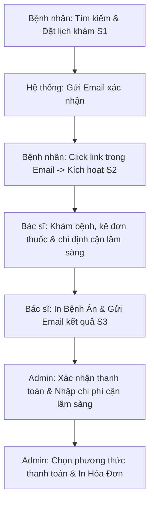

# HƯỚNG DẪN THUYẾT TRÌNH HỆ THỐNG ĐẶT LỊCH KHÁM BỆNH TRỰC TUYẾN
## (HEALTHCARE BOOKING SYSTEM)

Tài liệu này được biên soạn nhằm hướng dẫn bạn thuyết trình bảo vệ đồ án/dự án một cách chuyên nghiệp, trôi chảy và thuyết phục nhất. Tài liệu bao gồm cấu trúc slide đề xuất, kịch bản thuyết trình chi tiết (lời văn dễ học), quy trình Demo thực tế và bộ câu hỏi Q&A phản biện thường gặp.

---

## 1. PHÂN BỔ THỜI GIAN THUYẾT TRÌNH (DỰ KIẾN: 15 PHÚT)

| Phần | Nội dung | Thời gian | Trọng tâm |
| :--- | :--- | :--- | :--- |
| **Phần 1** | Giới thiệu dự án & Lý do chọn đề tài | 2 phút | Nêu bật nỗi đau (pain point) và giải pháp của hệ thống. |
| **Phần 2** | Kiến trúc hệ thống & Cơ sở dữ liệu | 3 phút | Chứng minh tính logic qua mô hình MVC, Sequelize ORM và ERD. |
| **Phần 3** | **Demo Chức năng Thực tế (Quan trọng nhất)** | 7 phút | Thực hiện luồng đi hoàn chỉnh (End-to-End) của Bệnh nhân, Bác sĩ và Admin. |
| **Phần 4** | Công nghệ sử dụng & Ưu điểm nổi bật | 2 phút | Nhấn mạnh việc xử lý bất đồng bộ, bảo mật (JWT, Bcrypt), gửi mail, Markdown. |
| **Phần 5** | Tổng kết & Hướng phát triển tương lai | 1 phút | Định hướng nâng cấp hệ thống và lời cảm ơn. |

---

## 2. KỊCH BẢN THUYẾT TRÌNH CHI TIẾT (SPEECH SCRIPT)

> [!NOTE]
> *Những đoạn nằm trong ô trích dẫn như thế này là **lời thoại gợi ý (lời văn)** để bạn nói khi thuyết trình. Hãy điều chỉnh tông giọng tự tin và tốc độ vừa phải.*

### PHẦN 1: GIỚI THIỆU DỰ ÁN & LÝ DO CHỌN ĐỀ TÀI (2 phút)
*(Trình chiếu Slide 1: Tiêu đề đề tài & Slide 2: Đặt vấn đề)*

> **Lời thoại:**
> *"Kính chào thầy cô và các bạn trong Hội đồng. Em tên là **[Tên của bạn]**, hôm nay em xin phép được đại diện nhóm trình bày về dự án tốt nghiệp/đồ án môn học của tụi em với đề tài: **'Xây dựng Hệ thống Đặt lịch khám bệnh trực tuyến - Healthcare Booking System'**.*
>
> *Thưa thầy cô, trong thời đại số hóa hiện nay, việc xếp hàng chờ đợi lấy số khám bệnh tại các bệnh viện truyền thống đang gây ra sự lãng phí rất lớn về thời gian và công sức cho người bệnh, đồng thời tạo ra áp lực quản lý khổng lồ cho các cơ sở y tế. Xuất phát từ thực trạng đó, hệ thống Healthcare Booking System được phát triển nhằm mục tiêu tối ưu hóa quy trình kết nối giữa bệnh nhân và bác sĩ. Hệ thống giúp bệnh nhân dễ dàng chủ động chọn chuyên khoa, phòng khám, bác sĩ phù hợp và đặt lịch trực tuyến chỉ trong vài thao tác đơn giản."*

---

### PHẦN 2: KIẾN TRÚC HỆ THỐNG & CƠ SỞ DỮ LIỆU (3 phút)
*(Trình chiếu Slide 3: Kiến trúc công nghệ & Slide 4: Sơ đồ ERD)*

> **Lời thoại:**
> *"Về mặt kiến trúc công nghệ, hệ thống của tụi em được xây dựng theo mô hình **Client-Server độc lập** nhằm đảm bảo tính mở rộng và bảo mật:*
>
> 1. **Frontend**: Sử dụng thư viện **ReactJS** kết hợp với **Redux** để quản lý trạng thái ứng dụng. Giao diện được thiết kế responsive, thân thiện với người dùng và hỗ trợ đa ngôn ngữ (Tiếng Anh - Tiếng Việt).
> 2. **Backend**: Sử dụng framework **NodeJS (Express)** xây dựng các RESTful API. Hệ thống sử dụng **Sequelize ORM** để tương tác với cơ sở dữ liệu **MySQL**.
>
> *Tiếp theo, em xin giới thiệu về cấu trúc Cơ sở dữ liệu của hệ thống. Cơ sở dữ liệu bao gồm 10 bảng dữ liệu chính, được liên kết chặt chẽ với nhau:*
> * *Bảng **User** là trung tâm lưu trữ thông tin của cả bệnh nhân, bác sĩ và quản trị viên, được phân quyền qua trường `roleId`.*
> * *Bảng **Allcode** là bảng từ điển dùng chung giúp chuẩn hóa và hỗ trợ đa ngôn ngữ cho các trường dữ liệu như giới tính, chức danh, khung giờ khám, khoảng giá, và trạng thái lịch hẹn.*
> * *Mối quan hệ Nhiều-Nhiều giữa Bác sĩ và Chuyên khoa/Phòng khám được giải quyết thông qua bảng trung gian **Doctor_Clinic_Specialty**.*
> * *Các thông tin lịch hẹn và ca trực được lưu trữ và đồng bộ hóa qua hai bảng **Booking** và **Schedule**."*

---

### PHẦN 3: DEMO CHỨC NĂNG THỰC TẾ (7 phút)
*(Mở trình duyệt, chuyển sang giao diện Web đang chạy)*

> **Lời thoại:**
> *"Để giúp hội đồng có cái nhìn trực quan nhất về sản phẩm, sau đây em xin phép được demo trực tiếp các luồng chức năng trên hệ thống của mình. Hệ thống của chúng em phân chia rõ ràng làm 3 phân hệ chính tương ứng với 3 đối tượng sử dụng: Bệnh nhân, Bác sĩ và Quản trị viên.*
>
> *Đầu tiên, trong vai trò là một **Bệnh nhân** truy cập trang chủ..."*
> *(Bắt đầu thao tác các bước Demo theo hướng dẫn ở Mục 3 bên dưới).*

---

### PHẦN 4: CÔNG NGHỆ CỐT LÕI & ƯU ĐIỂM NỔI BẬT (2 phút)
*(Trình chiếu Slide công nghệ/kỹ thuật nâng cao)*

> **Lời thoại:**
> *"Sau quá trình phát triển dự án, tụi em đã đúc kết được một số ưu điểm công nghệ nổi bật của hệ thống này:*
>
> * **Thứ nhất là tính bảo mật:** Mật khẩu người dùng được mã hóa một chiều bằng thư viện **bcrypt** trước khi lưu vào MySQL. Các API nhạy cảm của Bác sĩ và Admin đều được bảo vệ chặt chẽ thông qua cơ chế **JWT (JSON Web Token) Middleware**.*
> * **Thứ hai là luồng xác thực khép kín:** Khi bệnh nhân đặt lịch thành công, hệ thống sẽ tự động gửi email xác nhận chứa mã token một lần (One-time token). Chỉ khi bệnh nhân nhấn xác nhận trong email, lịch khám mới chính thức được chuyển sang trạng thái chờ khám.*
> * **Thứ ba là tính linh hoạt quản trị:** Admin có thể tạo hàng loạt khung giờ khám cho bác sĩ bằng thuật toán **Bulk Create** của Sequelize, và viết bài giới thiệu bác sĩ/phòng khám sinh động thông qua trình soạn thảo **Markdown Editor**."*

---

### PHẦN 5: TỔNG KẾT & HƯỚNG PHÁT TRIỂN (1 phút)
*(Trình chiếu Slide kết luận & cảm ơn)*

> **Lời thoại:**
> *"Tóm lại, dự án Healthcare Booking System đã giải quyết trọn vẹn bài toán đặt lịch khám trực tuyến, đáp ứng nhu cầu thực tế của cả bệnh nhân, bác sĩ và nhà quản lý.*
>
> *Trong tương lai, tụi em hướng tới phát triển thêm các tính năng:*
> 1. *Tích hợp cổng thanh toán trực tuyến (VNPAY/Momo) để bệnh nhân đóng tiền khám trước.*
> 2. *Tích hợp hệ thống tư vấn trực tuyến Video Call thông qua WebRTC.*
> 3. *Ứng dụng AI gợi ý bác sĩ dựa trên triệu chứng ban đầu.*
>
> *Em xin chân thành cảm ơn thầy cô và các bạn đã chú ý lắng nghe. Em rất mong nhận được những câu hỏi và ý kiến đóng góp từ Hội đồng để hệ thống ngày càng hoàn thiện hơn. Em xin cảm ơn ạ!"*

---

## 3. QUY TRÌNH LIVE DEMO MƯỢT MÀ (KHÔNG BỊ LỖI)

Để buổi thuyết trình thành công, hãy tuân thủ chính xác quy trình demo dưới đây. Việc này giúp luồng hoạt động logic của phần mềm hiển thị rõ ràng nhất.

### Bước chuẩn bị trước buổi thuyết trình:
1. Đảm bảo Backend NodeJS và Frontend ReactJS đang chạy ổn định.
2. Kiểm tra kết nối Internet (để gửi email thật qua Mail Server).
3. Đăng nhập sẵn tài khoản **Admin** (`admin@gmail.com` / mật khẩu) trên trình duyệt thứ nhất (ví dụ: Google Chrome).
4. Đăng nhập sẵn tài khoản **Bác sĩ** (`doctor@gmail.com` / mật khẩu) trên trình duyệt thứ hai (ví dụ: Microsoft Edge).
5. Mở trang chủ dành cho **Bệnh nhân** ở một cửa sổ riêng (hoặc tab ẩn danh) để không bị chồng chéo Session.

---

### KỊCH BẢN DEMO TỪNG BƯỚC (STEP-BY-STEP DEMO)

#### Bước 1: Vai trò Bệnh nhân (Tìm kiếm và Đặt lịch)
1. **Tại Trang chủ**: Giới thiệu giao diện thân thiện, đa ngôn ngữ (Việt - Anh) và thanh Tìm kiếm thông minh (Live Search). Gõ thử từ khóa (Ví dụ tên chuyên khoa như "Cơ xương khớp" hoặc tên Bác sĩ).
2. **Chọn Bác sĩ**: Click vào bác sĩ để xem trang chi tiết.
   * *Nói thêm:* Giải thích thông tin phòng khám, giá dịch vụ, phương thức thanh toán được lấy động từ CSDL. Bài viết giới thiệu dài bên dưới được render từ Markdown.
3. **Thực hiện Đặt lịch**: 
   * Chọn ngày khám (ví dụ ngày mai).
   * Click chọn một khung giờ (Ví dụ: `9:00 - 10:00 AM`).
   * Form Booking Modal hiện ra -> Nhập thông tin thật: Họ tên, số điện thoại, **địa chỉ Email thật của bạn** (để lát mở Mail cho hội đồng xem), lý do khám.
   * Nhấn **Xác nhận đặt lịch**. Hệ thống thông báo đặt lịch thành công và yêu cầu kiểm tra email.

#### Bước 2: Vai trò Bệnh nhân (Xác nhận lịch đặt qua Email)
1. Mở hòm thư Gmail của bạn lên ngay trước mặt hội đồng.
2. Mở mail hệ thống vừa gửi -> Chỉ ra thông tin bác sĩ, thời gian và click vào đường link **Click vào đây để xác nhận lịch hẹn**.
3. Trình duyệt mở ra trang `/verify-booking` báo "Xác nhận lịch khám thành công!".
   * *Nói thêm:* Giải thích rằng lúc này trạng thái lịch hẹn trong CSDL đã chuyển từ `S1` (Chờ xác nhận) sang `S2` (Đã xác nhận).

#### Bước 3: Vai trò Bác sĩ (Khám bệnh, kê đơn và in Bệnh Án)
1. Chuyển sang trình duyệt của **Bác sĩ** (ví dụ Microsoft Edge).
2. Vào mục **Quản lý bệnh nhân**. Chọn đúng ngày khám mà bạn vừa đặt ở Bước 1.
3. Hội đồng sẽ thấy thông tin bệnh nhân của bạn xuất hiện trong danh sách chờ với trạng thái đã xác nhận (`S2`).
4. Click vào nút **Xác nhận khám xong** (Confirm):
   * Hộp thoại **Medical Record Modal** hiện ra.
   * Ở cột bên trái: Cho hội đồng xem **Lịch sử khám bệnh** của bệnh nhân đó để bác sĩ theo dõi hồ sơ bệnh án cũ (nếu có).
   * Ở cột bên phải: Tiến hành chẩn đoán.
     * Nhập **Kết luận bệnh** (Ví dụ: Viêm khớp dạng thấp).
     * Nhập **Chỉ định Lâm Sàng** bằng cách chọn từ dropdown (Ví dụ: *Chụp X-Quang*, *Xét nghiệm máu*).
     * Kê đơn thuốc: Nhấp **Thêm thuốc**, nhập tên thuốc, số lượng (Ví dụ: *Glucosamine - 30 viên*), liều dùng (*Uống 1 viên/ngày sau ăn*) và ghi chú.
     * Chọn lịch hẹn tái khám (Tùy chọn).
     * Tải lên file đính kèm (Ảnh chụp đơn thuốc bản cứng hoặc ảnh siêu âm).
   * Thao tác **In Bệnh Án**: Bác sĩ bấm nút **In Bệnh Án** để mở bản xem trước và in hồ sơ bệnh án chuyên nghiệp gửi cho bệnh nhân.
   * Hoàn thành: Nhấn **Hoàn Tất & Gửi Email**.
   * *Giải thích:* Hệ thống chuyển trạng thái lịch hẹn sang `S3` (Đã khám), tạo bản ghi lịch sử bệnh án trong bảng `History`, đồng thời gửi email chứa kết quả khám và ảnh đơn thuốc cho bệnh nhân.
5. Cho hội đồng xem email kết quả khám mới gửi từ bác sĩ.

#### Bước 4: Vai trò Quản trị viên (Admin - Thanh toán và xuất hóa đơn)
1. Chuyển sang trình duyệt của **Admin** (ví dụ Google Chrome) đã đăng nhập tài khoản quản trị.
2. Truy cập trang **Quản lý lịch đặt khám toàn hệ thống** (`/system/manage-booking`).
3. Lọc theo trạng thái **Hoàn thành** (`S3`) hoặc tìm kiếm tên bệnh nhân vừa khám.
4. Tại dòng lịch hẹn của bệnh nhân, click vào nút **Thanh toán** (hoặc **Hoàn thành**).
5. Hộp thoại **Confirm Payment Modal** mở ra:
   * Hệ thống hiển thị thông tin bệnh nhân, bác sĩ phụ trách.
   * Hiển thị bảng chi tiết phí khám gốc của bác sĩ cùng các **dịch vụ cận lâm sàng** mà bác sĩ đã chỉ định ở Bước 3.
   * Admin nhập giá tiền thực tế cho các xét nghiệm cận lâm sàng (Ví dụ: *X-Quang: 150.000 VNĐ*, *Xét nghiệm máu: 200.000 VNĐ*). Tổng số tiền sẽ tự động tính toán theo thời gian thực (Real-time).
   * Chọn phương thức thanh toán linh hoạt: *Tiền mặt*, *Chuyển khoản*, *Ví MoMo*, *Thẻ tín dụng*, v.v.
   * Tích chọn checkbox "Bệnh nhân đã thanh toán và hoàn tất thủ tục khám bệnh".
   * Click **Hoàn tất thanh toán**.
   * Nút **In Hóa Đơn** hiện lên -> Click để hiển thị biểu mẫu hóa đơn khám bệnh chi tiết và in trực tiếp gửi bệnh nhân.

---

## 4. BỘ CÂU HỎI PHẢN BIỆN THƯỜNG GẶP (Q&A CHEAT SHEET)

Dưới đây là các câu hỏi mà hội đồng thầy cô rất hay hỏi đối với dạng đề tài này và cách trả lời thông minh nhất:

### Câu 1: Làm thế nào để giải quyết vấn đề trùng lịch (hai bệnh nhân đặt cùng một khung giờ của cùng một bác sĩ)?
* **Cách trả lời:**
  > *"Dạ thưa thầy cô, hệ thống giải quyết vấn đề này qua hai lớp bảo vệ:*
  > * *Ở Frontend, khi một khung giờ đã được đặt thành công, hệ thống sẽ ẩn hoặc chuyển khung giờ đó sang trạng thái không thể click chọn.*
  > * *Ở Backend, trước khi tiến hành lưu bản ghi Booking mới ở trạng thái `S1`, hệ thống thực hiện một truy vấn kiểm tra (FindOrCreate hoặc Check tồn tại) để xác nhận xem đã có lịch hẹn nào của bác sĩ đó tại khung giờ và ngày đó hay chưa. Nếu đã tồn tại, API sẽ trả về mã lỗi trùng lịch và ngăn chặn việc ghi dữ liệu trùng lặp."*

### Câu 2: Bảng `Allcode` dùng để làm gì và tại sao lại thiết kế cấu trúc như vậy?
* **Cách trả lời:**
  > *"Dạ, bảng `Allcode` đóng vai trò là **từ điển danh mục dùng chung** cho toàn hệ thống. Thay vì mỗi bảng (như User, Booking, Doctor_Infor) tự định nghĩa các chuỗi text cố định như giới tính (Nam/Nữ), chức danh (Thạc sĩ/Tiến sĩ), hay trạng thái lịch (Chờ xác nhận/Đã khám)... thì chúng em lưu tập trung tại bảng Allcode thông qua các khóa `keyMap` (ví dụ: M1, S1, R1).*
  > * *Thiết kế này giúp hệ thống dễ dàng cấu hình, bảo trì và đặc biệt là hỗ trợ **đa ngôn ngữ (i18n)** cực kỳ dễ dàng bằng cách lưu song song trường hiển thị `valueVi` và `valueEn`."*

### Câu 3: Làm thế nào để gửi email tự động và bảo mật các link xác nhận đặt lịch?
* **Cách trả lời:**
  > *"Dạ, hệ thống sử dụng thư viện **Nodemailer** kết hợp dịch vụ Gmail SMTP của Google để gửi thư tự động dưới nền (asynchronous). Để bảo mật link xác nhận gửi cho bệnh nhân, khi đặt lịch, hệ thống tự động sinh ra một chuỗi **UUID Token ngẫu nhiên** duy nhất lưu vào bảng Booking. Link trong email sẽ có dạng `http://.../verify-booking?token=abc-xyz&doctorId=123`.*
  > * *Khi bệnh nhân click, Backend sẽ kiểm tra Token này khớp với `doctorId` và trạng thái hiện tại phải là `S1` thì mới cho phép xác nhận. Sau khi xác nhận thành công, token này sẽ hết hiệu lực để tránh việc tái sử dụng."*

### Câu 4: Bài viết giới thiệu bác sĩ, phòng khám được quản lý như thế nào?
* **Cách trả lời:**
  > *"Dạ, để bài viết giới thiệu có định dạng đẹp mắt (có in đậm, danh sách, hình ảnh minh họa), chúng em tích hợp thư viện **Markdown Editor** ở phân hệ Admin. Nội dung bài viết được lưu trữ dưới hai định dạng trong bảng `MarkDown`: `contentMarkdown` (dạng thô để Admin dễ sửa đổi) và `contentHTML` (dạng HTML đã biên dịch để render trực tiếp lên giao diện Frontend ReactJS)."*

### Câu 5: Bệnh nhân điền sai thông tin cá nhân khi đặt lịch khám thì xử lý thế nào? Hệ thống có cho phép chỉnh sửa không?
* **Cách trả lời:**
  > *"Dạ thưa thầy cô, hệ thống hỗ trợ giải quyết vấn đề điền sai thông tin tùy theo các trường hợp cụ thể:*
  > * * **Nếu sai địa chỉ email:** Bệnh nhân sẽ không nhận được email xác nhận, do đó lịch hẹn sẽ mãi ở trạng thái `S1` (Chờ xác nhận) và không được gửi tới bác sĩ. Bệnh nhân chỉ cần thực hiện đặt lại một lịch hẹn mới với email chính xác.*
  > * * **Nếu sai các thông tin cá nhân khác (Họ tên, SĐT, Địa chỉ, Giới tính):** Để tối ưu trải nghiệm, hệ thống của chúng em đã được tích hợp tính năng **Sửa thông tin** trực tiếp tại trang **Lịch sử cuộc hẹn** (`/appointments`) đối với những lịch hẹn chưa khám (trạng thái Chờ xác nhận `S1` hoặc Đã xác nhận `S2`) và ngày hẹn ở tương lai.*
  > * * **Về mặt kỹ thuật và bảo mật:** Việc tra cứu lịch hẹn được thực hiện nhanh qua Email (không bắt buộc đăng nhập bằng mật khẩu). Do đó, để tránh việc thay đổi ác ý, hệ thống chỉ cho phép chỉnh sửa trước ngày hẹn khám. Khi bệnh nhân nhấn lưu, Frontend gọi API `/api/edit-user` cập nhật trực tiếp vào bảng `User` để sửa đổi thông tin đồng bộ."*

---

## 5. CÁC MẸO BỎ TÚI ĐỂ ĐẠT ĐIỂM CAO
1. **Phong thái tự tin**: Luôn tương tác bằng mắt với hội đồng, nói to, rõ ràng.
2. **Không đọc slide**: Slide chỉ chứa từ khóa và hình ảnh/sơ đồ. Hãy dùng lời nói để diễn giải chi tiết.
3. **Quay video backup**: Luôn chuẩn bị sẵn 1 video quay lại màn hình chạy thử toàn bộ luồng demo mượt mà từ trước. Đề phòng trường hợp trong lúc thuyết trình mạng bị lỗi, máy chủ bị sập hoặc gặp sự cố bất ngờ, bạn có thể mở video backup lên trình chiếu ngay lập tức để chữa cháy.
4. **Nhận lỗi và cầu thị**: Nếu thầy cô chỉ ra điểm chưa hợp lý trong code hoặc logic nghiệp vụ, hãy ghi nhận lịch sự: *"Dạ, em cảm ơn góp ý của thầy/cô. Đây là một điểm thiếu sót mà tụi em chưa lường hết trong quá trình thiết kế cơ sở dữ liệu. Tụi em chắc chắn sẽ nghiên cứu nghiêm túc và cải thiện phần này trong phiên bản tiếp theo ạ."*
