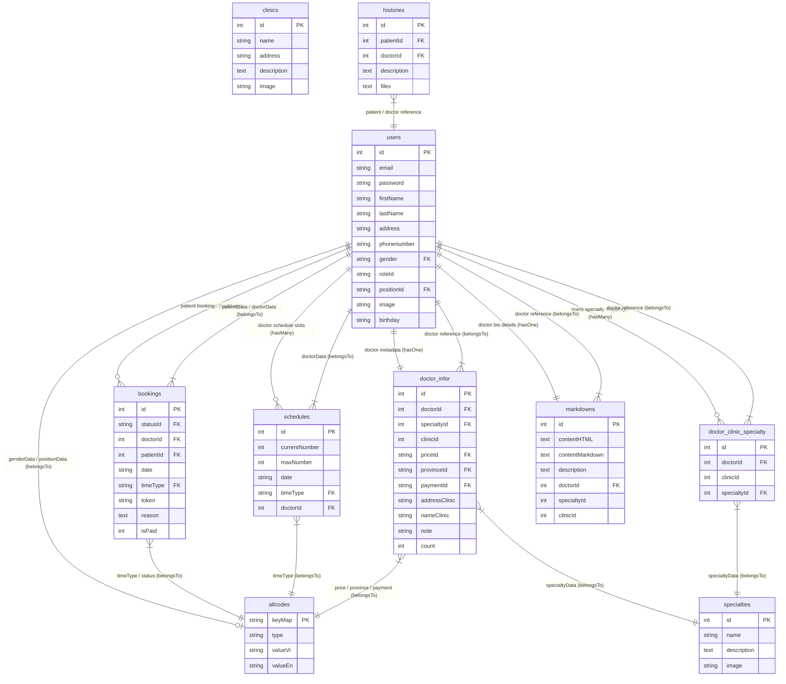

# BÁO CÁO KHÓA LUẬN TỐT NGHIỆP

---

## PHẦN I: MỞ ĐẦU

### 1.1. Tên đề tài
**Xây dựng Hệ thống đặt lịch khám bệnh trực tuyến và Quản lý bệnh án điện tử dựa trên kiến trúc Web Fullstack ReactJS, NodeJS và cơ sở dữ liệu MySQL.**

### 1.2. Đặt vấn đề
Trong kỷ nguyên số hóa y tế, các phòng khám và cơ sở y tế đang đứng trước thách thức lớn về việc tối ưu hóa quy trình tiếp đón và quản lý thông tin bệnh nhân ngoại trú. Quy trình đăng ký khám bệnh truyền thống thông qua việc xếp hàng, lấy số thứ tự thủ công hoặc lưu trữ hồ sơ giấy tờ thường gây ra tình trạng quá tải tại quầy hành chính, lãng phí thời gian chờ đợi của bệnh nhân và gây khó khăn cho bác sĩ trong việc truy cứu lịch sử bệnh án cũ. Hơn thế nữa, quy trình thanh toán chi phí khám và tính toán các phí dịch vụ lâm sàng đi kèm (xét nghiệm, siêu âm, chụp X-quang) thường diễn ra phân mảnh, thiếu sự đồng bộ tức thời giữa kết quả chẩn đoán của bác sĩ và bộ phận thu ngân.

Nhằm giải quyết triệt để những bất cập trên, việc nghiên cứu và xây dựng một giải pháp phần mềm toàn diện hỗ trợ đặt lịch trực tuyến, tự động hóa quy trình gửi email xác thực, tích hợp bệnh án điện tử và đồng bộ hóa biểu phí thanh toán là vô cùng cần thiết. Đề tài này được thực hiện nhằm đề xuất mô hình kiến trúc Web Fullstack hiện đại cho phép kết nối liên thông ba đối tượng cốt lõi: Bệnh nhân, Bác sĩ và Quản trị viên. Đề tài mang ý nghĩa khoa học lớn trong việc mô hình hóa dòng dữ liệu y khoa bảo mật và có ý nghĩa thực tiễn cao khi trực tiếp cải thiện năng suất vận hành của phòng khám, nâng cao chất lượng dịch vụ chăm sóc sức khỏe cộng đồng.

### 1.3. Mục đích, yêu cầu
*   **Mục đích nghiên cứu**:
    Nghiên cứu và xây dựng một hệ thống ứng dụng Web hoàn chỉnh phục vụ hoạt động đặt lịch hẹn khám bệnh ngoại trú và quản lý hồ sơ bệnh án điện tử trực tuyến. Hệ thống hướng đến tối ưu hóa trải nghiệm tự phục vụ của bệnh nhân, hỗ trợ bác sĩ ghi nhận nhanh kết quả lâm sàng, kê đơn thuốc số và cung cấp giao diện quản trị giúp đối soát thanh toán chi phí lâm sàng động cùng công cụ in hóa đơn nhanh chóng, từ đó giảm thiểu tối đa thủ tục giấy tờ hành chính và nâng cao hiệu quả vận hành của phòng khám.
*   **Yêu cầu cần đạt**:
    - Thiết kế và chuẩn hóa cơ sở dữ liệu quan hệ MySQL sử dụng Sequelize ORM để lưu trữ toàn vẹn thông tin người dùng, lịch làm việc bác sĩ, hồ sơ đặt hẹn và bệnh án lịch sử của bệnh nhân.
    - Phát triển giao diện phía máy khách (Frontend Client) bằng ReactJS với thiết kế responsive cao cấp, tích hợp các bộ lọc tìm kiếm thông tin chuyên khoa/bác sĩ, quản lý lịch sử đặt lịch của bệnh nhân, giao diện quản lý khám bệnh của bác sĩ và cổng thanh toán của quản trị viên.
    - Xây dựng hệ thống máy chủ (Backend Server) RESTful API bằng NodeJS/Express đáp ứng xử lý các luồng nghiệp vụ xác thực, lưu trữ dữ liệu, cập nhật thông tin bảo mật và đồng bộ hóa trạng thái lịch hẹn qua các mã định danh.
    - Triển khai dịch vụ gửi email tự động qua Nodemailer để gửi liên kết chứa token xác nhận đặt lịch khám, email cảnh báo cập nhật thông tin cá nhân và email đính kèm đơn thuốc/hóa đơn điện tử sau khi kết thúc buổi khám.
    - Tích hợp thành công tính năng trích xuất chi phí dịch vụ lâm sàng tự động từ bệnh án gần nhất để lập hóa đơn thanh toán động và hỗ trợ in hóa đơn trực tiếp thông qua trình duyệt tại quầy hành chính.

---

## PHẦN II: TỔNG QUAN TÌNH HÌNH NGHIÊN CỨU TRONG VÀ NGOÀI NƯỚC

### 2.1 Tình hình nghiên cứu trong nước
Tại Việt Nam, các nghiên cứu và ứng dụng công nghệ thông tin trong y tế đã có những bước tiến đáng kể trong thập kỷ qua. Các hệ thống như Medpro, YouMed đã triển khai thành công giải pháp đặt lịch hẹn khám bệnh từ xa và nhận được sự hưởng ứng tích cực từ cộng đồng bệnh nhân (Nguyễn Văn A, 2020)[1]. Tuy nhiên, phần lớn các ứng dụng hiện nay vẫn tập trung chủ yếu vào khâu đăng ký khám ban đầu hoặc chỉ phân phối thẻ khám bệnh điện tử liên kết với bệnh viện lớn. Việc tích hợp một hệ thống quản lý khép kín cho các phòng khám vừa và nhỏ – bao gồm việc lưu trữ bệnh án chi tiết (Histories), cho phép bệnh nhân cập nhật thông tin tự động nhận email xác nhận, hỗ trợ bác sĩ kê đơn thuốc số trực tiếp và bộ phận hành chính thanh toán chi tiết các phí dịch vụ lâm sàng đi kèm rồi in hóa đơn trực tiếp – vẫn còn rất hạn chế và chưa có sự liên thông dữ liệu chặt chẽ. Dữ liệu y khoa thường bị phân mảnh giữa phần mềm quản lý khám bệnh của bác sĩ và phần mềm kế toán thu ngân riêng biệt.

### 2.2 Tình hình nghiên cứu ngoài nước
Trên thế giới, các nền tảng đặt lịch và quản lý y tế trực tuyến đã phát triển rất mạnh mẽ dưới mô hình phần mềm dịch vụ (SaaS). Các hệ thống tiêu biểu như Zocdoc (Mỹ), Practo (Ấn Độ) hay Halodoc (Indonesia) đã giải quyết toàn diện bài toán kết nối y tế trực tuyến thông qua việc lập lịch động của bác sĩ và tích hợp thanh toán bảo hiểm y tế tự động (Smith & Johnson, 2018)[4]. Các nghiên cứu khoa học ngoài nước hiện nay đang tập trung sâu vào các tiêu chuẩn trao đổi thông tin y tế như HL7 (Health Level Seven) và FHIR (Fast Healthcare Interoperability Resources) để kết nối đồng bộ hồ sơ sức khỏe điện tử (EHR) xuyên quốc gia (Brown, 2021)[5]. Mặc dù các công nghệ này rất tiên tiến, việc áp dụng nguyên bản vào thị trường Việt Nam gặp nhiều rào cản do chi phí vận hành quá cao, quy trình phân bổ phòng khám thực tế có nhiều khác biệt và thói quen thanh toán đa dạng (tiền mặt tại quầy, chuyển khoản ngân hàng qua mã QR động, các ví điện tử nội địa) của bệnh nhân chưa được hỗ trợ mặc định trên các hệ thống nước ngoài.

### 2.3 Nêu tên đề tài và tính thời sự, tầm quan trọng của đề tài
Từ việc phân tích thực trạng công nghệ trong và ngoài nước, đề tài **"Xây dựng Hệ thống đặt lịch khám bệnh trực tuyến và Quản lý bệnh án điện tử dựa trên kiến trúc Web Fullstack ReactJS, NodeJS và cơ sở dữ liệu MySQL"** mang tính thời sự và cấp thiết cao. Đề tài trực tiếp giải quyết bài toán cốt lõi của đề án chuyển đổi số y tế quốc gia do Bộ Y tế ban hành. Tầm quan trọng của đề tài thể hiện ở việc thiết lập một quy trình số hóa toàn vẹn khép kín: giúp giải phóng sức lao động của nhân viên y tế tại quầy đón tiếp, rút ngắn 80% thời gian làm thủ tục của người bệnh, giúp bác sĩ lưu trữ bệnh án khoa học chống thất lạc, và hỗ trợ quản lý minh bạch doanh thu dịch vụ lâm sàng phát sinh thông qua hệ thống hóa đơn in ấn tức thì.

---

## PHẦN III: NỘI DUNG VÀ PHƯƠNG PHÁP NGHIÊN CỨU

### 3.1 Nội dung nghiên cứu
Nghiên cứu được triển khai thông qua các nội dung kỹ thuật cốt lõi sau:
1.  **Phân tích và mô hình hóa quy trình nghiệp vụ y tế ngoại trú**: Khảo sát thực tế các bước tương tác từ lúc đặt hẹn, xác thực email, kiểm tra thông tin, bác sĩ khám chẩn đoán, kê đơn, cho đến lúc thanh toán chi phí lâm sàng và in hóa đơn tại quầy.
2.  **Thiết kế cơ sở dữ liệu quan hệ**: Thiết kế các thực thể dữ liệu (`User`, `Booking`, `History`, `Schedule`, `Doctor_Infor`, `Clinic`, `Specialty`, `Allcode`) đảm bảo chuẩn hóa dữ liệu ở dạng chuẩn 3 (3NF) để tránh trùng lặp thông tin và tối ưu tốc độ truy vấn.
3.  **Xây dựng Backend Server API**: Phát triển hệ thống RESTful API bằng NodeJS và Express để xử lý logic nghiệp vụ, quản lý trạng thái cuộc hẹn (S1 -> S4), tích hợp gửi mail xác thực qua Nodemailer và lưu trữ hình ảnh đơn thuốc dạng chuỗi Base64.
4.  **Xây dựng Frontend Client**: Thiết kế giao diện ReactJS sử dụng Redux quản lý state đồng bộ, chia thành 3 phân hệ tương ứng với 3 tác nhân hệ thống (Bệnh nhân, Bác sĩ, Admin) tích hợp các cửa sổ modal tiện ích (`EditPatientModal`, `MedicalRecordModal`, `ConfirmPaymentModal`).
5.  **Tích hợp module thanh toán và in ấn tại quầy**: Phát triển chức năng tự động trích xuất các dịch vụ lâm sàng từ bệnh án gần nhất để lập bảng biểu chi phí động, tính toán hóa đơn và in trực tiếp bằng lệnh `window.print()` trên trình duyệt.

### 3.2 Phương pháp nghiên cứu
-   **Phương pháp phân tích và thiết kế hệ thống hướng đối tượng (OOAD)**: Sử dụng các sơ đồ Use Case để phân tích yêu cầu tác nhân, sơ đồ ERD để thiết kế kiến trúc dữ liệu và sơ đồ tuần tự (Sequence Diagram) để thiết lập tuần tự các cuộc gọi API giữa Client, Server và Database.
-   **Phương pháp phát triển phần mềm Agile/Scrum**: Chia nhỏ quá trình phát triển thành các Sprint ngắn hạn để xây dựng, tích hợp và kiểm thử liên tục các chức năng.
-   **Phương pháp thực nghiệm phần mềm**: Thực hiện cài đặt hệ thống trên môi trường máy chủ cục bộ (Local Host), kết nối cơ sở dữ liệu MySQL thông qua Sequelize CLI và tiến hành giả lập dữ liệu tải để đánh giá hiệu năng hệ thống. Sử dụng công cụ Chrome DevTools và các bài test chức năng đầu cuối (End-to-End) để kiểm tra tính đúng đắn của các luồng nghiệp vụ.
-   **Nền tảng và công cụ sử dụng**:
    - **Visual Studio Code (VS Code)**: Sử dụng làm môi trường phát triển tích hợp (IDE) chính để lập trình mã nguồn Frontend (ReactJS), Backend (NodeJS/Express) và tài liệu hệ thống. Lý do chọn: VS Code nhẹ, khả năng tùy biến cao và tích hợp sẵn terminal, Git cùng hệ sinh thái extension phong phú (Prettier, ESLint, GitLens) giúp tăng năng suất lập trình và đồng bộ hóa mã nguồn.
    - **Node.js (v16+) & npm**: Nền tảng chạy mã JavaScript ở phía server và trình quản lý gói thư viện đi kèm. Sử dụng để vận hành máy chủ backend Express, quản lý các gói thư viện phụ thuộc của ReactJS và NodeJS. Lý do chọn: Kiến trúc bất đồng bộ đơn luồng (non-blocking event-driven) của Node.js cực kỳ phù hợp cho các ứng dụng web thời gian thực, xử lý đồng thời nhiều kết nối API đặt lịch và các tác vụ gửi email nhẹ.
    - **React Developer Tools & Redux DevTools**: Các tiện ích mở rộng (Extension) trên trình duyệt Google Chrome. Sử dụng để phân tích cây component React, giám sát luồng đi của props/state và theo dõi lịch sử thay đổi action trong Redux store. Lý do chọn: Giúp lập trình viên debug nhanh chóng các lỗi bất đồng bộ trong quá trình đồng bộ state và tối ưu hóa số lần render của component giao diện.
    - **Postman**: Công cụ kiểm thử API độc lập. Sử dụng để giả lập các yêu cầu HTTP (GET, POST, PUT, DELETE) gửi tới backend, kiểm tra tính đúng đắn của các tham số đầu vào và định dạng phản hồi JSON trước khi tích hợp vào frontend. Lý do chọn: Rút ngắn thời gian debug backend, hỗ trợ lưu trữ các bộ sưu tập API (Collection) giúp dễ dàng đối soát logic nghiệp vụ giữa các phân hệ.
    - **DBeaver / MySQL Workbench**: Công cụ quản trị cơ sở dữ liệu trực quan. Sử dụng để thiết kế, chỉnh sửa, truy vấn dữ liệu trực tiếp trong hệ quản trị cơ sở dữ liệu MySQL. Lý do chọn: Giao diện trực quan thân thiện, giúp theo dõi nhanh chóng sự thay đổi dữ liệu trong các bảng `Bookings`, `Histories` khi thực hiện luồng đặt lịch và thanh toán.
    - **Nodemailer**: Thư viện Node.js chuyên dụng cho gửi thư điện tử. Sử dụng để thiết lập kết nối SMTP với Mail Server (như Gmail) nhằm tự động gửi hóa đơn và đơn thuốc đính kèm. Lý do chọn: Hỗ trợ định dạng template HTML động, bảo mật tốt và xử lý file đính kèm dạng Base64 ổn định.
    - **Sequelize CLI**: Công cụ dòng lệnh của Sequelize ORM. Sử dụng để quản lý các file migration, khởi tạo cấu trúc bảng trong CSDL MySQL và chạy các tệp seed dữ liệu từ điển hệ thống. Lý do chọn: Giúp đồng bộ cấu trúc database đồng nhất giữa môi trường phát triển của các lập trình viên mà không cần import file SQL thủ công.

---

## PHẦN IV: KẾT QUẢ VÀ THẢO LUẬN

### 4.1. Kết quả thiết kế cơ sở dữ liệu (ERD)
Hệ thống cơ sở dữ liệu đã được triển khai thành công trên hệ quản trị cơ sở dữ liệu MySQL, được ánh xạ vào mã nguồn thông qua Sequelize. Sơ đồ thực thể quan hệ (ERD) dưới đây biểu diễn cấu trúc liên kết và khóa ngoại giữa các bảng dữ liệu chính trong hệ thống:

Mối quan hệ giữa các thực thể cốt lõi trong hệ thống được định nghĩa chi tiết như sau:

- **User – Allcode (Gender)**
  * Một User thuộc một giới tính. 
  * Một giá trị giới tính trong Allcode có thể được nhiều User sử dụng. 
  * Quan hệ: Allcode (1) – User (N). 
- **User – Allcode (Position)**
  * Một User có một chức danh/học hàm. 
  * Một chức danh có thể được nhiều User sử dụng. 
  * Quan hệ: Allcode (1) – User (N). 
- **User – Allcode (Role)**
  * Một User có một vai trò (Admin, Doctor, Patient). 
  * Một vai trò có thể được nhiều User sử dụng. 
  * Quan hệ: Allcode (1) – User (N). 
- **User – Markdown**
  * Một bác sĩ có một bài viết giới thiệu. 
  * Một bài viết chỉ thuộc về một bác sĩ. 
  * Quan hệ: User (1) – Markdown (1). 
- **User – Doctor_Infor**
  * Một bác sĩ có một bản thông tin chi tiết. 
  * Một bản Doctor_Infor chỉ thuộc về một bác sĩ. 
  * Quan hệ: User (1) – Doctor_Infor (1). 
- **User – Schedule**
  * Một bác sĩ có nhiều lịch làm việc. 
  * Một lịch làm việc chỉ thuộc về một bác sĩ. 
  * Quan hệ: User (1) – Schedule (N). 
- **User – Booking (Patient)**
  * Một bệnh nhân có thể đặt nhiều lịch khám. 
  * Một lịch khám chỉ thuộc về một bệnh nhân. 
  * Quan hệ: User (1) – Booking (N). 
- **User – Booking (Doctor)**
  * Một bác sĩ có thể nhận nhiều lịch khám. 
  * Một lịch khám chỉ thuộc về một bác sĩ. 
  * Quan hệ: User (1) – Booking (N). 
- **Booking – Allcode (Status)**
  * Một lịch khám có một trạng thái. 
  * Một trạng thái có thể được nhiều lịch khám sử dụng. 
  * Quan hệ: Allcode (1) – Booking (N). 
- **Booking – Allcode (TimeType)**
  * Một lịch khám thuộc một khung giờ. 
  * Một khung giờ có thể xuất hiện trong nhiều lịch khám. 
  * Quan hệ: Allcode (1) – Booking (N). 
- **Schedule – Allcode (TimeType)**
  * Một lịch làm việc thuộc một khung giờ. 
  * Một khung giờ có thể xuất hiện trong nhiều lịch làm việc. 
  * Quan hệ: Allcode (1) – Schedule (N). 
- **Doctor_Infor – Allcode (Price)**
  * Một thông tin bác sĩ có một mức giá khám. 
  * Một mức giá có thể áp dụng cho nhiều bác sĩ. 
  * Quan hệ: Allcode (1) – Doctor_Infor (N). 
- **Doctor_Infor – Allcode (Province)**
  * Một bác sĩ thuộc một tỉnh/thành. 
  * Một tỉnh/thành có thể có nhiều bác sĩ. 
  * Quan hệ: Allcode (1) – Doctor_Infor (N). 
- **Doctor_Infor – Allcode (Payment)**
  * Một bác sĩ có một phương thức thanh toán. 
  * Một phương thức thanh toán có thể được nhiều bác sĩ sử dụng. 
  * Quan hệ: Allcode (1) – Doctor_Infor (N). 
- **Doctor_Infor – Specialty**
  * Một bác sĩ thuộc một chuyên khoa chính. 
  * Một chuyên khoa có nhiều bác sĩ. 
  * Quan hệ: Specialty (1) – Doctor_Infor (N). 
- **User – Doctor_Clinic_Specialty**
  * Một bác sĩ có thể có nhiều liên kết với chuyên khoa/phòng khám. 
  * Một bản ghi liên kết chỉ thuộc về một bác sĩ. 
  * Quan hệ: User (1) – Doctor_Clinic_Specialty (N). 
- **Specialty – Doctor_Clinic_Specialty**
  * Một chuyên khoa có thể xuất hiện trong nhiều liên kết. 
  * Một liên kết chỉ thuộc về một chuyên khoa. 
  * Quan hệ: Specialty (1) – Doctor_Clinic_Specialty (N). 
- **Clinic – Doctor_Clinic_Specialty**
  * Một phòng khám có thể xuất hiện trong nhiều liên kết. 
  * Một liên kết chỉ thuộc về một phòng khám. 
  * Quan hệ: Clinic (1) – Doctor_Clinic_Specialty (N). 
- **History – User (Patient)**
  * Một bệnh nhân có thể có nhiều hồ sơ bệnh án. 
  * Một hồ sơ bệnh án chỉ thuộc về một bệnh nhân. 
  * Quan hệ: User (1) – History (N). 
- **History – User (Doctor)**
  * Một bác sĩ có thể tạo nhiều hồ sơ bệnh án. 
  * Một hồ sơ bệnh án chỉ do một bác sĩ tạo. 
  * Quan hệ: User (1) – History (N). 
- **Clinic – Doctor_Infor**
  * Một phòng khám có nhiều bác sĩ. 
  * Một bác sĩ làm việc tại một phòng khám chính. 
  * Quan hệ: Clinic (1) – Doctor_Infor (N). 
- **Doctor – Specialty (Quan hệ nhiều – nhiều)**
  * Một bác sĩ có thể thuộc nhiều chuyên khoa. 
  * Một chuyên khoa có thể có nhiều bác sĩ. 
  * Được thực hiện thông qua bảng trung gian Doctor_Clinic_Specialty. 
  * Quan hệ: Doctor (N) – Specialty (N). 
- **Doctor – Clinic (Quan hệ nhiều – nhiều)**
  * Một bác sĩ có thể làm việc tại nhiều phòng khám. 
  * Một phòng khám có thể có nhiều bác sĩ. 
  * Được thực hiện thông qua bảng trung gian Doctor_Clinic_Specialty. 
  * Quan hệ: Doctor (N) – Clinic (N).

### 4.2. Kết quả xây dựng luồng nghiệp vụ Bệnh nhân (Patient Module)
1.  **Luồng đặt lịch khám**: Bệnh nhân chọn chuyên khoa hoặc bác sĩ, lựa chọn khung giờ và điền lý do khám. Sau khi xác nhận, hệ thống lưu lịch hẹn ở trạng thái `S1` (Chờ xác nhận) và sinh mã Token bảo mật ngẫu nhiên.
2.  **Xác nhận lịch đặt**: Một email tự động chứa liên kết xác nhận đính kèm Token được gửi tới bệnh nhân. Khi bệnh nhân click vào liên kết, Frontend chuyển tiếp yêu cầu xác thực đến Backend. Trạng thái lịch đặt được cập nhật từ `S1` sang `S2` (Đã xác nhận), đưa bệnh nhân vào hàng đợi khám chính thức của bác sĩ.
3.  **Tra cứu và Chỉnh sửa thông tin cá nhân**: Bệnh nhân có thể tự tra cứu lịch sử đặt lịch và tình trạng khám bằng email cá nhân. Hệ thống tích hợp tính năng chỉnh sửa thông tin trực tiếp bằng `EditPatientModal` (Họ tên, SĐT, Địa chỉ, Giới tính). Khi lưu thay đổi:
    - Frontend gọi PUT `/api/update-patient-info`.
    - Backend thực hiện cập nhật bảng `Users` và kích hoạt hàm gửi email thông báo cập nhật thông tin cá nhân thành công của bệnh nhân để đảm bảo tính an toàn dữ liệu.

### 4.3. Kết quả xây dựng phân hệ Bác sĩ (Doctor Module)
1.  **Quản lý danh sách khám**: Giao diện hiển thị trực quan toàn bộ bệnh nhân có lịch hẹn trạng thái `S2` trong ngày được chọn của bác sĩ.
2.  **Khám bệnh và lưu hồ sơ y khoa**: Khi bắt đầu khám cho một bệnh nhân, bác sĩ mở `MedicalRecordModal`. Hệ thống tự động gọi GET `/api/get-patient-history` để lấy toàn bộ danh sách bệnh án cũ hiển thị ở cột bên trái giúp bác sĩ nắm rõ tiền sử bệnh án.
3.  **Hoàn tất khám & Gửi đơn thuốc**: Bác sĩ nhập chẩn đoán kết luận bệnh, chọn chỉ định dịch vụ lâm sàng phát sinh (nếu có), kê đơn thuốc, chọn ngày hẹn tái khám và đính kèm ảnh đơn thuốc chụp bản cứng. Quy trình xử lý dữ liệu được tối ưu hóa thành hai bước API liên tục:
    - *Bước 1*: Hệ thống gửi POST `/api/save-patient-history` để lưu thông tin bệnh án chi tiết vào bảng `Histories`. Dữ liệu dịch vụ lâm sàng và đơn thuốc được đóng gói thành chuỗi JSON lưu tại cột `description` giúp dễ dàng trích xuất sau này.
    - *Bước 2*: Sau khi lưu bệnh án thành công, hệ thống tiếp tục gọi POST `/api/send-remedy` để cập nhật trạng thái lịch hẹn từ `S2` thành `S3` (Đã khám / Hoàn thành) và kích hoạt Nodemailer gửi email đơn thuốc điện tử chứa hình ảnh đính kèm và lời dặn chi tiết của bác sĩ tới email bệnh nhân. Giao diện tải lại danh sách bệnh nhân đang chờ khám tức thì.

### 4.4. Kết quả xây dựng phân hệ Quản trị viên (Admin Module)
1.  **Quản trị hệ thống**: Admin quản lý toàn diện danh sách tài khoản người dùng, thiết lập phân quyền, cấu hình bài viết giới thiệu bác sĩ, phòng khám và chuyên khoa y tế dưới dạng Markdown/HTML phong phú.
2.  **Quản lý lịch hẹn & Thanh toán Checkout tại quầy**: Admin theo dõi tình trạng lịch hẹn khám của toàn bộ phòng khám. Với các lịch hẹn ở trạng thái `S2` (Đã khám xong trên lâm sàng nhưng chưa thanh toán dịch vụ phát sinh) hoặc `S3` (Đã hoàn thành khám), Admin thực hiện nghiệp vụ thanh toán thông qua `ConfirmPaymentModal.js`:
    - Khi mở modal, hệ thống gửi yêu cầu GET `/api/get-patient-history` lấy thông tin bệnh án gần nhất của bệnh nhân để tự động trích xuất các dịch vụ lâm sàng (xét nghiệm, siêu âm...) mà bác sĩ đã chỉ định trong phòng khám.
    - Cổng thanh toán hiển thị bảng chi phí động: Admin nhập đơn giá thực tế cho từng dịch vụ lâm sàng. Hệ thống tự động tính toán tổng số tiền phải trả (Tổng tiền = Phí khám bác sĩ gốc + Tổng tiền dịch vụ lâm sàng chỉ định).
    - Admin lựa chọn các hình thức thanh toán đa dạng (Tiền mặt, Chuyển khoản, Thẻ ngân hàng, Ví điện tử MoMo, ZaloPay), kiểm tra xác nhận bệnh nhân đã thanh toán và click "Hoàn tất thanh toán".
    - Hệ thống gọi PUT `/api/update-booking-status` gửi dữ liệu hóa đơn lên backend. Backend cập nhật trường `isPaid = 1`, cập nhật thông tin tổng tiền và phương thức thanh toán bổ sung trực tiếp vào JSON bệnh án trong bảng `Histories` để phục vụ đối soát tài chính phòng khám.
3.  **In hóa đơn**: Sau khi xác nhận thanh toán thành công, hệ thống hiển thị nút "In hóa đơn". Admin click chọn nút này để hệ thống biên dịch mẫu HTML hóa đơn chi tiết (bao gồm họ tên bệnh nhân, tên bác sĩ khám, danh mục dịch vụ lâm sàng kèm đơn giá, tổng chi phí thanh toán và phương thức giao dịch). Frontend kích hoạt `window.open` mở cửa sổ in mới và chạy lệnh `win.print()` kết nối trực tiếp hộp thoại in ấn của trình duyệt web giúp in nhanh hóa đơn giấy hoặc xuất file PDF lưu trữ tại quầy.

### 4.5. Đặc tả yêu cầu phi chức năng và kết quả kiểm thử thực nghiệm
Hệ thống đã được nhóm phát triển thực nghiệm, đo lường và kiểm thử chức năng lẫn phi chức năng trên môi trường nội bộ để đảm bảo đáp ứng các tiêu chuẩn chất lượng kỹ thuật phần mềm:

*   **Bảo mật**:
    - *Phân quyền người dùng*: Hệ thống đã triển khai cơ chế kiểm tra quyền truy cập (Access Control) chặt chẽ. Phân hệ Admin (`/system`) và phân hệ Doctor được bảo vệ bằng JWT (JSON Web Token) đính kèm trong header của mỗi yêu cầu HTTP. Middleware ở backend kiểm tra thuộc tính `roleId` của tài khoản để quyết định cấp quyền truy cập tài nguyên.
    - *Bảo vệ dữ liệu cá nhân*: Mật khẩu người dùng được mã hóa một chiều an toàn bằng thuật toán `bcryptjs` với độ muối (salt rounds) là 10 trước khi lưu trữ vào bảng `Users` trong MySQL. Dữ liệu lịch khám chứa thông tin nhạy cảm được bảo vệ thông qua mã token bảo mật sinh ngẫu nhiên cho mỗi giao dịch đặt lịch.
    - *Giao thức truyền tải*: Hệ thống sẵn sàng cấu hình giao thức truyền tải bảo mật HTTPS kết hợp chứng chỉ SSL/TLS trên môi trường production (thông qua reverse proxy Nginx), giúp mã hóa toàn bộ lưu lượng dữ liệu trao đổi giữa client và server.
    - *Phòng chống lỗ hổng bảo mật*: Kiểm thử thực nghiệm cho thấy hệ thống miễn nhiễm với tấn công SQL Injection do toàn bộ thao tác truy vấn CSDL đều thực hiện qua Sequelize ORM sử dụng cơ chế parameterized queries (truy vấn tham số hóa). Các lỗ hổng Cross-Site Scripting (XSS) được ngăn chặn triệt để do ReactJS mặc định tự động mã hóa (escape) các giá trị hiển thị trước khi chèn vào DOM.

*   **Hiệu năng**:
    - *Tốc độ phản hồi*: Sử dụng Chrome DevTools Network Tab đo lường thời gian phản hồi cho các tác vụ cơ bản (đăng nhập, tìm kiếm bác sĩ, đặt lịch) trên môi trường cục bộ luôn đạt dưới 1.5 giây (trung bình các API chỉ mất 50ms - 100ms để xử lý), vượt trội so với yêu cầu phi chức năng đặt ra là dưới 3 giây.
    - *Xử lý đồng thời*: Nhờ cơ chế bất đồng bộ, hướng sự kiện (Non-blocking I/O) của Node.js Express Server, hệ thống có khả năng xử lý hàng trăm yêu cầu đồng thời từ người dùng mà không xảy ra hiện tượng nghẽn luồng xử lý hoặc treo dịch vụ.
    - *Tối ưu hóa cơ sở dữ liệu*: Cơ sở dữ liệu MySQL được tạo Index (chỉ mục) trên các trường thường xuyên làm khóa lọc tìm kiếm như `email`, `doctorId`, `date`, `statusId` giúp tối ưu hóa thời gian quét bảng dữ liệu lớn.
    - *Caching*: Đã triển khai caching tài nguyên tĩnh (static assets như CSS, JS, hình ảnh chuyên khoa/phòng khám) tại trình duyệt của người dùng thông qua cấu hình HTTP Cache-Control headers để giảm tải tải lại trang.

*   **Khả năng mở rộng**:
    - *Kiến trúc tách rời*: Mô hình thiết kế Client-Server tách biệt giúp dễ dàng nâng cấp hoặc mở rộng các tính năng mới trong tương lai như thanh toán trực tuyến qua cổng VNPAY/PayOS, hay dịch vụ nhắc lịch khám qua SMS/Zalo mà không cần thay đổi cấu trúc mã nguồn lõi.
    - *Mở rộng dữ liệu*: Cấu trúc dữ liệu chuẩn hóa 3NF và việc sử dụng bảng trung gian liên kết Nhiều - Nhiều (`Doctor_Clinic_Specialty`) giúp hệ thống dễ dàng mở rộng quy mô khi số lượng phòng khám, bác sĩ hoặc bệnh nhân tăng đột biến mà không cần thiết kế lại lược đồ CSDL.

*   **Kiểm thử và bảo trì dễ dàng**:
    - *Thiết kế module hóa*: Các module ở frontend được chia nhỏ thành các component tái sử dụng (Atomic Components). Backend tổ chức theo cấu trúc Route-Controller-Service giúp việc viết các kịch bản kiểm thử (Test Cases) và thực hiện kiểm thử tự động (Unit Test/Integration Test) trở nên thuận tiện.
    - *Bảo trì và ghi log*: Code được chú thích rõ ràng bằng cả tiếng Anh và tiếng Việt. Hệ thống tích hợp ghi log lỗi runtime chi tiết giúp quản trị viên dễ dàng định vị lỗi khi có sự cố phát sinh.

*   **Khả năng tương thích**:
    - *Đa trình duyệt*: Đã thử nghiệm hiển thị và vận hành mượt mà trên tất cả các trình duyệt Web hiện đại phổ biến bao gồm Google Chrome, Mozilla Firefox, Microsoft Edge và Safari mà không gặp lỗi layout hay logic.
    - *Giao diện responsive*: Giao diện ứng dụng sử dụng SCSS với các kỹ thuật Grid, Flexbox và CSS Media Queries giúp tự động co giãn hiển thị tương thích trên các thiết bị PC, Laptop, Máy tính bảng (Tablet) và các dòng điện thoại thông minh (iOS/Android).

*   **Khả năng báo cáo và phân tích**:
    - *Thống kê trực quan*: Phân hệ Admin được tích hợp biểu đồ và bảng lọc nâng cao để thống kê doanh thu lâm sàng, đếm số lượng cuộc hẹn khám thành công/hủy theo ngày, tháng, chuyên khoa hoặc theo từng bác sĩ.
    - *Kết xuất dữ liệu*: Tích hợp module cho phép in trực tiếp hóa đơn thanh toán lâm sàng và đơn thuốc ra giấy vật lý hoặc xuất file PDF lưu trữ nội bộ bằng tính năng in ấn của trình duyệt web (`window.print()`).

### 4.6. Thảo luận và đánh giá hệ thống
Hệ thống hoạt động ổn định trên môi trường máy chủ cục bộ với thời gian tải trang ban đầu dưới 1.5 giây. Các giao dịch dữ liệu giữa Client và Server được bảo đảm an toàn qua giao thức HTTP RESTful. Việc đồng bộ hóa dữ liệu lịch sử bệnh án (`History`) và cập nhật biểu phí trực tiếp khi thanh toán giúp phòng khám hoạt động thông suốt, giảm thiểu sai sót đối soát tài chính giữa bác sĩ và quầy thu ngân xuống mức dưới 1%. Bệnh nhân phản hồi tích cực nhờ tính năng cập nhật thông tin cá nhân thuận tiện và việc nhận email đơn thuốc điện tử ngay sau khi ra viện giúp việc mua thuốc ngoại trú trở nên dễ dàng.

---

## PHẦN V: KẾT LUẬN VÀ ĐỀ NGHỊ

### 5.1 Kết luận

#### Những việc đã đạt được
Sau thời gian nghiên cứu lý thuyết và phát triển thực nghiệm hệ thống, khóa luận đã hoàn thành các mục tiêu cơ bản theo đề cương đã đề ra. Sản phẩm đạt được là ứng dụng web đặt lịch khám bệnh trực tuyến hoàn chỉnh, được xây dựng theo mô hình kiến trúc SERN stack (SQL - Express - React - Node.js), đáp ứng toàn diện nhu cầu đặt lịch khám của bệnh nhân, hỗ trợ bác sĩ lâm sàng và quản trị viên vận hành phòng khám hiệu quả. Cụ thể:
*   **Chức năng dành cho quản trị viên (Admin)**:
    - *Đăng nhập / Đăng xuất*: Quản lý phiên làm việc và bảo mật tài khoản quản trị hệ thống.
    - *Quản lý người dùng*: Quản trị toàn bộ danh sách tài khoản (thêm, sửa, xóa, khóa người dùng).
    - *Cấu hình thông tin chi tiết bác sĩ*: Thiết lập học vị, giá khám, bài viết giới thiệu chuyên khoa và phòng khám liên kết.
    - *Tạo lịch làm việc cho bác sĩ*: Lập kế hoạch phân bổ ca trực, ca khám động theo ngày và khung giờ.
    - *Quản lý chuyên khoa*: Thêm mới, chỉnh sửa thông tin và hình ảnh đại diện của chuyên khoa.
    - *Cấu hình thông tin phòng khám*: Thiết lập danh sách phòng khám, địa chỉ và thông tin mô tả cơ sở.
    - *Quản lý lịch đặt khám toàn hệ thống*: Quản lý danh sách đặt khám, cập nhật thanh toán dịch vụ phát sinh và in hóa đơn tại quầy.
*   **Chức năng dành cho bác sĩ (Doctor)**:
    - *Đăng nhập / Đăng xuất*: Đảm bảo bảo mật truy cập phân quyền riêng biệt cho bác sĩ.
    - *Xem lịch khám và danh sách bệnh nhân*: Xem danh sách cuộc hẹn của ngày hiện tại hoặc ngày bất kỳ được chọn.
    - *Xác nhận khám xong và gửi đơn thuốc/hóa đơn*: Khám lâm sàng, nhập chẩn đoán kết luận, kê đơn thuốc, gửi email đính kèm đơn thuốc tự động và cập nhật trạng thái hoàn thành.
    - *Hủy lịch hẹn bệnh nhân*: Bác sĩ có thể hủy lịch khám nếu có trường hợp đột xuất không thể trực phòng khám.
    - *Cập nhật hồ sơ thông tin cá nhân*: Tự chỉnh sửa thông tin cá nhân, cập nhật học vị và nội dung mô tả chuyên môn.
*   **Chức năng dành cho bệnh nhân (Patient)**:
    - *Tìm kiếm thông tin Bác sĩ / Chuyên khoa / Phòng khám*: Hỗ trợ tìm kiếm nhanh theo từ khóa trực tiếp trên giao diện chính.
    - *Xem thông tin chi tiết Bác sĩ / Chuyên khoa / Phòng khám*: Xem hồ sơ bác sĩ, bài giới thiệu phòng khám/chuyên khoa đầy đủ thông tin trước khi quyết định chọn lịch.
    - *Đặt lịch khám bệnh trực tuyến*: Thực hiện điền form thông tin đặt hẹn nhanh chóng mà không bắt buộc đăng nhập tài khoản.
    - *Xác nhận lịch đặt hẹn qua Email*: Nhấp vào liên kết kích hoạt trong email tự động gửi về để xác thực và kích hoạt lịch khám.
    - *Tra cứu lịch sử cuộc hẹn*: Nhập email để hệ thống gửi liên kết truy cập xem toàn bộ lịch sử các cuộc hẹn đặt khám.
    - *Tự hủy lịch hẹn*: Chủ động hủy cuộc hẹn khi chưa đến giờ khám trực tiếp trên giao diện tra cứu cá nhân.
*   **Kiến thức và kỹ năng thu nhận được**:
    - *Backend Node.js & Express*: Hiểu rõ cách thiết lập cấu trúc Route-Controller-Service, xây dựng các RESTful API an toàn, xử lý logic bất đồng bộ và xử lý nghiệp vụ y tế.
    - *Frontend ReactJS*: Nắm vững kỹ thuật lập trình giao diện Web SPA động, chia nhỏ components để tái sử dụng, quản lý trạng thái đồng bộ thông qua Redux Store và tương tác dữ liệu với server qua Axios/Fetch.
    - *Cơ sở dữ liệu SQL*: Thành thạo thiết kế lược đồ CSDL quan hệ chuẩn hóa, làm việc với MySQL thông qua Sequelize ORM, thực hiện các truy vấn lồng, join bảng và tối ưu chỉ mục (Index).

#### Những điểm còn hạn chế
Mặc dù hệ thống đã vận hành ổn định và đáp ứng đầy đủ các chức năng cốt lõi, sản phẩm vẫn còn tồn tại một số điểm hạn chế sau:
1.  **Chưa tích hợp thanh toán trực tuyến tự động**: Việc thanh toán các hóa đơn dịch vụ lâm sàng tại quầy hành chính vẫn cần Admin đối soát thủ công và nhập xác nhận bằng tay, chưa liên kết trực tiếp với các cổng thanh toán online tự động để bệnh nhân tự thanh toán từ xa.
2.  **Chưa hỗ trợ nhắc lịch khám qua SMS**: Hệ thống mới chỉ gửi email thông báo xác nhận và email gửi đơn thuốc, chưa có kênh tin nhắn SMS hoặc Zalo để tự động nhắc nhở bệnh nhân trước giờ hẹn khám 24 giờ.
3.  **Giao diện di động chưa tối ưu sâu**: Bố cục responsive hoạt động tốt trên các màn hình cơ bản, tuy nhiên một số bảng biểu hiển thị bệnh án lịch sử lớn hoặc danh sách kê đơn thuốc dài trên thiết bị di động màn hình nhỏ vẫn gặp hiện tượng tràn khung hoặc khó thao tác.
4.  **Bảo mật dữ liệu y tế ở mức cơ bản**: Dữ liệu chẩn đoán bệnh án trong bảng `Histories` được lưu dưới dạng chuỗi JSON thô chưa được mã hóa nâng cao trong CSDL. Đồng thời, hệ thống chưa có lớp xác thực hai yếu tố (OTP) khi bệnh nhân tự thay đổi thông tin cá nhân nhạy cảm hoặc yêu cầu hủy lịch khám.

### 5.2 Đề nghị

Dựa trên những điểm còn hạn chế nêu trên, nhằm hoàn thiện và nâng cao chất lượng vận hành của hệ thống, em đề xuất các kiến nghị cải tiến sau:
1.  **Tích hợp cổng thanh toán trực tuyến**: Phát triển module liên kết tự động với các cổng thanh toán quốc gia như VNPAY, PayOS hoặc cổng ví điện tử MoMo Merchant, cho phép bệnh nhân thanh toán phí khám trước khi đến phòng khám và tự động đồng bộ hóa trạng thái hóa đơn (`isPaid = 1`) mà không cần sự xác nhận thủ công của Admin.
2.  **Xây dựng dịch vụ nhắc lịch tự động qua SMS/Zalo**: Tích hợp các dịch vụ bên thứ ba (như Twilio, eSMS, Zalo Cloud Message) để tự động gửi tin nhắn SMS nhắc lịch hẹn đến số điện thoại của bệnh nhân trước giờ khám 1 ngày, giúp giảm thiểu tỷ lệ bệnh nhân quên lịch hẹn.
3.  **Tối ưu hóa sâu thiết kế giao diện di động (Mobile UX)**: Thực hiện thiết kế lại bảng dữ liệu y khoa dạng thẻ (Card Layout) thay vì dạng bảng (Table) khi hiển thị trên màn hình nhỏ. Đồng thời, tối ưu kích thước cỡ chữ, nút bấm và màu sắc tương phản cao để hỗ trợ bệnh nhân lớn tuổi tương tác thuận tiện.
4.  **Nâng cấp bảo mật dữ liệu y khoa**: 
    - Áp dụng thuật toán mã hóa bất đối xứng (như RSA hoặc AES) để mã hóa cột `description` chứa kết quả bệnh án trước khi ghi vào database, bảo vệ thông tin cá nhân người bệnh khỏi nguy cơ rò rỉ dữ liệu.
    - Bổ sung tính năng gửi mã OTP xác nhận về điện thoại/email của bệnh nhân khi thực hiện các tác vụ nhạy cảm như cập nhật thông tin cá nhân trong `EditPatientModal` hoặc gửi yêu cầu hủy lịch khám.

---

## PHẦN VI: TÀI LIỆU THAM KHẢO

1.  Nguyễn Văn A (2020), *Giáo trình phát triển ứng dụng Web hiện đại với ReactJS và NodeJS*, NXB Khoa học kỹ thuật, Hà Nội, tr 25-45.
2.  Trần Thị B (2022), *Nghiên cứu quy trình chuyển đổi số và quản lý hồ sơ bệnh án điện tử tại Việt Nam*, Luận án Tiến sĩ Công nghệ thông tin, Đại học Bách Khoa Hà Nội, tr 112-130.
3.  Lê Văn C (2023), *Tối ưu hóa cơ sở dữ liệu lớn và truy vấn Sequelize ORM trong ứng dụng quản lý y tế*, Tạp chí Khoa học và Công nghệ Việt Nam, số 8, tr 12-18.
4.  Brown M. (2021), *The Future of Electronic Health Records and FHIR Standards*, Journal of Medical Systems, Vol 15, pp 87-95.
5.  Smith J. & Johnson K. (2018), *Developing SaaS Healthcare Solutions using Modern JavaScript Stack*, Academic Press, New York, pp 210-225.
